# IBM i Development and Modernization — A Practitioner's Guide

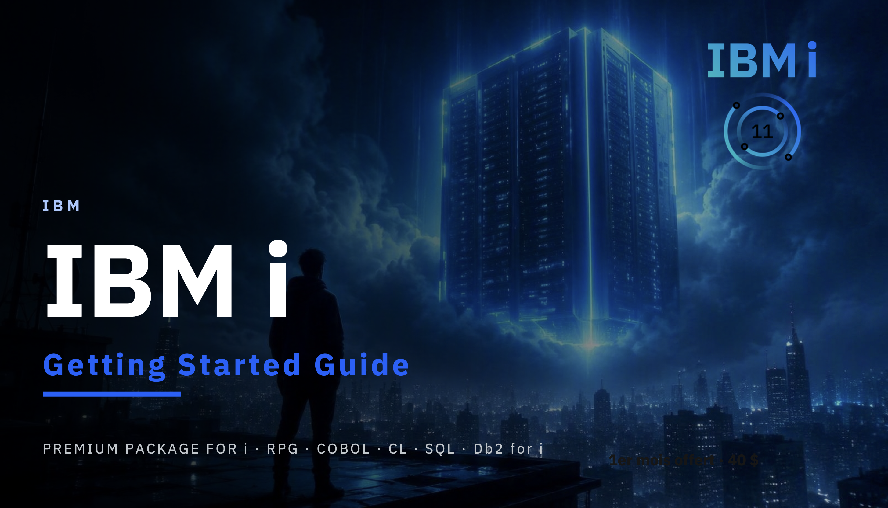

**A comprehensive reference for IBM i developers — platform foundations, RPG, SQL, CL, and modernization**
---

## How to Use This Book

This guide is structured as a **progressive learning path**. You do not need to read it front to back, but the order is intentional:

1. **Part I–III** — Understand the platform, its objects, and the tools before touching any code.
2. **Part IV** — Understand how source becomes a runnable object.
3. **Parts V–VIII** — The RPG language itself, from legacy to modern, plus SQL and CL.
4. **Parts IX–X** — Debug and ship code confidently.
5. **Parts XI–XII** — Performance, security, modernization, and quick-reference tables.

> **Note:** This Book does not replace official documentation or IBM Training offerings for IBM i developers. Please refer to the Reference/Links section. 
---

## Table of Contents

**Part I — The IBM i Platform**
- [1. What IBM i Is — Architecture Pillars, Application Stack, Customer Footprint](#1-whats-ibm-i-)
- [2. Object-Based Architecture — Object Types, Defined Interfaces, Authority Enforcement](#2-object-based-architecture)
- [2b. Single Level Storage](#2b-single-level-storage)
- [3. Libraries and the Library List — LIBL, DSPLIBL](#3-libraries-and-the-library-list)
- [4. Jobs and Subsystems — Work Management Overview](#4-jobs-and-subsystems)
- [5. Activation Groups](#5-activation-groups)
- [5b. IBM i Application Modernization — The 7 Challenges, Road Map, Refactoring Guide, DevOps, API, IoT, CDC, AI](#5b-introduction-to-ibm-i-application-modernization)
- [5c. IBM Power Hardware, System Management and Tools — Power Generations, LPARs, Deployment Options, ACS, Navigator](#5c-ibm-power-hardware-system-management-and-tools)

**Part II — Storage: QSYS and IFS**
- [6. QSYS — The Library/Object World](#6-qsys-the-libraryobject-world)
- [7. IFS — The Integrated File System — File Systems Table, Windows View](#7-ifs-the-integrated-file-system)
- [8. Source Physical Files, Members, and IFS Paths](#8-source-physical-files-members-and-ifs-paths)
- [9. QSYS vs IFS — Comparison](#9-qsys-vs-ifs-comparison)

**Part III — Development Tools**
- [10. Traditional Tools: PDM and SEU](#10-traditional-tools-pdm-and-seu)
- [10b. The 5250 Interface — Menu Anatomy, List Anatomy, Commands, Keyboard Shortcuts](#10b-the-5250-interface-green-screen-navigation-guide)
- [11. RDi — Rational Developer for i](#11-rdi-rational-developer-for-i)
- [12. VS Code + Code for IBM i — SQL Editor, Library Browser](#12-vs-code-code-for-ibm-i)
- [13. Development Approaches in VS Code](#13-development-approaches-in-vs-code)

**Part IV — Compilation and Build**
- [15. Source vs Object — What Compiling Means](#15-source-vs-object-what-compiling-means)
- [16. OPM vs ILE Compilation Models](#16-opm-vs-ile-compilation-models)
- [17. ILE Binding: Modules, Programs, Service Programs](#17-ile-binding-modules-programs-service-programs)
- [18. Binding Directories](#18-binding-directories)
- [19. Binder Source and Export Control](#19-binder-source-and-export-control)
- [20. Build Command Quick Reference](#20-build-command-quick-reference)

**Part V — RPG Language: Legacy to Modern**
- [21. The RPG Cycle — Key to Legacy RPG](#21-the-rpg-cycle)
- [22. HFELICO — The Mental Map of Legacy RPG](#22-hfelico-the-mental-map-of-legacy-rpg)
- [23. H-spec and CTL-OPT](#23-h-spec-and-ctl-opt)
- [24. F-spec and DCL-F — File Declarations](#24-f-spec-and-dcl-f-file-declarations)
- [25. E-spec, L-spec, I-spec, O-spec](#25-legacy-specs-e-l-i-o)
- [26. C-spec and Free-Form Calculations](#26-c-spec-and-free-form-calculations)
- [27. Mental Conversion: RPG III → RPG IV → Free-Form](#27-mental-conversion-rpg-iii-rpg-iv-free-form)
- [28. \*\*FREE, DCL-S, DCL-DS, QUALIFIED](#28-free-dcl-s-dcl-ds-qualified)
- [29. Control Flow: IF, SELECT, DOW, DOU, FOR](#29-control-flow-if-select-dow-dou-for)
- [30. Procedures: DCL-PROC, DCL-PR, DCL-PI](#30-procedures-dcl-proc-dcl-pr-dcl-pi)
- [31. Calls: RPG→RPG, RPG→CL, CL→RPG](#31-calls-rpgrpg-rpgcl-clrpg)
- [32. ILE Modularity in RPG](#32-ile-modularity-in-rpg)
- [33. Exception Handling: MONITOR / ON-ERROR](#33-exception-handling-monitor-on-error)
- [34. Built-In Functions (BIFs)](#34-built-in-functions-bifs)
- [35. Arrays, Dates, and Other Types](#35-arrays-dates-and-other-types)

**Part VI — Files, I/O and DDS**
- [36. RPG File Types Overview](#36-rpg-file-types-overview)
- [37. Sequential and Keyed DISK Files](#37-sequential-and-keyed-disk-files)
- [38. Key Operations: SETLL, SETGT, READE, READPE, CHAIN](#38-key-operations-setll-setgt-reade-readpe-chain)
- [39. WRITE, UPDATE, DELETE](#39-write-update-delete)
- [40. Externally Described vs Program-Described](#40-externally-described-vs-program-described)
- [41. Record Formats, RENAME, PREFIX, QUALIFIED](#41-record-formats-rename-prefix-qualified)
- [42. INFDS, USROPN, Overrides, Level Checking](#42-infds-usropn-overrides-and-level-checking)
- [43. Display Files (DSPF) and Subfiles](#43-display-files-dspf-and-subfiles)
- [44. Printer Files and Spooled Files](#44-printer-files-and-spooled-files)
- [45. DCL-F Complete Reference](#45-dcl-f-complete-reference)

**Part VII — SQL and Db2 for i**
- [45b. Db2 for i — Platform Positioning, SQL Standards, Access Interfaces](#45b-db2-for-i-platform-positioning)
- [46. Why SQLRPGLE](#46-why-sqlrpgle)
- [47. SELECT INTO and SQLSTATE](#47-select-into-and-sqlstate)
- [48. SQL Cursors](#48-sql-cursors)
- [49. DML: INSERT, UPDATE, DELETE](#49-dml-insert-update-delete)
- [50. Commitment Control](#50-commitment-control)

**Part VIII — CL**
- [51. CL and RPG — Two Complementary Roles](#51-cl-and-rpg-two-complementary-roles)
- [52. CL Variables, IF, DO, MONMSG](#52-cl-variables-if-do-monmsg)
- [53. Overrides, Library List, SBMJOB](#53-overrides-library-list-and-sbmjob)

**Part IX — Debugging**
- [54. Professional Debug Method](#54-professional-debug-method)
- [55. Traditional STRDBG](#55-traditional-strdbg)
- [56. Modern Debugging in VS Code](#56-modern-debugging-in-vs-code)
- [57. PSDS, INFDS, and Diagnostics](#57-psds-infds-and-diagnostics)
- [58. DSPPGMREF — Mapping Dependencies](#58-dsppgmref-mapping-dependencies)

**Part X — Source Code Management and DevOps**
- [59. Native IBM i SCM](#59-native-ibm-i-scm)
- [60. Enterprise SCM Tools](#60-enterprise-scm-tools)
- [61. Git-Based Workflows on IBM i](#61-git-based-workflows-on-ibm-i)

**Part XI — Performance and Security**
- [62. Performance: I/O and SQL](#62-performance-io-and-sql)
- [63. IBM i Security Model — User Profiles, Privileges, Authorization Lists, Object Authority](#63-ibm-i-security-model)

**Part XII — Quick References**
- [69. Build Commands Reference](#69-build-commands-reference)
- [70. IBM References](#70-ibm-official-references)

---

# Part I — The IBM i Platform

## 1. What's IBM i ?

IBM i is an integrated operating system from the IBM Power family. It is not simply a Unix variant with a different shell — it is a fundamentally different architecture where **the operating system, the database, the security model, and the runtime are unified**.

### IBM i at a Glance

> Installed in **98% of Fortune 100 companies**, 115+ countries, 100,000s of systems across 20+ industries. 70% of customers are small and mid-sized businesses; 30% are enterprise.

### Why organisations keep IBM i

IBM i has an unrivalled combination of **total cost of ownership (TCO)** and **reliability** — systems routinely run for years without a planned outage. This is why it remains the platform of choice for mission-critical workloads across industries:

| Industry | Typical workloads |
|----------|------------------|
| **Banking & financial services** | Core banking, payment processing, ledger, risk calculation |
| **Insurance** | Policy administration, claims processing, actuarial batch |
| **Retail & distribution** | Order management, inventory, supply chain, POS integration |
| **Manufacturing** | Production scheduling, MRP/ERP, shop floor control |
| **Healthcare & government** | Patient records, billing, regulatory reporting |

Many organisations run **ERP solutions directly on IBM i** — including **SAP**, **Infor M3**, **JD Edwards**, and other vertical ISV packages. These ERPs rely on the platform's integrated database, stability, and batch throughput.

**How IBM i applications are built:** while most custom code is written in RPG, CL, and COBOL, a significant share of applications are generated by **4GL and low-code IDEs** that target IBM i — tools such as **Lansa**, **Synon/CA 2E**, **Adelia**... that produce RPG behind the scenes. Developers using these tools may never write a line of RPG directly, yet the platform and its objects are the same underneath.

### 38 years of continuous innovation

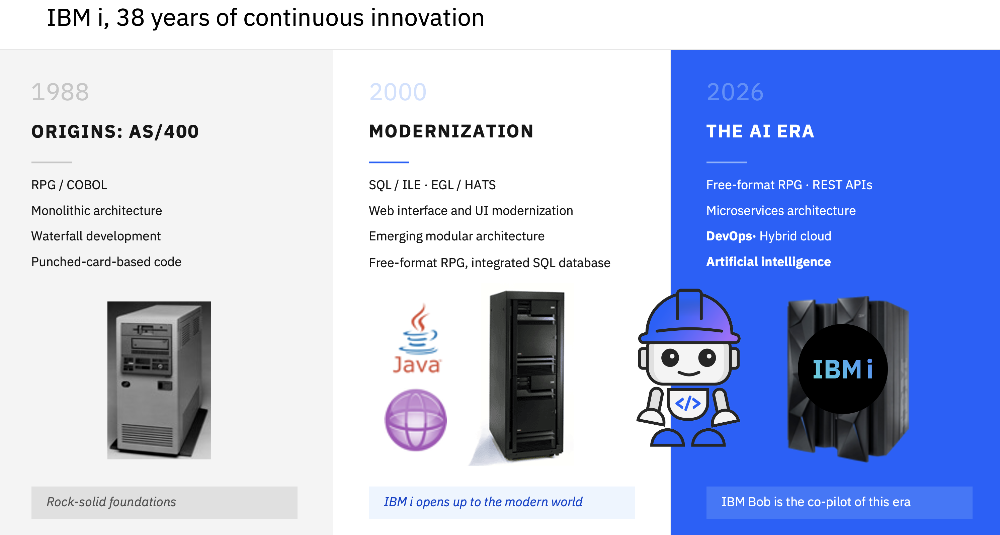

| Era | Language style | Architecture | Tooling |
|-----|---------------|-------------|---------|
| **1988 — Origins: AS/400** | RPG / COBOL, punched-card-based code | Monolithic, waterfall | SEU + PDM (5250 green-screen) |
| **2000 — Modernization** | SQL / ILE · EGL / HATS; free-format RPG begins | Web UI modernization, emerging modular | RDi, Java, Web |
| **2026 — The AI Era** | Free-format RPG · REST APIs · Microservices | DevOps, hybrid cloud, AI | VS Code + IBM Bob + Git + CI/CD |

Before writing a single line of RPG, understand three things:

| Concept | What it means in practice |
|---------|--------------------------|
| **Everything is an object** | Programs, files, libraries, queues — all are typed objects with built-in security and metadata |
| **Database is built-in** | Db2 for i is not an add-on; it is the file system itself |
| **Jobs, not processes** | Work runs in *jobs*, managed by *subsystems*, with their own library list, overrides, and spool |

### Architecture pillars

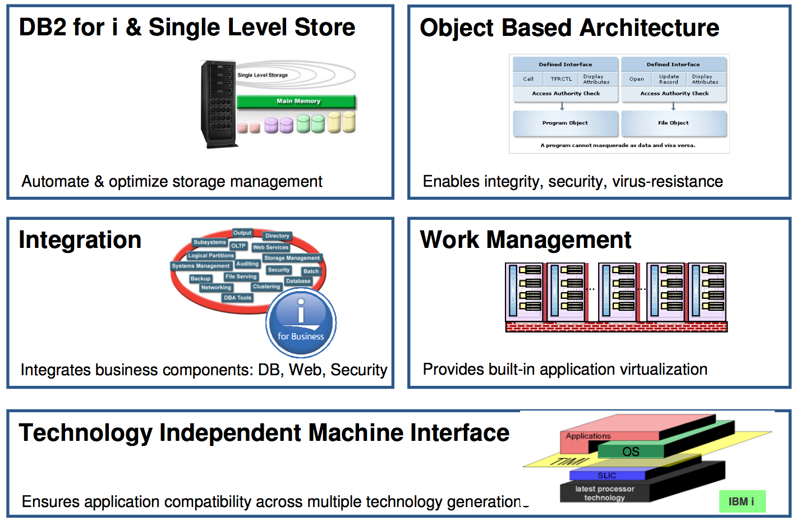

The diagram above summarises the five interlocking pillars:

| Pillar | What it means |
|--------|--------------|
| **DB2 for i & Single Level Storage** | All storage — SSD, HDD, memory — is one contiguous address space; DB2 is integrated, nothing to install |
| **Object-Based Architecture** | Every resource is a typed object with a defined interface and authority check; programs cannot masquerade as data |
| **Integration** | Subsystems, OLTP, web services, storage management, security, batch, networking, clustering — all built in |
| **Work Management** | Built-in job queues, output queues, subsystems and virtualization |
| **TIMI (Technology Independent Machine Interface)** | Applications compile once against the TIMI; the OS handles mapping to new processor generations — source code never needs recompilation for hardware changes |

### The Application Solution Stack — "It's All In There"

On most platforms, customers must integrate every component themselves. On IBM i, IBM integrates and delivers the full stack as one:

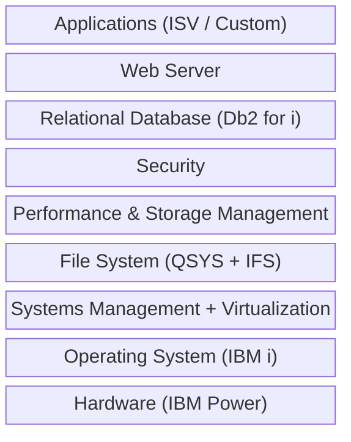
```mermaid
block-beta
  columns 1
  A["Applications (ISV / Custom)"]
  B["Web Server"]
  C["Relational Database (Db2 for i)"]
  D["Security"]
  E["Performance & Storage Management"]
  F["File System (QSYS + IFS)"]
  G["Systems Management + Virtualization"]
  H["Operating System (IBM i)"]
  I["Hardware (IBM Power)"]
```

> Competitors require customers to source, install, patch and integrate each layer separately. IBM i ships with all of them unified under one licence and one support contract.

```cl
DSPPGM     PGM(MYLIB/ORDENT)              -- show program attributes
DSPPGMREF  PGM(MYLIB/ORDENT) OUTPUT(*PRINT) -- show static dependencies
WRKOBJ     OBJ(MYLIB/*ALL) OBJTYPE(*FILE)  -- list all files in a library
WRKJOB     JOB(*)                          -- inspect current job
```

---

## 2. Object-Based Architecture

Everything in IBM i is stored as a **typed object**. The type determines what operations are allowed, what security applies, and how the system manages it.

### Object types

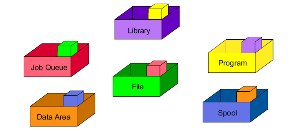

| Object Type | Purpose |
|-------------|---------|
| `*PGM` | Executable program |
| `*SRVPGM` | Service program — shared, reusable procedures |
| `*MODULE` | Compiled code unit — not directly executable |
| `*FILE` | Database file, source physical file, printer file, display file |
| `*LIB` | Library — container for other objects |
| `*BNDDIR` | Binding directory — dependency list for build |
| `*DTAARA` | Data area — small shared data store |
| `*DTAQ` | Data queue — inter-job communication |
| `*JOBQ` | Job queue — holds submitted batch jobs |
| `*OUTQ` | Output queue — holds spooled print output |

### Defined interfaces and authority enforcement

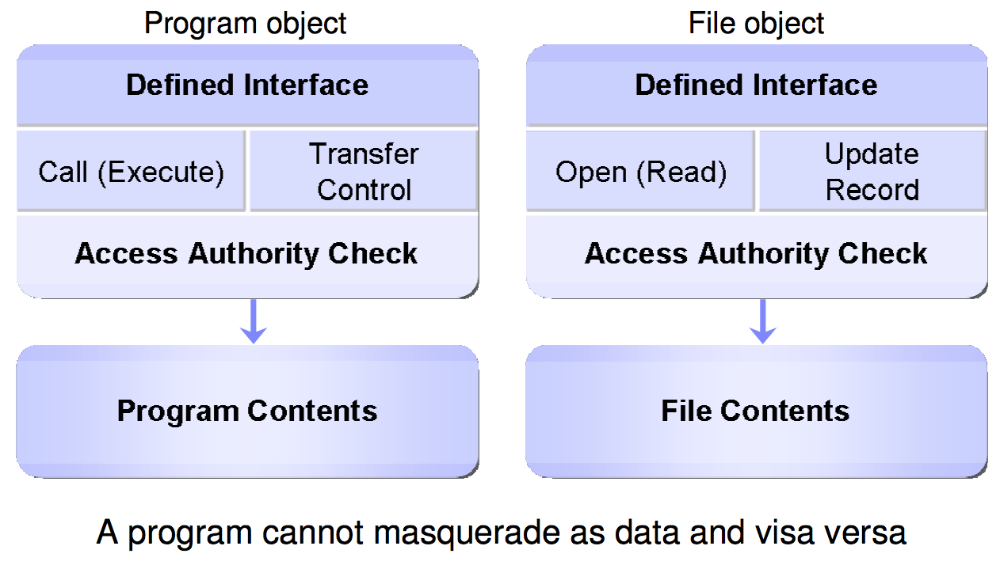

Every object exposes only a **defined interface**. Before the OS grants access to the object's contents, it performs an **Authority Check**:

- A **program object** can only be called or have control transferred to it — it cannot be read as raw data
- A **file object** can only be opened or updated through its defined record interface

> **"A program cannot masquerade as data and vice versa."** This is why IBM i has never had a traditional virus problem — there is no mechanism to trick the OS into executing data.

Objects include built-in metadata, security, and lifecycle management handled by the OS. This architecture is why IBM i systems are known for **stability and integrity**.

```cl
WRKOBJ OBJ(MYLIB/*ALL) OBJTYPE(*ALL)   -- browse all objects in MYLIB
DSPOBJD OBJ(MYLIB/ORDENT) OBJTYPE(*PGM) -- display program metadata
```

---

## 2b. Single Level Storage

IBM i treats all storage as **one large contiguous addressable space** — from the processor's perspective, main memory, SSD, and HDD form a single flat address space. The OS handles placement automatically.

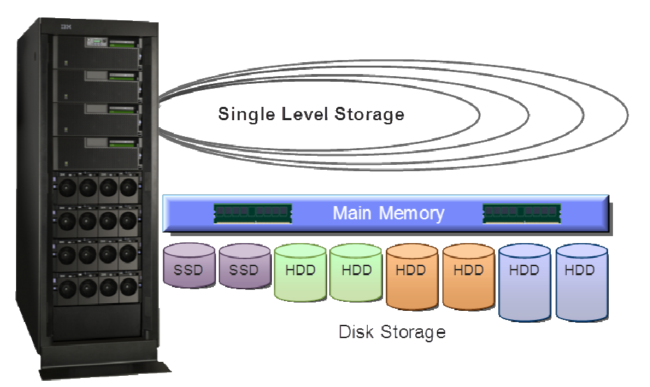

### How it works

| Aspect | Detail |
|--------|--------|
| **Unified address space** | Programs address objects by name, not by physical location |
| **Automated tiering** | The OS balances objects across SSD and HDD based on usage patterns |
| **Dynamic rebalancing** | Storage is automatically redistributed as access patterns change |
| **Innovation-ready** | New storage types (SSD, NVMe) integrate into the management algorithm without application changes |

> Because all storage is a single space, IBM i programs do not open files "on disk" — they reference objects by name and the OS resolves physical location invisibly. This is why backup/restore on IBM i is a **single-step object operation**, not a file-by-file copy.

---

## 3. Libraries and the Library List

A **library** (`*LIB`) is a container for other objects — it is itself an object. There is no nesting: libraries live directly in the system namespace QSYS.

### Library List (LIBL)

The library list is the ordered search path IBM i uses to resolve unqualified object names. It behaves like a **PATH variable** on Linux/Windows.

When you call:
```cl
CALL CUSTINQ
```
IBM i searches in order:
1. Current library (`*CURLIB`)
2. User library list (user-defined entries)
3. System library list (IBM system libraries)

### Qualifying a Name

```cl
CALL PGM(MYLIB/CUSTINQ)    -- qualified: unambiguous, no library list search
CALL CUSTINQ               -- unqualified: resolved via library list
```

**Why this matters:** programs can resolve differently in DEV, TEST, and PROD environments purely through library list management — without recompiling.

### Library list structure

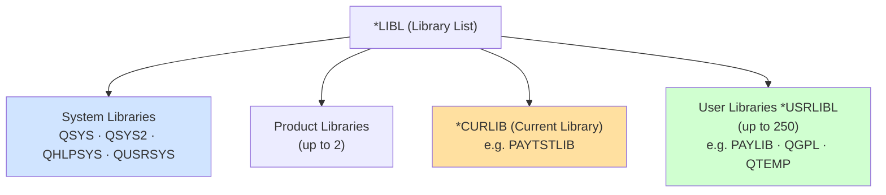
```mermaid
flowchart TD
    A["*LIBL (Library List)"] --> B["System Libraries\nQSYS · QSYS2 · QHLPSYS · QUSRSYS"]
    A --> C["Product Libraries\n(up to 2)"]
    A --> D["*CURLIB (Current Library)\ne.g. PAYTSTLIB"]
    A --> E["User Libraries *USRLIBL\n(up to 250)\ne.g. PAYLIB · QGPL · QTEMP"]
    style B fill:#d0e4ff
    style D fill:#ffe0a0
    style E fill:#d0ffd0
```

Every job carries exactly one library list. Objects are resolved by searching the list top-to-bottom. The first match wins.

### DSPLIBL — viewing the library list

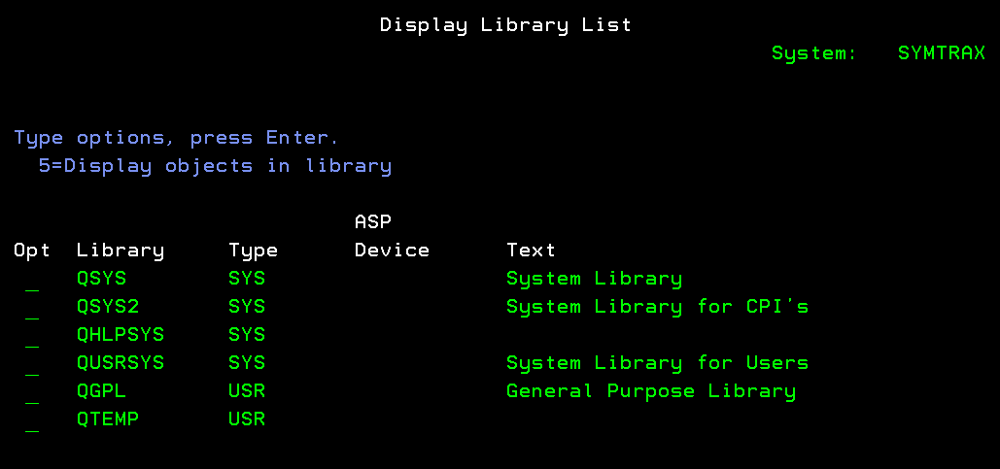

```cl
ADDLIBLE   LIB(APPLTEST)       -- add a library to the job's library list
RMVLIBLE   LIB(APPLTEST)       -- remove it
DSPLIBL                        -- display the current library list (screenshot above)
CHGLIBL    LIBL(MYLIB QGPL)    -- replace the user portion entirely
```

---

## 4. Jobs and Subsystems

IBM i is **job-centric**, not process-centric. Every unit of work runs inside a **job**.

### Work Management overview

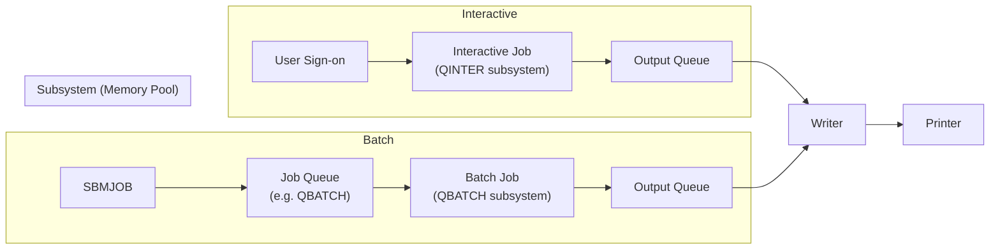
```mermaid
flowchart LR
    subgraph Interactive
        U["User Sign-on"] --> IS["Interactive Job\n(QINTER subsystem)"]
        IS --> OUTQ_I["Output Queue"]
    end
    subgraph Batch
        SBMJOB["SBMJOB"] --> JQ["Job Queue\n(e.g. QBATCH)"]
        JQ --> BJ["Batch Job\n(QBATCH subsystem)"]
        BJ --> OUTQ_B["Output Queue"]
    end
    subgraph Subsystem_Pool["Subsystem (Memory Pool)"]
        IS
        BJ
    end
    OUTQ_I --> WRITER["Writer"] --> PRINTER["Printer"]
    OUTQ_B --> WRITER
```

| Job Type | Subsystem | Purpose |
|----------|-----------|---------|
| Interactive | `QINTER` | User sessions — 5250 terminal, SSH, RDi, VS Code |
| Batch | `QBATCH` | Background processing — submitted via `SBMJOB` |
| System | `QSYSWRK` | OS services — managed by IBM |
| Spool Writer | `QSPL` | Writes spooled output to printers |

Each job has its own:
- Library list and current library
- Active overrides (`OVRDBF`, `OVRPRTF`, …)
- Spool files (output queue entries)
- Job log

```cl
WRKACTJOB  SBS(QBATCH)                       -- active batch jobs
WRKJOB     JOB(123456/USER/NIGHTLY) OPTION(*JOBLOG)
DSPJOBLOG  JOB(123456/USER/NIGHTLY)          -- first place to look on failure
SBMJOB     CMD(CALL PGM(MYLIB/NIGHTLY)) JOB(NIGHTLY) JOBQ(QBATCH)
WRKSBS                                        -- work with all active subsystems
WRKJOBQ    JOBQ(QBATCH)                       -- jobs waiting in the batch queue
```

> **The joblog is the first source of truth when a program fails.** Always read it before changing code.

---

## 5. Activation Groups

An **activation group** is the ILE runtime context that controls:
- How programs share memory and static variables
- When service programs are loaded or unloaded
- When static storage resets

```
Program A  (Activation Group: MYAPP)
  └─ calls Service Program B  (same activation group)
       → shares static storage
```

When the activation group ends, all static storage resets and service programs unload.

| Strategy | Meaning |
|----------|---------|
| `*CALLER` | Join the caller's activation group — state persists across calls |
| Named (e.g., `'MYAPP'`) | Named group — all programs using this name share state |
| `*NEW` | A new group per call — isolated, resets on return |
| `DFTACTGRP(*YES)` | OPM-compatible default activation group (legacy) |

```rpgle
ctl-opt dftactgrp(*no) actgrp('MYAPP');
```

> Activation groups are a common source of subtle bugs when static variables unexpectedly retain state between calls. Always understand the activation group strategy before modifying an ILE program.

---

## 5b. IBM i Application Modernization

### The modernization gap

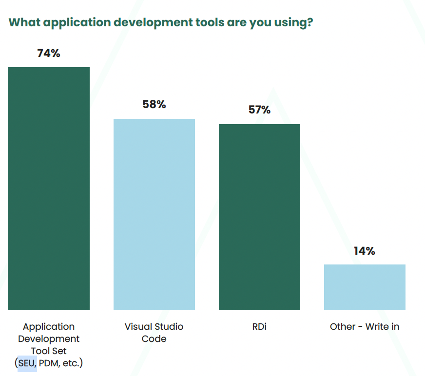

> Source: [Fortra IBM i Marketplace Survey](https://www.fortra.com/resources/guides/ibm-i-marketplace-survey-results). Despite VS Code being available and free, **74% of developers still use SEU/PDM** — the green-screen toolchain from the 1980s. This is the modernization gap.

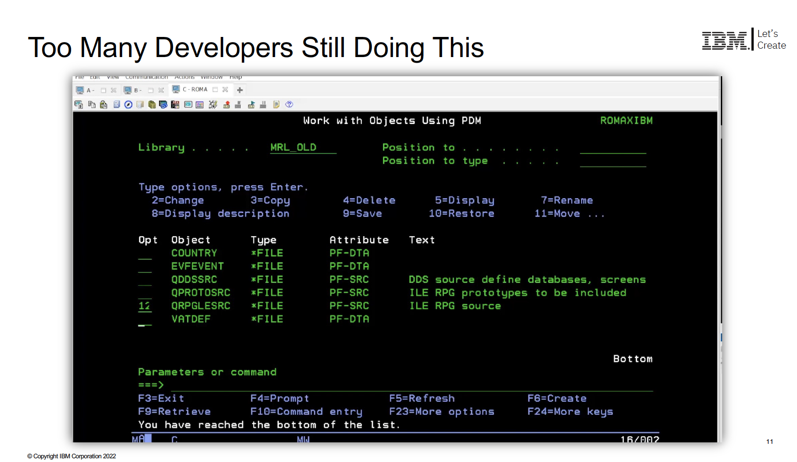

This is a real production IBM i system, actively developed on in 2022. Thousands of teams still work this way.

> **Mission:** The goal is not to rewrite everything. It is to enable the next generation of developers to work with IBM i using the tools they already know, while protecting the business logic that runs in production.

IBM i modernization is not a single project — it is a set of deliberate, prioritised transformations that bring proven business logic into the modern software delivery world. This section maps the **key challenges** every IBM i team faces, and pairs each one with a clear direction.

### The 7 Modernization Challenges

Each challenge below represents a real-world friction point. Understanding the problem before reaching for a tool is the foundation of every successful modernization.

| # | Challenge | Why it matters | Direction |
|---|-----------|----------------|-----------|
| 1 | **Fixed-format RPG** | Unreadable to new hires; tooling support is limited | Convert to full free-format RPG |
| 2 | **High volume of code** | Hard to navigate, understand, and safely change | Invest in code understanding tooling (IBM Bob, ARCAD) |
| 3 | **Mega-programs** | Thousands of lines, multiple responsibilities in one object | Refactor into focused ILE modules and service programs |
| 4 | **Spaghetti-plate architecture** | Implicit dependencies, no build graph, fragile changes | Introduce intelligent build tooling (BOB, Makefile) |
| 5 | **Embedded business logic** | Logic locked inside programs — cannot be reused or called from modern front-ends | Expose as REST/SOAP services via IWS or Liberty |
| 6 | **"Create it all" approach** | Homegrown utilities, duplicated code, no service consumption | Adopt a service consumption mindset; use APIs |
| 7 | **Source code "where it always was"** | Members in QSYS libraries — no Git, no code review, no CI/CD | Move source to IFS; adopt Git and standard DevOps tooling |

### Challenge 1: Refactor the Monolith

IBM i runs on **IBM Power Systems**, which supports IBM i, AIX, and Linux — on-premises or in the cloud. The runtime choice matters:

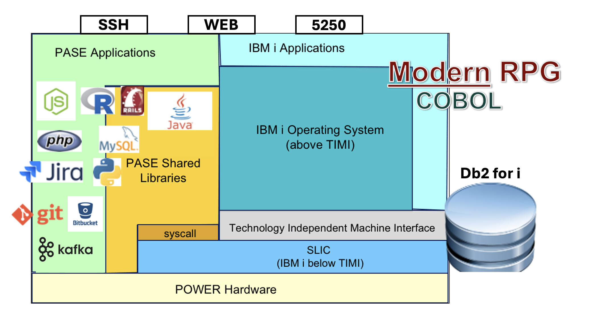

| Runtime layer | What it is | Use for |
|---------------|-----------|---------|
| **ILE** | Integrated Language Environment — native IBM i runtime | RPG, COBOL, CL, SQL — existing business logic |
| **PASE** | Portable App Solutions Environment — AIX-compatible POSIX layer on IBM i | Node.js, Python, Git, open-source tools running alongside ILE |
| **Db2 for i** | Integrated relational database | All data access — RLA and SQL |

> The architecture goal: keep **business logic in ILE**, expose it through **service layers**, and run **modern tooling in PASE** — all on the same machine.

**Refactoring best practices:**

- **Rename variables** to be self-describing — rename consistently across all occurrences
- **Migrate to modern free-format RPG** — syntax-only first, no logic change
- **Extract procedures** — replace `EXSR` with `DCL-PROC` where safe
- **Leverage service programs** — ILE is designed for maintainability through `*SRVPGM`
- **Convert from record-level to SQL access** — set-based SQL replaces `SETLL`/`READE` loops
- **Convert DDS to DDL** — replace `CRTPF`/DDS with `CREATE TABLE`; both programs and SQL can access the same object
- **Use surrogates** — leave unchanged programs using record-level access as-is; they still work against the new DDL table; only modernise the programs that will benefit most from SQL power
- **Be targeted** — not all programs need to be refactored; prioritise high-change, high-impact programs

### Challenge 2: RPG Format Modernization

The goal of moving to full free-format RPG is not just technical — it is about **developer onboarding and long-term maintainability**.

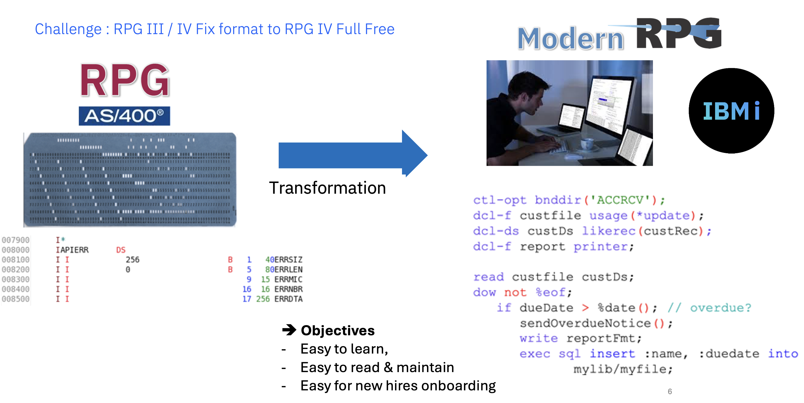

**Objectives:**
- Easy to learn for developers coming from Python, Java, or JavaScript
- Easy to read and maintain — self-documenting variable names, readable control flow
- Easy onboarding for new hires — no punch-card column rules to memorise

The conversion is **syntax-only in the first pass** — no logic changes. Tools like IBM Bob (AI-assisted conversion), ARCAD Transform, or RDi refactoring can assist. The key rule: always understand the cycle, indicators, and I/O semantics before changing a line.

### Challenge 3: IDE and DevOps Adoption — IBM Bob

The biggest cultural shift: moving developers off SEU/PDM and into a modern, unified DevOps workflow.


**IBM Bob** is the AI-powered developer assistant for IBM i, integrated directly into VS Code. It accelerates modernization by:

- Converting fixed-format RPG to free-format
- Explaining legacy code and documenting business rules
- Generating RPGUnit test stubs
- Assisting with SQL migration and DDS-to-DDL conversion


The modernization path for tooling:

```
SEU + PDM (5250)  →  VS Code + Code for IBM i  →  Git (IFS)  →  CI/CD pipeline
      74% still here        58% adopted              branching, review          automated build + deploy
```

> Adopting VS Code and IBM Bob does **not** require moving source immediately. You can start by editing QSYS members from VS Code while progressively migrating source to the IFS.

### Challenge 4: Data-Centric Design — DDS to DDL, RLA to SQL

Throwing hardware at an I/O-bound problem is no longer an option. Application-level data access changes are inevitable.

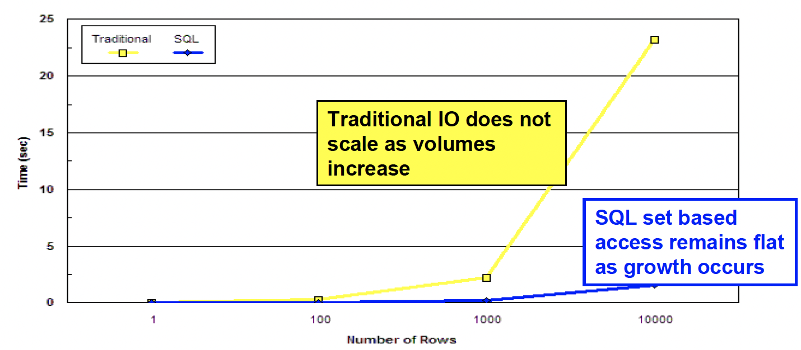

Two parallel transformations:

**Data design: DDS → DDL**

| Aspect | DDS (old) | DDL — SQL (modern) |
|--------|-----------|-------------------|
| Create | `CRTPF` + DDS source | `CREATE TABLE` |
| Indexes | DDS logical files | `CREATE INDEX` / `CREATE VIEW` |
| Constraints | None | `PRIMARY KEY`, `FOREIGN KEY`, `CHECK` |
| Tooling | PDM/SEU | VS Code SQL editor, IBM Bob |
| Object type | Same `*FILE` — both coexist | |

**Data access: RLA → SQL**

| Aspect | Record-Level Access (RLA) | SQL (SQLRPGLE) |
|--------|--------------------------|----------------|
| Read pattern | `SETLL` / `READE` loop | `SELECT ... WHERE` / cursor |
| Joins | Manual multi-file logic | `JOIN` |
| Aggregates | Manual accumulators | `SUM`, `COUNT`, `GROUP BY` |
| Performance | Row-by-row | Set-based — optimizer can use indexes, parallelism |
| Commitment control | `COMMIT` opcode | `COMMIT` / `ROLLBACK` in SQL |

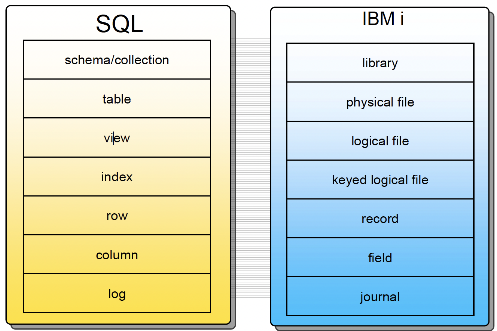

> **Key insight:** A `CREATE TABLE` and a DDS `CRTPF` produce the same `*FILE` object type. Existing RPG programs using record-level access continue to work unchanged against a DDL-defined table. There is no forced cutover.


## 64. Modernization Road Map

Modernization is a journey, not a one-time event. The key insight: **you do not need to rewrite everything** — you need to be strategic about what you modernize, when, and why.

### The 5-layer modernization path

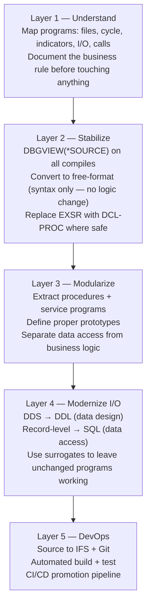
```mermaid
flowchart TD
    L1["Layer 1 — Understand\nMap programs: files, cycle, indicators, I/O, calls\nDocument the business rule before touching anything"]
    L2["Layer 2 — Stabilize\nDBGVIEW(*SOURCE) on all compiles\nConvert to free-format (syntax only — no logic change)\nReplace EXSR with DCL-PROC where safe"]
    L3["Layer 3 — Modularize\nExtract procedures + service programs\nDefine proper prototypes\nSeparate data access from business logic"]
    L4["Layer 4 — Modernize I/O\nDDS → DDL (data design)\nRecord-level → SQL (data access)\nUse surrogates to leave unchanged programs working"]
    L5["Layer 5 — DevOps\nSource to IFS + Git\nAutomated build + test\nCI/CD promotion pipeline"]
    L1 --> L2 --> L3 --> L4 --> L5
```

### Challenge-by-challenge refactoring guide

| Challenge | What to do | Tools / techniques | IBM Bob can help |
|-----------|-----------|-------------------|--------------------|
| Fixed-format RPG | Convert to full free-form | ARCAD Transform, manual | Convert fixed-format members to free-format automatically |
| Rename variables to be self-describing | Rename refactor — change all occurrences consistently | RDi refactor | Suggest self-describing names; find all occurrences |
| Mega-programs | Extract focused procedures; leverage service programs | ILE | Identify procedure extraction candidates; generate stubs |
| Record-level access at scale | Replace with SQL set-based access | SQLRPGLE cursors, SQL DML | Rewrite SETLL/READE loops as equivalent SQL queries |
| DDS physical files | Redefine as SQL DDL tables | `CREATE TABLE` replaces `CRTPF` | Generate `CREATE TABLE` DDL from existing DDS source |
| DDS logical files / indexes | Replace with SQL views and indexes | `CREATE VIEW`, `CREATE INDEX` | Generate equivalent SQL views and indexes from DDS LF source |
| Embedded 5250 UI logic | Expose as service; front-end with Liberty/Node.js/REST | IWS, PASE | Explain program structure; identify logic suitable for API extraction |
| Source in QSYS members | Move to IFS + Git | Code for IBM i + Git | Guide migration steps; generate `.gitignore` and project structure |
| No CI/CD | Implement build pipeline | BOB build / GitHub Actions | Generate build scripts and pipeline configuration |

> **Surrogates pattern:** Leave some programs using record-level access unchanged — they will still work against the new SQL DDL table. Only modernize the high-value programs that need SQL power.

> **IBM Bob** is available at every step of this table — ask Bob to start any of these transformations directly from VS Code.

### Challenge: IDE and DevOps adoption

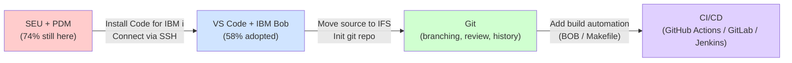
```mermaid
flowchart LR
    PDM["SEU + PDM\n(74% still here)"] -->|"Install Code for IBM i\nConnect via SSH"| VSC["VS Code + IBM Bob\n(58% adopted)"]
    VSC -->|"Move source to IFS\nInit git repo"| GIT["Git\n(branching, review, history)"]
    GIT -->|"Add build automation\n(BOB / Makefile)"| CICD["CI/CD\n(GitHub Actions / GitLab / Jenkins)"]
    style PDM fill:#ffcccc
    style VSC fill:#d0e4ff
    style GIT fill:#d0ffd0
    style CICD fill:#e0d0ff
```

### Challenge: Expose IBM i as an API platform

IBM i's strength is proven business logic. The modernization goal is to expose that logic to the world via services — not rewrite it.

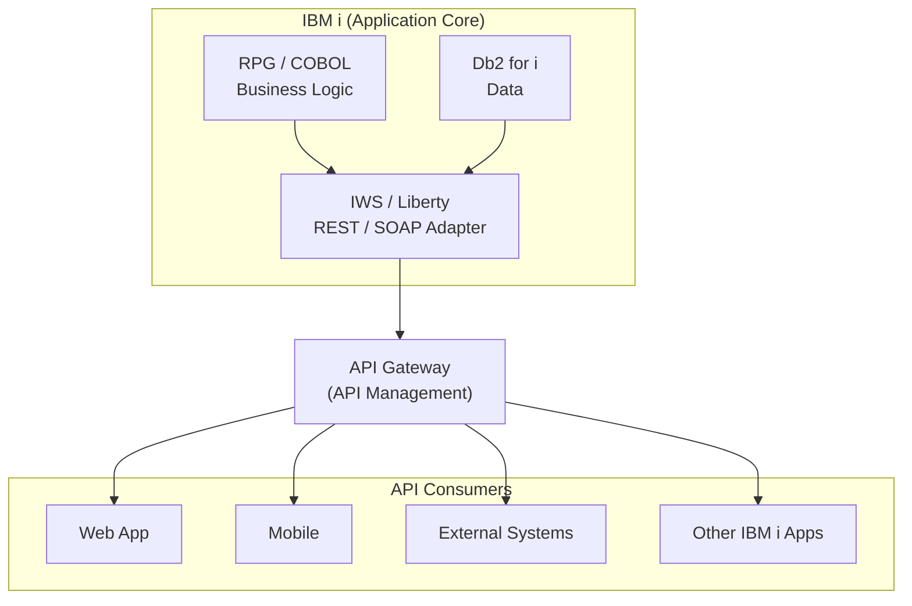
```mermaid
flowchart TB
    subgraph IBM_i["IBM i (Application Core)"]
        RPG["RPG / COBOL\nBusiness Logic"]
        DB2["Db2 for i\nData"]
        IWS["IWS / Liberty\nREST / SOAP Adapter"]
        RPG --> IWS
        DB2 --> IWS
    end
    subgraph Consumers["API Consumers"]
        WEB["Web App"]
        MOB["Mobile"]
        EXT["External Systems"]
        INT["Other IBM i Apps"]
    end
    GW["API Gateway\n(API Management)"]
    IWS --> GW
    GW --> WEB
    GW --> MOB
    GW --> EXT
    GW --> INT
```

Key technologies for IBM i API exposure:
- **IWS (Integrated Web Services)** — generate REST/SOAP directly from RPG/COBOL programs
- **IBM Liberty on PASE** — full Java EE application server embedded in IBM i
- **PASE + Node.js/Python** — open-source runtimes running natively alongside ILE
- **SQL services** — expose Db2 for i data via REST without writing RPG

### Challenge: Beyond APIs — Event Streaming and IoT

IBM i does not have to be a passive data repository. Modern IBM i runs as an active event-processing node:

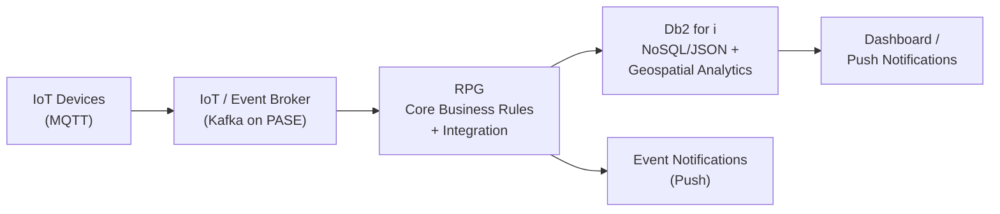
```mermaid
flowchart LR
    IOT["IoT Devices\n(MQTT)"] --> BROKER["IoT / Event Broker\n(Kafka on PASE)"]
    BROKER --> RPG["RPG\nCore Business Rules\n+ Integration"]
    RPG --> DB2["Db2 for i\nNoSQL/JSON +\nGeospatial Analytics"]
    DB2 --> DASH["Dashboard /\nPush Notifications"]
    RPG --> NOTIFY["Event Notifications\n(Push)"]
```

> **Real example:** Connected Warehouse Management System on Power10 — RPG as the core business rules engine, Kafka for event streaming, Db2 for i with JSON/geospatial analytics, IoT sensor ingestion.
> GitHub: <https://github.com/bmarolleau/vms-iot-dashboard>

### Challenge: Change Data Capture (CDC) — Streaming Db2 for i Events

IBM i is increasingly used as an **event source** in modern event-driven architectures. **CDC** captures every INSERT, UPDATE, and DELETE on a Db2 for i table in real time and streams it to downstream systems — without touching RPG. Options range from simple polling programs and DB2 triggers feeding a `*DTAQ`, to journal-based **Debezium** (open-source, zero trigger overhead, streams to Kafka), IBM InfoSphere CDC (enterprise), and community tools like **Manzan** / **AIStream** (Apache Camel–based).

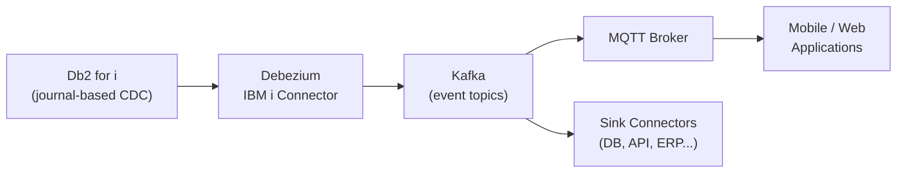
```mermaid
flowchart LR
    DB2["Db2 for i\n(journal-based CDC)"] --> DBZ["Debezium\nIBM i Connector"]
    DBZ --> KAFKA["Kafka\n(event topics)"]
    KAFKA --> MQTT["MQTT Broker"]
    KAFKA --> SINK["Sink Connectors\n(DB, API, ERP...)"]
    MQTT --> APP["Mobile / Web\nApplications"]
```

> **Real example:** Db2 for i order/customer changes captured by Debezium, streamed to Kafka, routed to MQTT for e-invoicing and downstream consumers.
> GitHub: <https://github.com/bmarolleau/debezium-ibmi-demo>

### Challenge: AI Inference on IBM i

IBM Power10 includes the **Matrix Math Accelerator (MMA)** — hardware AI inference built into the processor. IBM i can run AI models natively without a GPU:

- **MMA** accelerates matrix operations — the core of deep learning inference
- **RPG** calls inference routines via ILE service programs
- **No external AI server required** — inference happens in the same job as the business logic
- Result: AI-enhanced business rules with microsecond latency, no network hop

> IBM Developer reference: <https://developer.ibm.com/tutorials/power10-business-inferencing-at-scale-with-mma/>

### Suggested RPG practitioner progression

With IBM Bob available, you no longer need to master legacy formats before being productive. Start modern, use Bob to decode what you encounter.

| Step | Skill | IBM Bob helps |
|------|-------|--------------|
| 1 | Set up VS Code + Code for IBM i + IBM Bob | Bob guides you from the first connection |
| 2 | Write a first free-format RPG program — `**free`, `dcl-s`, `dcl-f`, `dcl-proc` | Generate stubs, explain syntax |
| 3 | Read and understand existing legacy code (F-specs, C-specs, indicators) | Ask Bob to explain any legacy member |
| 4 | Use SQLRPGLE — `SELECT INTO`, cursors, `INSERT`/`UPDATE` | Bob converts RLA loops to SQL |
| 5 | Write and call procedures; build a service program | Bob generates prototypes and binder source |
| 6 | Debug with VS Code — breakpoints, variable watch, call stack | Bob explains error messages and job logs |
| 7 | Modernize a legacy program — free-format, rename, extract procedures | Bob automates the conversion |
| 8 | Expose business logic as a REST API via IWS | Bob explains IWS setup and generates service stubs |
| 9 | Move source to IFS + Git + CI/CD pipeline | Bob generates build scripts and `.gitignore` |

---
---

## 5c. IBM Power Hardware, System Management and Tools

### IBM Power Systems — The Hardware Underneath IBM i

IBM i runs exclusively on **IBM Power Systems** — a hardware family that has evolved continuously since the AS/400 in 1988. Understanding the hardware generation helps explain the performance and capability available to applications.

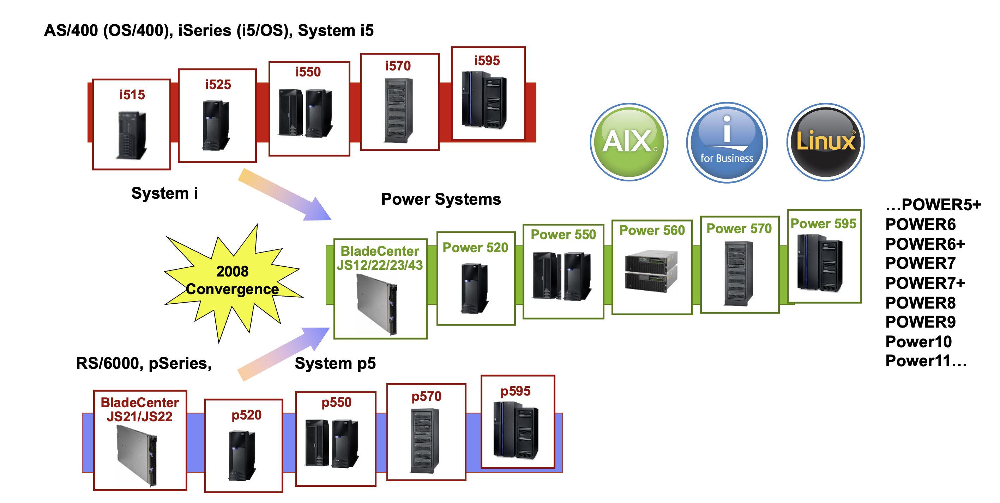

| Generation | Key capability for IBM i |
|-----------|------------------------|
| **Power9** | Up to 240 cores, PCIe 4, DDR4, improved virtualisation |
| **Power10** | Matrix Math Accelerator (MMA) for AI inference, PCIe 5, 50% more memory bandwidth vs Power9 |
| **Power11** | Next-gen Power architecture — enhanced AI, energy efficiency, cloud-native workload optimisation |

> **TIMI insulates applications from hardware.** RPG and COBOL programs compiled on Power9 run unchanged on Power11 — the OS recompiles the Licensed Internal Code (LIC) layer, not the application objects.

### LPARs — Logical Partitions

A single physical Power server can run **multiple independent LPARs** simultaneously — each with its own OS instance (IBM i, AIX, or Linux), its own virtual processors, memory, and storage.

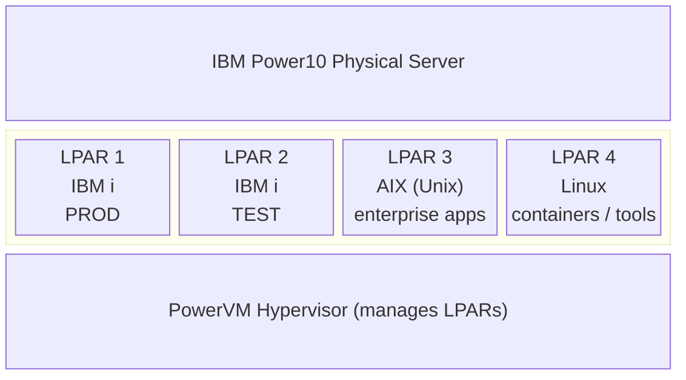
```mermaid
block-beta
  columns 1
  H["IBM Power10 Physical Server"]
  block:partitions
    columns 4
    A["LPAR 1\nIBM i\nPROD"]
    B["LPAR 2\nIBM i\nTEST"]
    C["LPAR 3\nAIX (Unix)\nenterprise apps"]
    D["LPAR 4\nLinux\ncontainers / tools"]
  end
  V["PowerVM Hypervisor (manages LPARs)"]
```

| Concept | Detail |
|---------|--------|
| **PowerVM** | IBM's hypervisor — manages LPARs, virtual I/O, live partition mobility |
| **Shared processor pool** | Multiple LPARs share physical cores — each gets a fractional entitlement |
| **Dedicated processors** | An LPAR owns specific cores — used for peak performance workloads |
| **Live Partition Mobility** | Move a running LPAR from one physical server to another with no downtime |
| **VIOS** | Virtual I/O Server — a special LPAR that owns physical disks/network and shares them with other LPARs |

### IBM i Deployment Options

IBM i is no longer exclusively on-premises. Three deployment models exist today:

| Model | Description | Best for |
|-------|-------------|---------|
| **On-premises** | Physical Power server in the customer's data centre | Full control, low latency, data sovereignty |
| **IBM Power Virtual Server (PowerVS)** | IBM i on Power hardware in IBM Cloud — true IBM i, not emulated | Hybrid cloud, disaster recovery, burst capacity |
| **Managed hosting / co-location** | Power hardware in a third-party data centre, managed by a partner | Customers who want IBM i without owning hardware |

> IBM Power Virtual Server (PowerVS) runs real IBM i on real Power hardware in IBM Cloud. It is **not emulation** — the same RPG programs, the same CL commands, the same QSYS objects.

### System Management — Essential CL Commands

IBM i system management is done through CL commands, the 5250 interface, and IBM ACS. Developers need to know enough to navigate their environment, manage their jobs, and escalate correctly.

**System status:**

```cl
WRKSYSSTS                    -- CPU utilisation, active jobs, memory pool sizes, disk %
WRKSBS                       -- list all active subsystems
WRKACTJOB                    -- all active jobs — CPU, status, type
WRKACTJOB SBS(QBATCH)        -- jobs in a specific subsystem
```

**Job and output management:**

```cl
WRKJOB                       -- inspect your own current job
DSPJOBLOG JOB(*)             -- display current job's log
WRKOUTQ OUTQ(QPRINT)         -- work with a print output queue
WRKSPLF                      -- all your spooled files (print output)
ENDJOB JOB(123456/USER/NAME) OPTION(*CNTRLD) -- end a job cleanly
```

**Library and object management:**

```cl
CRTLIB    LIB(MYLIB) TYPE(*PROD) TEXT('My application library')
DLTLIB    LIB(OLDLIB)                    -- delete a library (irreversible)
DSPOBJD   OBJ(MYLIB/*ALL) OBJTYPE(*ALL) -- list all objects with attributes
WRKOBJLCK OBJ(MYLIB/CUSTPF) OBJTYPE(*FILE) -- who holds a lock on an object
```

**User profiles:**

```cl
WRKUSRPRF USRPRF(*ALL)        -- list all user profiles
DSPUSRPRF USRPRF(MYUSER)      -- display a profile's attributes
```

### IBM Access Client Solutions (ACS)

**IBM ACS** is the free, cross-platform desktop tool for IBM i (Windows, macOS, Linux). It covers everything in one install: 5250 emulator, Run SQL Scripts, Visual Explain, SQL Performance Center, IFS browser, data transfer, and spooled file management.

> Install ACS first — before VS Code, before RDi. Download: **[IBM Access Client Solutions](https://www.ibm.com/support/pages/ibm-i-access-client-solutions)**

### IBM Navigator for i (Web Console)

**IBM Navigator for i** is the browser-based management console built into IBM i — no install required. Access it at `http://<ibmi-host>:2001` for a graphical dashboard covering jobs, subsystems, database, IFS, and security.

---

# Part II — Storage: QSYS and IFS

## 6. QSYS — The Library/Object World

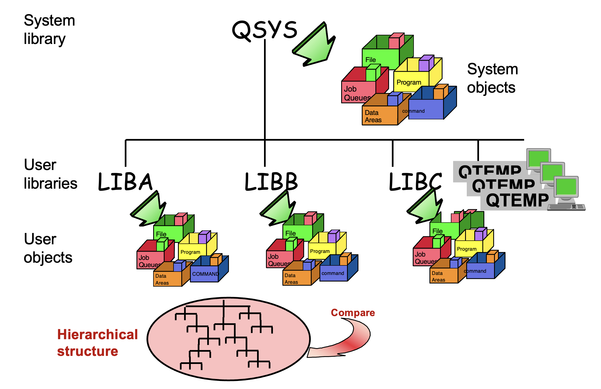

**QSYS** is the native IBM i library system — the traditional object-based world.

```
QSYS (Object Namespace)
  └─ Library: MYLIB
       ├─ Source Physical File: QRPGLESRC
       │    ├─ Member: ORDENT  (RPGLE source text)
       │    └─ Member: CUSTMGR (RPGLE source text)
       ├─ Source Physical File: QCLSRC
       │    └─ Member: NIGHTLY (CL source text)
       └─ Compiled Objects: ORDENT *PGM, CUSTSRV *SRVPGM
```

Typical source physical files:

| Source File | Language |
|-------------|----------|
| `QRPGSRC` | OPM RPG |
| `QRPGLESRC` | ILE RPG (RPGLE) |
| `QCLSRC` | CL |
| `QCBLSRC` | COBOL |
| `QDDSSRC` | DDS |
| `QSRVSRC` | Binder source |

```cl
CRTSRCPF   FILE(MYLIB/QRPGLESRC) RCDLEN(112)
ADDPFM     FILE(MYLIB/QRPGLESRC) MBR(ORDENT) SRCTYPE(RPGLE)
WRKMBRPDM  FILE(MYLIB/QRPGLESRC)
```

---

## 7. IFS — The Integrated File System

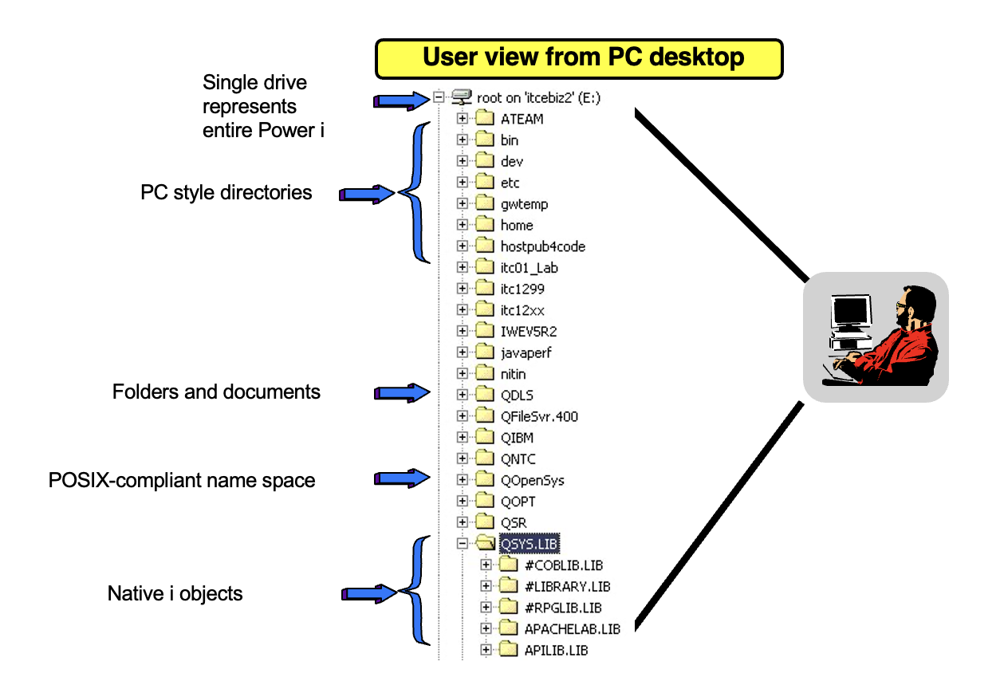


**IFS** is the modern Unix-like file system — directories and stream files, compatible with Git and standard tooling.

```
/home/dev/project/
  src/
    ordent.rpgle
    custsrv.rpgle
  cl/
    build.clle
  sql/
    schema.sql
  .gitignore
```

> With VS Code + Code for IBM i, source lives in the IFS or a Git repository. Compilation still happens on IBM i, but source is managed like any modern project.

### IFS file systems

The IFS presents a single unified tree (`/`) that spans multiple underlying file systems:

| File System | Mount point | Purpose |
|-------------|-------------|---------|
| Root | `/` | POSIX-compliant directories and stream files — new development home |
| QOpenSys | `/QOpenSys` | Open-source / POSIX-compatible (case-sensitive) — RPMs, Python, Node.js, Git |
| QSYS.LIB | `/QSYS.LIB` | The traditional library/object world accessed via IFS paths |
| UDFS | `/dev/...` | User-defined file systems — independent ASPs |
| QDLS | `/QDLS` | OfficeVision folders and documents (legacy) |
| QOPT | `/QOPT` | Optical media (CD/DVD) |
| QNTC | `/QNTC` | Windows network shares via NetServer |
| QFileSvr.400 | `/QFileSvr.400` | Remote IBM i system access |
| NFS | varies | Network File System mounts |

Use `WRKLNK` from 5250 or a shell (SSH / `QSH`) to work with IFS file systems.

### IFS viewed from Windows/Mac/Bob IDE

When mounted with NFS or Samba, the IFS appears as a single mapped drive (e.g. `E:`). Inside you can see the familiar QSYS.LIB folder alongside Unix-style directories, exactly like a local disk.

---

## 8. Source Physical Files, Members, and IFS Paths

| Aspect | QSYS path | IFS path |
|--------|-----------|----------|
| Format | `MYLIB/QRPGLESRC(ORDENT)` | `/home/dev/project/src/ordent.rpgle` |
| Editing | PDM/SEU or VS Code member editor | VS Code stream file editor |
| Git | Requires tooling (ARCAD, etc.) | Native |
| Compile from | `SRCFILE(MYLIB/QRPGLESRC) SRCMBR(ORDENT)` | `SRCSTMF('/home/dev/project/src/ordent.rpgle')` |

> **Key distinction:** The member `ORDENT` in `MYLIB/QRPGLESRC` is source text. The object `ORDENT *PGM` in `MYLIB` is the compiled, executable result. They are completely different things.

---

## 9. QSYS vs IFS — Comparison

| Aspect | QSYS (Library/Object) | IFS (Integrated File System) |
|--------|----------------------|------------------------------|
| Structure | Library → File → Member | Directory → File |
| Source storage | Members in physical files | Stream files |
| Git compatible | Requires tooling | Native |
| Modern tools | Limited | Full support |
| Traditional tools | Full support | Limited |
| Best for | Legacy / existing applications | New development |

---

# Part III — Development Tools

## 10. Traditional Tools: PDM and SEU

IBM i developers historically worked entirely **on the system**, using 5250 green-screen tools.

| Tool | Purpose |
|------|---------|
| PDM | Programming Development Manager — browse libraries, files, members |
| SEU | Source Entry Utility — edit source members |
| STRDBG | Start debugger |
| DSPSRC | View source |

```
Developer Terminal (5250)
  → PDM → Select Member → SEU → Save → CRTRPGMOD → *MODULE → Run
```

---

## 10b. The 5250 Interface — Green-Screen Navigation Guide

The **5250** terminal is the native IBM i interface. Even modern developers encounter it for administration, debugging, and system commands. Understanding its structure is essential.

### The IBM i Main Menu

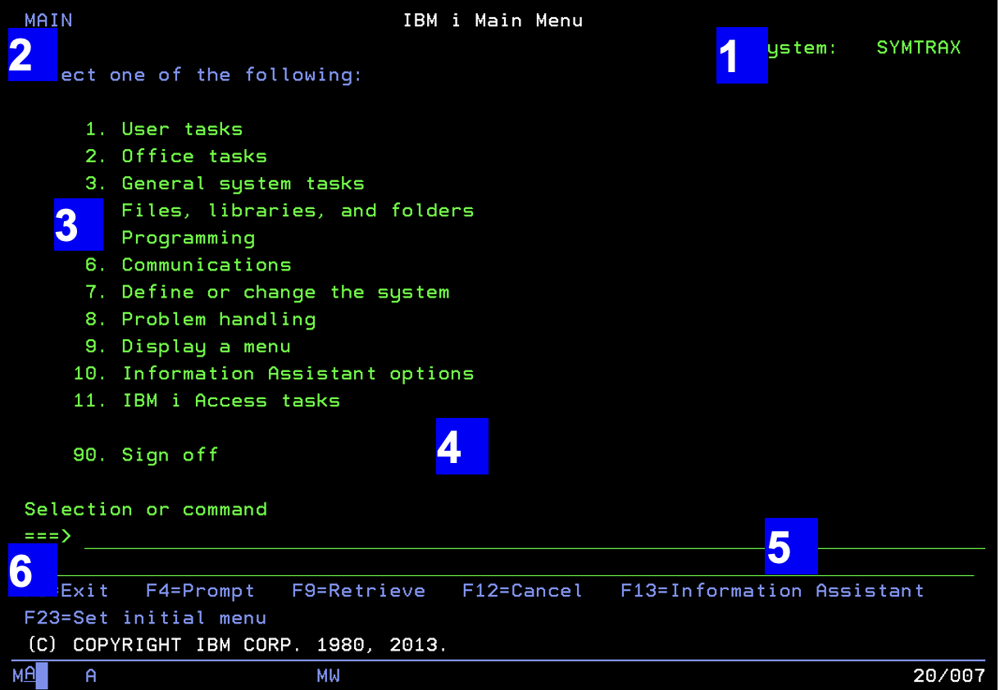


From the main menu (`MAIN`), navigate by typing the option number or a command on the command line (`===>`) and pressing Enter.

### Menu display anatomy

A 5250 menu screen has six labelled zones:

| Zone | Location | Purpose |
|------|----------|---------|
| **1 — Title** | Centre of top line | Name of the current menu |
| **2 — Menu ID** | Upper-left, CAPITALS | Short identifier; type it directly to jump here from anywhere |
| **3 — Options list** | Body | Numbered actions — type the number on the command line |
| **4 — Command line** | Bottom input area (`===>`) | Type option numbers, commands, or `GO menuname` |
| **5 — Function keys** | Below command line | Active keys for this screen; press `F24` to see more |
| **6 — Message line** | Very bottom | System messages and errors appear here |

### List display anatomy

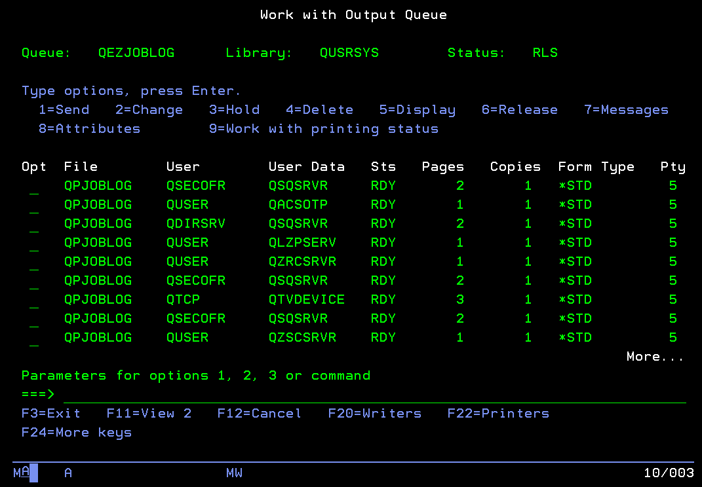

List screens (e.g. `WRKOBJ`, `WRKMBRPDM`, `WRKOUTQ`) follow the same pattern:

| Zone | Purpose |
|------|---------|
| **1 — Title** | Screen name |
| **2 — Positional field** | Jump directly to a row by typing the start of its name |
| **3 — Column headings** | Field labels |
| **4 — Option column (Opt)** | Type a number here beside any row to act on it (e.g. `5=Display`, `4=Delete`) |
| **5 — Command line** | Enter options or a command |
| **6 — Function keys** | `F3=Exit`, `F5=Refresh`, `F11=View 2`, `F12=Cancel` |

> **`F11 = View 2`** on many list screens reveals additional columns not visible in the default view.

### Essential keyboard shortcuts

| Key | Action |
|-----|--------|
| `F1` | Help |
| `F3` | Exit / back to previous menu |
| `F4` | Prompt — open a parameter list for the current command |
| `F9` | Retrieve previous command |
| `F12` | Cancel / previous screen |
| `F21` | Change assistance level for this session |
| `F24` | More function keys |
| `Shift + Fn` | `Fn + 12` (e.g. `Shift+F2 = F14`) |
| `Esc + Shift + Enter` | System Request — stop a job, open a second session |

### User assistance level

The assistance level controls how prompts and menus are displayed:

| Level | Command | Scope |
|-------|---------|-------|
| `*BASIC` | Simplified menus, fewer options | |
| `*INTERMED` | Default for programmers | |
| `*ADVANCED` | All options and parameters visible | |

```cl
CHGPRF ASTLVL(*ADVANCED)     -- set your own profile to Advanced
```
Press `F21` on most screens to change level for the current session only.

### Useful admin commands

```cl
CALL QCMD                  -- command entry with history and more space
GO ASSIST                  -- Operations Assistant menu
GO CMDXXX                  -- display all commands related to XXX (e.g. GO CMDLIB)
CRT*                       -- type CRT* then Enter to list all CREATE commands
GO PERFORM                 -- Performance Collection menu (with PF1 installed)

-- System status
WRKSYSSTS                  -- CPU, memory, jobs, disks
WRKDSKSTS                  -- disk utilisation
WRKSBS                     -- active subsystems

-- Subsystem lifecycle
ENDSBS *ALL                -- restricted state for maintenance (PTF, install, restore)
STRSBS QCTL               -- restart subsystems after maintenance
```

### CL command naming conventions

IBM i commands follow a consistent `VERBnounOBJECT` pattern:

| Prefix | Meaning | Example |
|--------|---------|---------|
| `WRK` | Work with (list + act) | `WRKUSRPRF`, `WRKOBJ` |
| `DSP` | Display (view details) | `DSPOBJD`, `DSPLIB` |
| `CRT` | Create | `CRTLIB`, `CRTPF` |
| `DLT` | Delete | `DLTLIB`, `DLTPGM` |
| `CHG` | Change | `CHGPRF`, `CHGJOB` |
| `SND` | Send | `SNDMSG`, `SNDBRKMSG` |
| `STR` | Start | `STRDBG`, `STRSBS` |
| `END` | End | `ENDSBS`, `ENDJOB` |

### Messaging commands

```cl
SNDMSG     MSG('text') TOUSR(USERNAME)     -- send a message to a user
SNDBRKMSG  MSG('ALERT') TOUSR(*ALLACT)    -- break-mode message to all active users
DSPMSG     MSGQ(QSYSOPR)                  -- display operator messages (hardware errors, licensing)
```

> In `DSPMSG`: press `F1` for message detail, `F10` to show the full message list.

---

## 11. RDi — Rational Developer for i

IBM introduced **RDi**, an Eclipse-based IDE that provides a modern editor while still working with QSYS source members.

**Key improvements over SEU:**
- Syntax highlighting and content assist
- Code navigation and outline view
- Remote debugging with visual breakpoints
- Direct integration with QSYS members over RSE

```
RDi (Eclipse) → SSH/RSE → IBM i
  → Open QSYS Member → Edit → Remote Compile → *PGM
```

---

## 12. VS Code + Code for IBM i

The current standard for modern IBM i development is **VS Code** with the **Code for IBM i** extension.

| Tool | Purpose |
|------|---------|
| VS Code | Code editor |
| Code for IBM i | IBM i integration — connect, browse, compile, debug |
| SSH | Secure connection to the system |
| IFS | File system used for source storage |

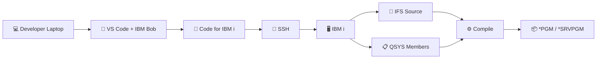
```mermaid
flowchart LR
    A["💻 Developer Laptop"] --> B["🎨 VS Code + IBM Bob"]
    B --> C["🔌 Code for IBM i"]
    C --> D["🔐 SSH"]
    D --> E["🖥️ IBM i"]
    E --> F["📁 IFS Source"]
    E --> G["📋 QSYS Members"]
    F --> H["⚙️ Compile"]
    G --> H
    H --> I["📦 *PGM / *SRVPGM"]
```

### What it looks like in practice

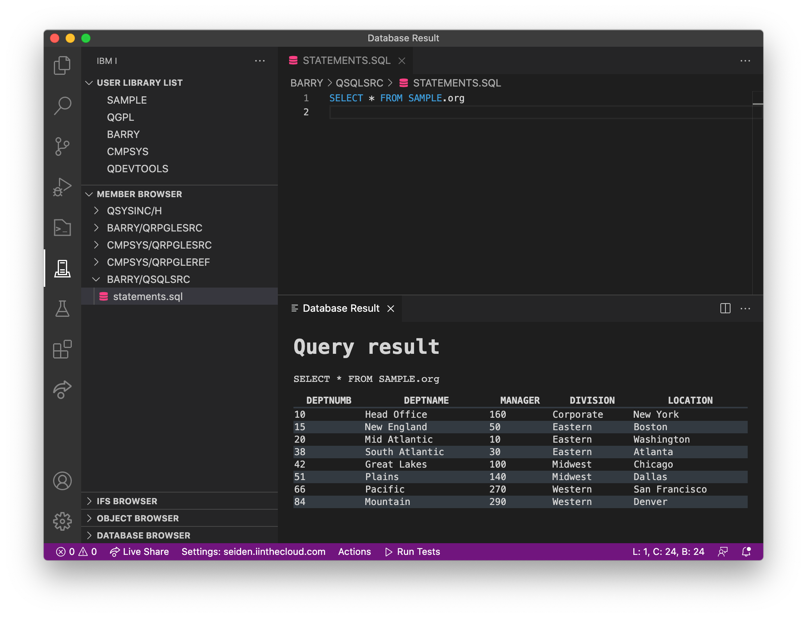

The left panel shows:
- **User Library List** — SAMPLE, QGPL, BARRY, CMPSYS, QDEVTOOLS
- **Member Browser** — browse QSYS source members from QRPGLESRC, QRPGLEREF, QSQLSRC
- **IFS Browser / Object Browser / Database Browser** — full IBM i object navigation

The right panel shows the integrated **SQL editor** (`STATEMENTS.SQL`) with immediate query execution (`SELECT * FROM SAMPLE.org`) and a live **Database Result** panel — no separate tool needed.

---

## 13. Development Approaches in VS Code

VS Code supports three source storage approaches:

### Approach 1 — IFS-Based (Recommended for new projects)

Source lives in `/home/dev/project/src/`. Full Git support. CI/CD friendly.

```
VS Code → Edit IFS file → CRTRPGMOD SRCSTMF('/home/dev/...') → *MODULE → CRTPGM
```

### Approach 2 — QSYS Member Editing

Edit traditional source members directly from VS Code via the Code for IBM i browser.

```
VS Code → Code for IBM i → QSYS Library → Source File → Member → Edit → Compile
```

### Approach 3 — Local + Sync

Source stored locally (and in Git), synchronized to the IBM i IFS or QSYS on push/deploy.

```
Local Files → Git → CI/CD → rsync/SFTP → IFS → Compile on IBM i
```

---

# Part IV — Compilation and Build

## 15. Source vs Object — What Compiling Means

On IBM i, **compiling is not simply saving**. It is the process of transforming source text (in a member or IFS file) into an executable or bindable object.

| Artifact | What it is |
|----------|-----------|
| Source member / IFS file | Text — can be read and changed |
| `*MODULE` | Compiled but not executable — must be bound |
| `*PGM` | Executable program |
| `*SRVPGM` | Shared library of exported procedures |

> The source can remain unchanged while the compiled object changes (e.g., after recompiling a dependency). Always recompile consumers after changing an interface.

```cl
CRTBNDRPG  PGM(MYLIB/ORDENT) SRCFILE(MYLIB/QRPGLESRC) SRCMBR(ORDENT) DBGVIEW(*SOURCE)
DSPPGM     PGM(MYLIB/ORDENT)   -- verify the result
```

---

## 16. OPM vs ILE Compilation Models

### OPM — Original Program Model

One source → one program. Simple, but no modularity or code sharing.

```
Source Member → CRTRPGPGM → *PGM
```

| Language | OPM Command |
|----------|------------|
| RPG | `CRTRPGPGM` |
| CL | `CRTCLPGM` |
| COBOL | `CRTCBLPGM` |

### ILE — Integrated Language Environment

Source → Module → Program or Service Program. Enables modularity, code sharing, and mixed-language programs.

```
Source → CRTxxxMOD → *MODULE → CRTPGM → *PGM
                             → CRTSRVPGM → *SRVPGM
```

| Language | Module Command |
|----------|---------------|
| RPG | `CRTRPGMOD` |
| SQLRPGLE | `CRTSQLRPGI` |
| COBOL | `CRTCBLMOD` |
| CL | `CRTCLMOD` |

**Shortcut for single-source ILE RPG programs:**
```cl
CRTBNDRPG PGM(MYLIB/ORDENT) SRCFILE(MYLIB/QRPGLESRC) SRCMBR(ORDENT)
```
`CRTBNDRPG` creates a module and binds it into a `*PGM` in one step.

### OPM vs ILE Summary

| Feature | OPM | ILE |
|---------|-----|-----|
| Compilation | One step | Multi-step |
| Modules | No | Yes |
| Code reuse | No | Yes — via `*SRVPGM` |
| Service Programs | No | Yes |
| Binding Directory | No | Yes |
| Flexibility | Low | High |

---

## 17. ILE Binding: Modules, Programs, Service Programs

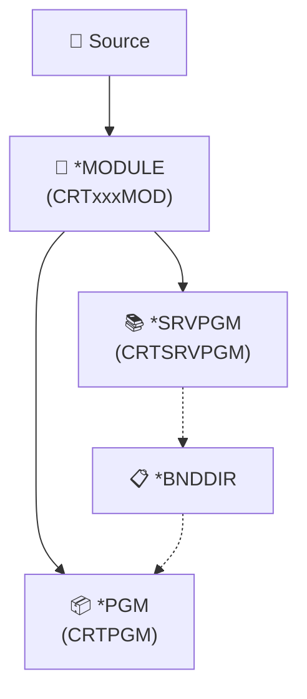
```mermaid
flowchart TD
    A["📄 Source"] --> B["🧩 *MODULE\n(CRTxxxMOD)"]
    B --> C["📦 *PGM\n(CRTPGM)"]
    B --> D["📚 *SRVPGM\n(CRTSRVPGM)"]
    D -.-> E["📋 *BNDDIR"]
    E -.-> C
```

**Explicit binding:**
```cl
CRTRPGMOD  MODULE(MYLIB/ORDMOD)  SRCFILE(MYLIB/QRPGLESRC) SRCMBR(ORDMOD)
CRTRPGMOD  MODULE(MYLIB/UTILMOD) SRCFILE(MYLIB/QRPGLESRC) SRCMBR(UTILMOD)
CRTPGM     PGM(MYLIB/ORDPGM) MODULE(MYLIB/ORDMOD MYLIB/UTILMOD)
```

**Service program:**
```cl
CRTRPGMOD  MODULE(MYLIB/CUSTMOD) SRCFILE(MYLIB/QRPGLESRC) SRCMBR(CUSTMOD)
CRTSRVPGM  SRVPGM(MYLIB/CUSTSRV) MODULE(MYLIB/CUSTMOD) SRCFILE(MYLIB/QSRVSRC) SRCMBR(CUSTSRV)
CRTPGM     PGM(MYLIB/APP) MODULE(MYLIB/APPMOD) BNDSRVPGM(MYLIB/CUSTSRV)
```

> A `*SRVPGM` is **not** directly callable via `CALL PGM(...)`. Its exported procedures are resolved by the binder and called from bound programs at near-zero overhead.

---

## 18. Binding Directories

A `*BNDDIR` is a dependency list used at bind time — it tells `CRTPGM` or `CRTSRVPGM` where to look for exported procedures from service programs and modules.

```cl
CRTPGM PGM(MYLIB/MYPGM)
       MODULE(MYLIB/MOD1)
       BNDDIR(MYLIB/MYBNDDIR)
```

What a `*BNDDIR` contains:
- References to `*SRVPGM` objects
- References to `*MODULE` objects
- The ordered list searched by the binder to locate exported procedure names

---

## 19. Binder Source and Export Control

Binder source controls **which procedures a service program exposes** and their **signature** (versioning). Disciplined signatures allow evolving a service program without breaking already-compiled consumers.

```
STRPGMEXP  PGMLVL(*CURRENT) SIGNATURE('CUSTSRV V1')
  EXPORT SYMBOL('GetCustomer')
  EXPORT SYMBOL('ValidateCustomer')
ENDPGMEXP
```

Retrieve binder source from an existing service program:
```cl
RTVBNDSRC SRVPGM(MYLIB/CUSTSRV) SRCFILE(MYLIB/QSRVSRC)
```

---

## 20. Build Command Quick Reference

Always use the application's official build options. Never recompile manually with different options from the build chain.

```cl
-- Create module
CRTRPGMOD  MODULE(MYLIB/CUSTMOD) SRCFILE(MYLIB/QRPGLESRC) SRCMBR(CUSTMOD)

-- Create service program
CRTSRVPGM  SRVPGM(MYLIB/CUSTSRV) MODULE(MYLIB/CUSTMOD) SRCFILE(MYLIB/QSRVSRC) SRCMBR(CUSTSRV)

-- Create bound program (single source)
CRTBNDRPG  PGM(MYLIB/ORDENT) SRCFILE(MYLIB/QRPGLESRC) SRCMBR(ORDENT) DBGVIEW(*SOURCE)

-- Create SQL RPG program
CRTSQLRPGI OBJ(MYLIB/SQLORD) SRCFILE(MYLIB/QRPGLESRC) SRCMBR(SQLORD) COMMIT(*CS)
```

**Core workflow to remember:**
1. `CRTxxxMOD` → create module
2. `CRTSRVPGM` → create reusable service program
3. `CRTPGM` → create executable program
4. `BNDDIR` → manage dependencies
5. `RTVBNDSRC` → inspect bindings

---

*End of Parts I–IV. Continued in the next section.*

---

# Part V — RPG Language: Legacy to Modern

## 21. The RPG Cycle

The RPG cycle is the logic the compiler automatically provides to an RPG program when it is written as a **cycle-main** program. In legacy RPG, understanding this cycle is essential: reading, field moving, calculations, and output can be triggered **without an explicit READ** in the C-specs.

> **Key Point:** Primary (P) and Secondary (S) indicate files whose input is controlled by the cycle. Full Procedural (F) means input operations are controlled explicitly by the program (READ, CHAIN).

### Cycle execution order

1. Process heading/detail outputs scheduled at this point.
2. Read the next record from the cycle-controlled file.
3. Set record identification and control-level indicators.
4. Execute Total calculations (L1–L9, LR, L0).
5. Produce Total output.
6. If LR is active, end the program.
7. Move fields from the selected record; set field indicators.
8. Execute Detail calculations; loop.

```rpg
FCLIENT  IP   E           K        DISK   * Primary file — cycle-controlled
FVENTES  IP   E           K        DISK   * Primary
FCLIENT  IS   E           K        DISK   * Secondary (multi-file)
FCLIENT  IF   E           K        DISK   * Full Procedural — explicit I/O
```

### Cycle indicators

| Indicator | Meaning |
|-----------|---------|
| `1P` | First page / first pass |
| `L1–L9` | Control-level — detect group changes, trigger Total |
| `LR` | Last Record — end of cycle, terminates the program |
| `RT` | Return condition |

```rpg
C   L1              EXSR      TOTALCLI
C   LR              EXSR      GRANDTOT
OQSYSPRT H  1P
O                         'SALES REPORT'
```

> **Maintenance rule:** Never modernize a cycle program immediately. Map first: P/S files, control fields, L1–L9 logic, O-spec outputs, LR conditions. Modernize only after you understand what the cycle is doing implicitly.

> **Common mistake:** Do not confuse the file *designation* (P/S/R/T/F) with the file *usage* (Input/Update/Output/Combined). These are different columns in the F-spec.

---

## 22. HFELICO — The Mental Map of Legacy RPG

HFELICO is the reading key for any RPG III / RPG/400 source member. It describes the order of the seven spec families:

| Spec | Name | Describes |
|------|------|-----------|
| **H** | Header/Control | Global program options |
| **F** | File Description | Files: database, printer, screen |
| **E** | Extension | Legacy arrays/tables, record-address files |
| **L** | Line Counter | Pagination for program-described PRINTER |
| **I** | Input | Input formats, field positions, control levels |
| **C** | Calculation | Logic, I/O operations, branches |
| **O** | Output | Output records and print lines |

A program does **not** need all seven. RPG IV eliminates E and L; fully free-form replaces H/F/D with CTL-OPT/DCL-F/DCL-S.

```
RPG III / RPG/400  →  H/F/E/L/I/C/O  (positional columns)
RPG IV fixed       →  H/F/D/I/C/O
RPG IV /free       →  free calculations, F/D still fixed
RPG fully-free     →  ctl-opt, dcl-f, dcl-s, dcl-proc
```

**IBM official RPG III example — all seven families:**

```rpg
H                                                                    TSTPGM
FFILE1   IF  E                    DISK
FQSYSPRT O   F     132     OF    LPRINTER
LQSYSPRT  60FL 56OL
E                    ARR1    3   3  1
IFORMAT1
I              OLDNAME                         NAME
C           ARR1,3    DSPLY
C                     READ FORMAT1                  01
C                     SETON                     LR
OQSYSPRT E   01           OUTPUT
O                         ARR2,3    10
```

**Method for reading a legacy member:**
1. H — note global options actually present
2. F — list files and their roles
3. E — identify legacy arrays/tables/RAF (not present in RPG IV)
4. L — check for historical PRINTER pagination
5. I — reconstruct input formats and fields
6. C — follow logic, indicators, I/O operations
7. O — reconstruct output records or lines

> RPG III and RPG IV layouts are **not compatible**. Never copy columns from one into the other.

---

## 23. H-spec and CTL-OPT

The H-spec (RPG IV fixed) and `CTL-OPT` (fully free) control program-wide options.

```rpg
H OPTION(*SRCSTMT:*NODEBUGIO)      // RPG IV fixed
```

```rpgle
**free
ctl-opt option(*srcstmt:*nodebugio) dftactgrp(*no) actgrp('MYAPP');
```

Common keywords:

| Keyword | Purpose |
|---------|---------|
| `DFTACTGRP(*NO)` | Use ILE activation group (required for service programs) |
| `ACTGRP('name')` | Named activation group |
| `OPTION(*SRCSTMT)` | Source-level debug info |
| `BNDDIR('MYBNDDIR')` | Default binding directory |
| `DATFMT(*ISO)` | Default date format |

---

## 24. F-spec and DCL-F — File Declarations

Always read file declarations **before** trying to understand any I/O operation. The file declaration defines what operations are allowed and what the data looks like.

### Legacy F-spec reading method

1. File name
2. Usage type (I=Input, U=Update, O=Output, C=Combined)
3. Designation (P/S/R/T/F or blank)
4. Externally described (`E`) or program-described
5. Keyed (`K`) or sequential
6. Device (DISK / WORKSTN / PRINTER / SEQ / SPECIAL)
7. Optional keywords (RENAME, PREFIX, INFDS, USROPN…)

```rpg
FCLIENT  IF   E           K        DISK        * Input, Full Procedural, Keyed
FCLIENTU UF   E           K        DISK        * Update
FREPORT  O    E                    PRINTER      * Output, printer
```

### Modern DCL-F

```rpgle
dcl-f CLIENTPF keyed
               usage(*input:*update)
               rename(CLIENTR:CLIR)
               prefix(C_)
               infds(ClientInfo)
               usropn;
```

| Element | Meaning |
|---------|---------|
| `KEYED` | Key access available |
| `USAGE(*INPUT:*UPDATE)` | Read and update permitted |
| `RENAME(CLIENTR:CLIR)` | Format CLIENTR called CLIR in this source |
| `PREFIX(C_)` | External fields get prefix C_ |
| `INFDS(ClientInfo)` | File status placed in ClientInfo DS |
| `USROPN` | Program does explicit OPEN/CLOSE |

**Pre-modification checklist:**
1. Which `*FILE` object will actually open?
2. Which record format is imported?
3. KEYED or sequential?
4. Exact USAGE: input/output/update/delete?
5. RENAME/PREFIX/QUALIFIED?
6. Override possible?
7. INFDS/INDDS/SFILE?
8. Commitment control?

---

## 25. Legacy Specs: E, L, I, O

### E-spec (Extension) — RPG III only

Used for arrays, tables, and record-address file definitions. Eliminated in RPG IV — replaced by D-spec/DCL-S.

```rpg
E                    ARR1    3   3  1   * 3-element packed(3:1) array
```
```rpgle
dcl-s arr1 packed(3:1) dim(3);         // Modern equivalent
```

### L-spec (Line Counter) — RPG III only

Configures printer form length and overflow for program-described PRINTER files. Eliminated in RPG IV — replaced by `FORMLEN`/`FORMOFL` on the F-spec.

```rpg
LQSYSPRT  60FL 56OL
```

### I-spec (Input)

For program-described files, maps record positions to field names. For externally described files, usually not needed.

```rpg
ICLIENTAA  01
I                                  1   7 CLIENTNO
I                                  8  37 NAME
```

### O-spec (Output)

Describes output records for program-described files. Essential for maintaining legacy reports.

```rpg
OQSYSPRT H  1P
O                         'CUSTOMER REPORT'
OQSYSPRT D
O                         CUSTNO
O                         NAME
```

---

## 26. C-spec and Free-Form Calculations

The C-spec is the heart of legacy logic. It contains factors, opcode, result, lengths/decimals, and indicators.

```rpg
C     QTE           MULT      PRIX          TOTAL
C                   IF        TOTAL > 1000
C                   SETON                                        50
C                   ENDIF
```

```rpgle
// Modern equivalent
total = qte * prix;
if total > 1000;
   bigCustomer = *on;
endif;
```

> Free-form makes intent more visible while preserving the same logic.

---

## 27. Mental Conversion: RPG III → RPG IV → Free-Form

### Why migrate — the business case

| Problem | Impact | Solution |
|---------|--------|---------|
| Fixed-format RPG | Hard to read, hard to onboard new developers | Convert to free-format |
| High code volume | No one understands it end-to-end | Invest in code understanding tools (Bob, ARCAD) |
| Mega-programs (10k+ lines) | Impossible to test or change safely | Refactor into focused modules |
| Spaghetti logic — GOTOs, indicators | Brittle, any change risks regression | Intelligent build + test coverage |
| Business logic embedded in screen I/O | Cannot expose as API or service | Extract into service programs |
| "Create it all" — no external libraries | Duplicated code, no reuse | Service consumption mindset |
| Source "where it always was" — QSYS members | No version history, no branching, no review | Move to Git |

> **Rule:** not all programs need to be modernized. Be targeted. Modernize what is being actively changed, what causes incidents, or what needs to be exposed as a service.

### The three layers of conversion

Safe modernization happens **in layers**. Never mix syntactic conversion and functional change in one step without solid tests.

1. **Preserve** the business rule exactly
2. **Replace** historical structures with readable forms
3. **Modularize**
4. **Consider** SQL or reusable service programs

```rpg
// RPG IV fixed
C     ClientNo      CHAIN     CLIR
```

```rpgle
// Free-form equivalent
chain clientNo CLIR;
if %found(CLIENTPF);
   processCustomer();
endif;
```

> Start by identifying the *business operation* (find a key), then translate the syntax.

---

## 28. \*\*FREE, DCL-S, DCL-DS, QUALIFIED

### Activating fully free-form

`**FREE` on the first line activates fully free-form. All declarations and calculations use free syntax — no column positions.

```rpgle
**free
ctl-opt dftactgrp(*no) option(*srcstmt);
dcl-f CUSTPF keyed usage(*input);
dcl-s customerId packed(7:0);
chain customerId CUSTREC;
*inlr = *on;
return;
```

### DCL-S — standalone field

```rpgle
dcl-s customerId packed(7:0)  inz(0);
dcl-s amount     packed(11:2) inz(0);
dcl-s name       varchar(50)  inz('');
dcl-s active     ind          inz(*off);
dcl-s today      date         inz(*sys);
```

Common types: `CHAR`, `VARCHAR`, `PACKED`, `ZONED`, `INT`, `UNS`, `IND`, `DATE`, `TIME`, `TIMESTAMP`, `POINTER`.

### DCL-DS — data structure

```rpgle
dcl-ds Order qualified inz;
   id         packed(9:0);
   customerId packed(7:0);
   amount     packed(11:2);
end-ds;
Order.id     = 50001;
Order.amount = 125.50;
```

`QUALIFIED` forces `Order.id` / `Order.amount` notation, making references explicit and avoiding name collisions.

### DS based on external definitions

```rpgle
dcl-ds CustomerTemplate qualified template;
   id   packed(7:0);
   name varchar(50);
end-ds;
dcl-ds CurrentCustomer likeds(CustomerTemplate);   // clone the DS shape
dcl-ds DbCustomer extname('MYLIB/CLIENTPF') qualified; end-ds;  // from file
```

- `LIKEDS` — clone a DS definition
- `LIKEREC` — base a DS on a record format
- `EXTNAME` — import field definitions from an external file

---

## 29. Control Flow: IF, SELECT, DOW, DOU, FOR

```rpgle
// Conditional
if amount <= 0;
   status = 'E';
elseif amount > creditLimit;
   status = 'H';
else;
   status = 'A';
endif;

// Multi-branch (cleaner than long elseif chains)
select;
when status = 'A'; processActive();
when status = 'H'; processHold();
other;             processOther();
endsl;

// Loops
dow not %eof(CUSTPF);    // while condition true
   read CUSTREC;
enddo;

dou valid;               // until condition true
   validate();
enddo;

for i = 1 to %elem(items);  // known count
   total += items(i);
endfor;
```

- `ITER` — skip to next iteration
- `LEAVE` — exit the loop

---

## 30. Procedures: DCL-PROC, DCL-PR, DCL-PI

### DCL-PROC — local procedure

```rpgle
dcl-proc CalcTax;
   dcl-pi *n packed(11:2);
      base packed(11:2) const;
      rate packed(5:4)  const;
   end-pi;
   return %dec(base * rate : 11 : 2);
end-proc;
```

- `DCL-PI` describes the procedure's own interface (parameters + return type)
- `RETURN` returns the value

### DCL-PR — prototype (call contract)

```rpgle
dcl-pr GetCustomerName varchar(50);
   customerId packed(7:0) const;
end-pr;
name = GetCustomerName(customerId);
```

The prototype lets the compiler verify the call signature at compile time.

### Parameter keywords

| Keyword | Meaning |
|---------|---------|
| `CONST` | Caller's variable protected — callee cannot modify it |
| `VALUE` | Passed by value, not by reference |
| `OPTIONS(*NOPASS)` | Parameter may be omitted |

```rpgle
dcl-pr SendNotice extpgm('SNDNOTICE');
   customerId packed(7:0)   const;
   mode       char(1)       value;
   note       varchar(100)  const options(*nopass);
end-pr;
```

### EXSR subroutines — understand before replacing

`BEGSR`/`EXSR`/`ENDSR` is still common in legacy code. A subroutine shares the full program context with no interface — it cannot have local variables or parameters. For new code, prefer `DCL-PROC`.

```rpgle
exsr ValidateOrder;
begsr ValidateOrder;
   if amount <= 0;
      error = *on;
   endif;
endsr;
```

---

## 31. Calls: RPG→RPG, RPG→CL, CL→RPG

### RPG calling RPG

```rpgle
dcl-pr PriceOrder extpgm('PRICEORD');
   orderId packed(9:0)  const;
   total   packed(11:2);
end-pr;
PriceOrder(orderId : total);
```

### RPG calling CL

```rpgle
dcl-pr BuildReport extpgm('BLDRPTCL');
   customerId packed(7:0) const;
end-pr;
BuildReport(customerId);
```

### CL calling RPG

```cl
PGM PARM(&CUSTID)
   DCL VAR(&CUSTID) TYPE(*DEC) LEN(7 0)
   CALL PGM(MYLIB/CUSTRPG) PARM(&CUSTID)
ENDPGM
```

> The CL parameter type/length must match exactly the RPG DCL-PI definition.

---

## 32. ILE Modularity in RPG

See also Part IV for build commands. In RPG:

```rpgle
// In the calling program: prototype bound via BNDDIR or BNDSRVPGM
dcl-pr ValidateCustomer ind extproc('ValidateCustomer');
   id packed(7:0) const;
end-pr;

// In the service program source
dcl-proc ValidateCustomer export;
   dcl-pi *n ind;
      id packed(7:0) const;
   end-pi;
   // ...validation logic...
   return id > 0;
end-proc;
```

`EXPORT` makes the procedure available outside the module.

---

## 33. Exception Handling: MONITOR / ON-ERROR

```rpgle
monitor;
   amount = %dec(inputText : 11 : 2);
on-error 00105;
   errorMsg = 'Invalid numeric value';
on-error;
   errorMsg = 'Unexpected error';
endmon;
```

- A specific `ON-ERROR` status must precede the catch-all `ON-ERROR`
- The `(E)` extender on I/O operations enables `%ERROR`/`%STATUS` testing instead

### PSDS and INFDS for diagnostics

```rpgle
dcl-ds PgmStatus psds qualified;
   program *proc;
   status  *status;
   routine *routine;
end-ds;

dcl-f CUSTPF keyed usage(*input) infds(FileInfo);
dcl-ds FileInfo qualified;
   status  zoned(5:0) pos(11);
   opCode  char(6)    pos(16);
end-ds;
```

> Use predefined keywords (`*PROC`, `*STATUS`, `*ROUTINE`, `*FILE`, `*OPCODE`) where possible. Use `POS()` only for documented zones without a predefined keyword.

---

## 34. Built-In Functions (BIFs)

### Type conversion

```rpgle
text          = %char(amount);          // numeric → string
amount        = %dec(inputText : 11 : 2); // string → packed
whole         = %int(amount);           // → integer
unsignedValue = %uns(positiveText);     // → unsigned
```

### String manipulation

```rpgle
name    = %trim(rawName);               // remove leading/trailing spaces
prefix  = %subst(code : 1 : 3);        // extract 3 chars from pos 1
pos     = %scan('-' : code);           // find position of '-'
newText = %replace('QC' : province : 1 : 2); // replace 2 chars at pos 1
```

> Always validate bounds before `%SUBST`/`%REPLACE` when positions come from external data.

### File status BIFs

```rpgle
chain customerId CUSTREC;
if %found(CUSTPF);     // true if CHAIN found a record
endif;
read CUSTREC;
if %eof(CUSTPF);       // true after READ past last record
endif;
setll customerId CUSTREC;
if %equal(CUSTPF);     // true if exact key match after SETLL
endif;
status = %status(CUSTPF);  // numeric file status code
```

> Always qualify `%FOUND` and `%EOF` with the file name to avoid ambiguity after multiple I/O operations.

---

## 35. Arrays, Dates, and Other Types

### Arrays

```rpgle
dcl-s codes char(3) dim(5) inz('A01':'B02':'C03':'D04':'E05');
count = %elem(codes);
idx   = %lookup('C03' : codes);
sorta codes;
for i = 1 to %elem(codes);
   dsply codes(i);
endfor;
```

- `%ELEM` — number of elements
- `%LOOKUP` — returns position found or 0
- `SORTA` — sort the array

### Dates and times

Use `DATE`, `TIME`, `TIMESTAMP` types — not strings.

```rpgle
dcl-s today date inz(*sys);
dcl-s due   date;
due      = today + %days(30);
daysLate = %diff(today : due : *days);
stamp    = %timestamp();
```

---

# Part VI — Files, I/O and DDS

## 36. RPG File Types Overview

| Device | Used for |
|--------|---------|
| `DISK` | Db2 for i database — physical files, logical files |
| `WORKSTN` | 5250 display file (DSPF), ICF |
| `PRINTER` | Report output — printer file (PRTF), spool |
| `SEQ` | Sequential stream — device determined at runtime |
| `SPECIAL` | Custom I/O — delegated to a user-written program |

The device determines which operations and keywords are available.

---

## 37. Sequential and Keyed DISK Files

### Sequential read

```rpgle
dcl-f CLIENTPF usage(*input);
read CLIENTR;
dow not %eof(CLIENTPF);
   processCustomer();
   read CLIENTR;
enddo;
```

### Keyed access

```rpgle
dcl-f CLIENTPF keyed usage(*input);
chain clientNo CLIENTR;
if %found(CLIENTPF);
   dsply NAME;
endif;
```

---

## 38. Key Operations: SETLL, SETGT, READE, READPE, CHAIN

| Operation | Behaviour |
|-----------|-----------|
| `CHAIN key REC` | Direct read — position and read in one step |
| `SETLL key REC` | Position to first record with key **>=** search key |
| `SETGT key REC` | Position after all records with key **<=** search key (strictly greater) |
| `READE key REC` | Read next record with key **equal** to search key (forward) |
| `READPE key REC` | Read previous record with key **equal** to search key (backward) |
| `READ REC` | Read next record sequentially |
| `READP REC` | Read previous record sequentially |

```rpgle
// Pattern: traverse all records for a key
setll customerId ORDERREC;
reade customerId ORDERREC;
dow not %eof(ORDERPF);
   total += AMOUNT;
   reade customerId ORDERREC;
enddo;
```

### CHAIN with lock control

```rpgle
chain customerId CUSTOMER;           // locks for update (file open *UPDATE)
if %found(CUSTPF);
   STATUS = 'A';
   update CUSTOMER;
endif;

chain(n) customerId CUSTOMER;        // (N) = no lock — read-only intent
```

> Use `(N)` only if no update of the read record is needed.

---

## 39. WRITE, UPDATE, DELETE

```rpgle
// Add a new record
clear CUSTREC;
CUSTNO = 1001;
NAME   = 'ABC INC';
write CUSTREC;

// Update current record (must be locked via CHAIN or READ on *UPDATE file)
chain 1001 CUSTREC;
if %found(CUSTPF);
   NAME = 'ABC INC 2';
   update CUSTREC;
endif;

// Delete current record
chain 1001 CUSTREC;
if %found(CUSTPF);
   delete CUSTREC;
endif;
```

> Always test `%ERROR`/`%STATUS` when using the `(E)` extender. UPDATE requires a prior successful CHAIN or READ that left the record locked.

---

## 40. Externally Described vs Program-Described

| Model | How it works |
|-------|-------------|
| **Externally described** | Format and field definitions come from the DDS/SQL object — no I-spec or O-spec needed |
| **Program-described** | Fields mapped inside the program via I-spec (input) or O-spec (output) |

External description is strongly preferred: field attributes are defined once in DDS/SQL and automatically imported by every program that uses the file.

```rpgle
dcl-f CLIENTPF keyed usage(*input);
// CLIENTNO, NAME, STATUS automatically imported from CLIENTPF
chain clientNo CLIENTR;
dsply NAME;
```

---

## 41. Record Formats, RENAME, PREFIX, QUALIFIED

### Why record formats matter

I/O operations (CHAIN, READ, WRITE, UPDATE, DELETE) target a **record format**, not just the file name. When two files share a format name, or the format name equals the file name, conflicts arise.

### RENAME — rename a format for this source

```rpgle
dcl-f CLIENTPF keyed usage(*input:*update)
               rename(CLIENTR:CLIR);   // CLIENTR → CLIR internally
chain clientNo CLIR;
update CLIR;
```

The file on IBM i (`CLIENTPF`) and its external format (`CLIENTR`) are **not changed** — only the name used in this source changes.

### PREFIX — avoid field name collisions

```rpgle
dcl-f CUSTOMER keyed usage(*input) prefix(C_);
dcl-f VENDOR   keyed usage(*input) prefix(V_);
// C_NAME and V_NAME are now distinct fields
dsply (C_NAME + ' / ' + V_NAME);
```

### QUALIFIED — format-level name qualification

```rpgle
dcl-f FILE1 extdesc('MYLIB/MYFILE') qualified;
dcl-f FILE2 extdesc('MYLIB/MYFILE') qualified;
// FILE1.MYFMT and FILE2.MYFMT are distinct despite same external name
update FILE1.MYFMT;
```

### INCLUDE / IGNORE — control visible formats

```rpgle
dcl-f MENUDSP workstn include(MENU01:MSG01);  // only these formats
dcl-f OLDDSP  workstn ignore(OLDREC);          // exclude OLDREC
```

---

## 42. INFDS, USROPN, Overrides, and Level Checking

### INFDS — file information data structure

```rpgle
dcl-f CLIENTPF keyed usage(*input) infds(FileInfo);
dcl-ds FileInfo qualified;
   status  zoned(5:0) pos(11);
   opCode  char(6)    pos(16);
end-ds;
chain clientNo CLIENTR;
if FileInfo.status <> 0;
   dsply ('File status: ' + %char(FileInfo.status));
endif;
```

### USROPN — explicit open/close

```rpgle
dcl-f CLIENTPF keyed usage(*input) usropn;
// prepare overrides before opening
open CLIENTPF;
chain clientNo CLIENTR;
close CLIENTPF;
```

### Overrides — redirect without recompiling

```cl
OVRDBF FILE(CLIENTPF) TOFILE(TESTDATA/CLIENTPF)
CALL PGM(MYLIB/CLIENTRPG)
DLTOVR FILE(CLIENTPF)
```

The program still references `CLIENTPF`; the override redirects I/O to `TESTDATA/CLIENTPF` within the job's scope.

### Level checking

The system compares the record level identifier stored at compile time with the current object. An incompatible format change causes a **level check error** at runtime. The remedy is to recompile all consumers — not to disable the check.

```cl
DSPFD FILE(MYLIB/CLIENTPF) TYPE(*RCDFMT)   // show current level ID
```

### EXTFILE, EXTDESC, EXTMBR — runtime file selection

```rpgle
dcl-s fileName varchar(21) inz('');
dcl-f INPUT disk(*ext)
            usage(*input)
            extdesc('PRODLIB/CLIENTPF')   // compile-time field defs
            extfile(fileName)              // runtime file name
            usropn;
fileName = 'TESTLIB/CLIENTPF';
open INPUT;
```

---

## 43. Display Files (DSPF) and Subfiles

### DSPF architecture

```
DSPF CUSTDSP
  ├─ Record format CUSTCTL   (main screen / control)
  ├─ Record format CUSTSFL   (subfile — one line per row)
  └─ Record format MSG01     (message overlay)
```

RPG declares a WORKSTN file and interacts via EXFMT/WRITE/READ:

```rpgle
dcl-f CUSTDSP workstn
              indds(Keys)
              sfile(CUSTSFL:rrn);
dcl-ds Keys qualified;
   Exit    ind pos(3);
   Refresh ind pos(5);
   Add     ind pos(6);
end-ds;
```

### EXFMT — write then read

```rpgle
dou Keys.Exit;
   exfmt CUST01;          // write format + wait for input
   if CUSTNO > 0;
      chain CUSTNO CUSTREC;
      if %found(CUSTPF); NAME = C_NAME; endif;
   endif;
enddo;
```

### Subfile — load, display, process changes

```rpgle
// Load
rrn = 0;
setll *loval CUSTREC;
read CUSTREC;
dow not %eof(CUSTPF) and rrn < 9999;
   rrn    += 1;
   SFLCUST = CUSTNO;
   SFLNAME = NAME;
   write CUSTSFL;
   read CUSTREC;
enddo;
exfmt CUSTCTL;

// Process changes
readc CUSTSFL;
dow not %eof(CUSTDSP);
   if SFLSEL = 'X'; processSelected(SFLCUST); endif;
   readc CUSTSFL;
enddo;
```

### Subfile DDS skeleton

```dds
A          R CUSTSFL                   SFL
A            SFLSEL         1A  B  8  2
A            SFLCUST        7Y 0O  8  5
A            SFLNAME       30A  O  8 15
A          R CUSTCTL                   SFLCTL(CUSTSFL)
A                                      SFLPAG(12)
A                                      SFLSIZ(9999)
A                                      CF03(03 'Exit')
```

### Complete interactive control flow

```rpgle
dou Keys.Exit;
   clearSubfile();
   loadSubfile();
   exfmt CUSTCTL;
   readChangedRows();
enddo;
```

### Common DSPF errors

- Wrong `SFLDSPCTL` indicator — subfile never displays
- RRN not reset to 0 before reload
- `SFLCLR` sequenced before `SFLDSP` — clears what was just displayed
- DSPF recompiled without recompiling RPG → level check at runtime
- Format collision — two files share a format name; use RENAME or QUALIFIED

---

## 44. Printer Files and Spooled Files

### External PRTF — preferred

Layout in DDS; RPG provides data.

```dds
A          R DETAIL
A            RPTCUST        7Y 0O     5  2
A            RPTNAME       30A  O     5 12
A            RPTAMT        11Y 2O     5 50EDTCDE(J)
```

```rpgle
dcl-f SALESRPT printer;
for i = 1 to %elem(lines);
   ITEM   = lines(i).item;
   AMOUNT = lines(i).amount;
   write DETAIL;
endfor;
```

### Program-described PRTF — legacy

```rpg
OQSYSPRT H  1P
O                         'CUSTOMER REPORT'
OQSYSPRT D
O                         CUSTNO
O                         NAME
```

The L-spec configured form length (eliminated in RPG IV, replaced by `FORMLEN`/`FORMOFL`).

### Spool diagnostics

```cl
WRKSPLF    SELECT(*CURRENT)
WRKOUTQ    OUTQ(QGPL/QPRINT)
DSPSPLF    FILE(QSYSPRT) SPLNBR(*LAST)
```

### Batch report pattern — CL + RPG + PRTF

```cl
PGM
   OVRPRTF FILE(SALESRPT) OUTQ(MYLIB/REPORTQ)
   CALL PGM(MYLIB/SALESRPG)
   MONMSG MSGID(CPF0000) EXEC(DO)
      SNDPGMMSG MSG('SALESRPG failed') MSGTYPE(*ESCAPE)
   ENDDO
ENDPGM
```

---

## 45. DCL-F Complete Reference

A fully annotated DCL-F declaration:

```rpgle
dcl-f CLIENTPF keyed
               usage(*input:*update)
               rename(CLIENTR:CLIR)
               prefix(C_)
               infds(ClientInfo)
               usropn;
```

| Element | Meaning |
|---------|---------|
| `CLIENTPF` | File name in the program (IBM i object to open) |
| `KEYED` | Key access: CHAIN, SETLL, SETGT, READE, READPE |
| `USAGE(*INPUT:*UPDATE)` | Read and update permitted |
| `RENAME(CLIENTR:CLIR)` | External format CLIENTR → called CLIR here |
| `PREFIX(C_)` | All external fields prefixed with C_ |
| `INFDS(ClientInfo)` | File status/context placed in ClientInfo DS |
| `USROPN` | Explicit OPEN/CLOSE required |

Reading rule: 1) file name → 2) access type → 3) allowed operations → 4) record format name → 5) field name transforms → 6) open/diagnostic options.

---

# Part VII — SQL and Db2 for i

## 45b. Db2 for i — Platform Positioning

### The DB2 family

Db2 for i is one of three members of the IBM DB2 family:

| Platform | Product |
|----------|---------|
| IBM i | **DB2 for i** — fully integrated, nothing to install |
| IBM z/OS | DB2 for z/OS |
| Linux / UNIX / Windows | DB2 for LUW |

SQL language, design algorithms, and code are selectively shared across the three platforms via an Information Management Architecture Board and SQL Language Council. Cross-platform compatibility is actively maintained.

### Why clients value DB2 for i

- **It's always there** — no installation, no DBA tasks for space allocation, index balance, statistics updates or application rebinding. The OS and database manage each other.
- **OS leverages the database** — system catalogue, security, journaling are all database-backed
- **Database leverages the OS** — storage management, virtualization, backup/restore are OS-integrated
- **Synchronised security** — OS profiles and database permissions are the same object
- **Focus on business** — less time on infrastructure, more on application value

### ISO/ANSI SQL standards compliance

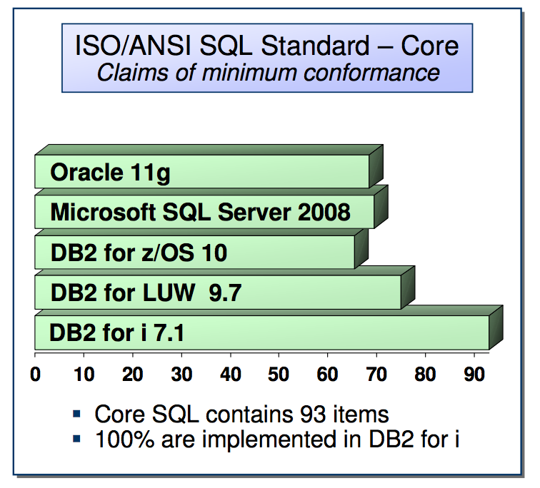

DB2 for i implements **100% of the 93 ISO/ANSI SQL Core items** — more than Oracle, SQL Server, or DB2 for LUW/z/OS at the time of this comparison.

### Accessing DB2 for i from anywhere

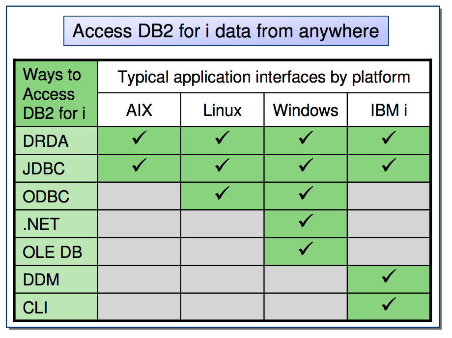

In addition to native RPG, COBOL, C and C++ embedded SQL, DB2 for i can be reached via:

| Interface | Platforms |
|-----------|----------|
| DRDA | AIX, Linux, Windows, IBM i |
| JDBC | AIX, Linux, Windows, IBM i |
| ODBC | Linux, Windows |
| .NET | Windows |
| OLE DB | Windows |
| DDM | IBM i |
| CLI | IBM i |

### SQL terminology vs IBM i native terminology

When moving from native IBM i I/O (RLA — Record Level Access) to SQL, these two naming worlds map directly:


| SQL term | IBM i native term |
|----------|-----------------|
| Schema / Collection | Library |
| Table | Physical file (PF) |
| View | Logical file (LF) |
| Index | Keyed logical file |
| Row | Record |
| Column | Field |
| Log | Journal |

> An SQL `CREATE TABLE` creates the same underlying object as a DDS `CRTPF` — the file exists once, accessible via both interfaces. Migrating to DDL does not require migrating your application code immediately.

---

## 46. Why SQLRPGLE

Db2 for i is built into the platform — no external database server. SQL tables and traditional physical/logical files coexist. Use SQL when the problem calls for:

| Use SQL | Use native I/O |
|---------|---------------|
| Joins, aggregations | Direct key access (CHAIN) |
| Set-based updates/deletes | Ordered traversal (SETLL/READE) |
| Complex filtering | Legacy code compatibility |
| Subqueries, CTEs | Subfile loading from indexed file |

> Best practice: master both. The choice depends on the problem.

---

## 47. SELECT INTO and SQLSTATE

```rpgle
exec sql
   select name, status
     into :name, :status      // RPG host variables
     from customer
    where customer_id = :customerId;
if sqlstate = '02000';
   found = *off;               // no row
elseif sqlstate <> '00000';
   // log error
endif;
```

| SQLSTATE | Meaning |
|----------|---------|
| `'00000'` | Success |
| `'02000'` | No rows found (SELECT INTO, FETCH) |
| Other | Error — handle explicitly |

---

## 48. SQL Cursors

For multi-row result sets processed one row at a time:

```rpgle
exec sql declare C1 cursor for
   select customer_id, name from customer order by customer_id;
exec sql open C1;
dou sqlstate = '02000';
   exec sql fetch next from C1 into :customerId, :name;
   if sqlstate = '00000';
      processRow();
   endif;
enddo;
exec sql close C1;
```

> Test SQLSTATE **after** FETCH, before using the variables — the last FETCH that returns `'02000'` should not process data.

---

## 49. DML: INSERT, UPDATE, DELETE

```rpgle
exec sql insert into customer(customer_id, name) values(:id, :name);
exec sql update customer set status = :status where customer_id = :id;
exec sql delete from customer where customer_id = :id;
```

> An incorrect WHERE clause can affect many rows. Always validate input and check SQLSTATE/SQLCODE after critical operations.

---

## 50. Commitment Control

COMMIT/ROLLBACK only make sense within a configured transactional strategy. The unit of work must be defined functionally: **which changes must succeed or fail together?**

```rpgle
exec sql set option commit = *cs;
exec sql update orders set status = 'C' where order_id = :orderId;
exec sql update stock  set qty = qty - :qty where item_id = :itemId;
if sqlstate = '00000';
   exec sql commit;
else;
   exec sql rollback;
endif;
```

```rpgle
// Native commitment control on files
dcl-f ORDER keyed usage(*input:*update) commit;
dcl-f STOCK keyed usage(*input:*update) commit;
chain orderNo ORDREC;
STATUS = 'C'; update ORDREC;
chain itemNo STKREC;
QTY -= orderQty; update STKREC;
commit;
```

> Commitment control requires journaled objects and a configured commit scope. COMMIT/ROLLBACK alone are not sufficient.

---

# Part VIII — CL

## 51. CL and RPG — Two Complementary Roles

| CL orchestrates | RPG carries |
|----------------|------------|
| Library list | Business logic |
| File/printer overrides | Data access (I/O) |
| Job submission | Calculations |
| Message handling | Screen interaction |
| Environment setup | Report generation |

A compiled CL is a `*PGM` — it can call RPG, and RPG can call it.

---

## 52. CL Variables, IF, DO, MONMSG

```cl
PGM PARM(&ENV)
   DCL VAR(&ENV)    TYPE(*CHAR) LEN(4)
   DCL VAR(&CUSTID) TYPE(*DEC)  LEN(7 0)
   IF COND(&ENV *EQ 'TEST') THEN(DO)
      ADDLIBLE LIB(APPLTEST)
   ENDDO
   CALL PGM(APP/MAIN) PARM(&CUSTID)
   MONMSG MSGID(CPF0000) EXEC(SNDPGMMSG MSG('APP Error') MSGTYPE(*ESCAPE))
ENDPGM
```

- `DCL` — declare variable
- `CHGVAR` — assign/calculate
- `IF/DO/ENDDO` — conditional block
- `MONMSG` — intercept a message ID (like a try/catch)

> Place `MONMSG` carefully — an overly broad generic MONMSG at program level can swallow important diagnostic messages.

---

## 53. Overrides, Library List, and SBMJOB

### Overrides — redirect without recompiling

```cl
ADDLIBLE LIB(TESTDATA)                          // add to library list
OVRDBF FILE(CLIENTPF) TOFILE(TESTDATA/CLIENTPF) // redirect database file
OVRPRTF FILE(SALESRPT) OUTQ(TESTOUTQ)           // redirect printer file
CALL PGM(MYLIB/SALESRPG)
DLTOVR FILE(CLIENTPF)                           // remove when done
DLTOVR FILE(SALESRPT)
```

Overrides are scoped to the job (and optionally to a call level). An invisible active override is a classic cause of hard-to-diagnose behavior.

### SBMJOB — submit batch job

```cl
SBMJOB CMD(CALL PGM(MYLIB/NIGHTLY)) JOB(NIGHTLY) JOBQ(QBATCH)
WRKJOBQ JOBQ(QBATCH)
WRKACTJOB SBS(QBATCH)
```

The submitted job has its own library list, overrides, and job log. Ensure the job description and job queue are configured correctly for the expected environment.

---

*End of Parts V–VIII. Continued in the final section.*

---

# Part IX — Debugging

## 54. Professional Debug Method

Before touching any code, follow this sequence:

1. **Reproduce** the issue in a controlled environment
2. **Identify the exact object** — which `*PGM`, which `*SRVPGM`, which module
3. **Read the joblog** — `DSPJOBLOG` is the first source of truth
4. **Verify parameters and environment** — library list, overrides, data
5. **Place the breakpoint before the first incorrect data** — not where you think the bug is
6. **Never modify a critical production program randomly**

> Always check the joblog before changing code. Many apparent RPG bugs are actually environment issues: wrong library resolved, override still active, wrong activation group.

---

## 55. Traditional STRDBG

The classic approach uses `STRDBG` on a 5250 terminal or from a command line.

```cl
STRDBG PGM(MYLIB/ORDENT) UPDPROD(*YES)   -- start debug session
ADDPGM PGM(MYLIB/SUBPGM)                 -- add another program to debug
ADDSRVPGM SRVPGM(MYLIB/MYSRVPGM)         -- add a service program

-- Inside the debugger:
BREAK 100                                  -- set breakpoint at line 100
BREAK 100 WHEN(customerID = 12345)         -- conditional breakpoint
CALL PGM(MYLIB/ORDENT)                     -- run until breakpoint
DISPLAY VARIABLE(customerName)             -- inspect variable
EVAL totalAmount                           -- evaluate expression
STEP                                       -- step one line
ENDDBG                                     -- end session
```

Key commands summary:

| Command | Purpose |
|---------|---------|
| `STRDBG` | Start debug session |
| `ENDDBG` | End debug session |
| `ADDPGM` | Add program to session |
| `ADDSRVPGM` | Add service program to session |
| `BREAK` | Set breakpoint (with optional condition) |
| `STEP` | Step through code one line |
| `DISPLAY` | Display variable value |
| `EVAL` | Evaluate expression |
| `WATCH` | Watch a variable for changes |

> **UPDPROD(\*YES)** is required to debug in production — it is a sensitive decision. Always prefer a test environment with a copy of the data.

### Debug multiple programs

```cl
STRDBG PGM(MYLIB/MAINPGM) UPDPROD(*YES)
ADDPGM PGM(MYLIB/SUBPGM1)
ADDPGM PGM(MYLIB/SUBPGM2)
BREAK SRVPGM(MYLIB/MYSRVPGM) PROCEDURE(calculateTotal)
```

### Compile for source-level debugging

```cl
CRTRPGMOD MODULE(MYLIB/MYMOD)
          SRCFILE(MYLIB/QRPGLESRC)
          SRCMBR(MYMOD)
          DBGVIEW(*SOURCE)              -- required for line-level breakpoints
```

---

## 56. Modern Debugging in VS Code

VS Code + Code for IBM i provides graphical debugging with visual breakpoints, variable panels, and call stack view.

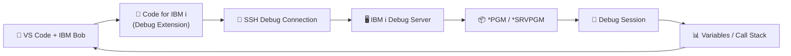
```mermaid
flowchart LR
    A["🎨 VS Code + IBM Bob"] --> B["🔌 Code for IBM i\n(Debug Extension)"]
    B --> C["🔐 SSH Debug Connection"]
    C --> D["🖥️ IBM i Debug Server"]
    D --> E["📦 *PGM / *SRVPGM"]
    E --> F["🐛 Debug Session"]
    F --> G["📊 Variables / Call Stack"]
    G --> A
```

| Feature | STRDBG | RDi | VS Code |
|---------|--------|-----|---------|
| Interface | Text-based | Graphical | Graphical |
| Breakpoints | Command-based | Visual | Visual |
| Variable watch | Manual | Automatic | Automatic |
| Call stack | Text | Visual tree | Visual tree |
| Conditional break | Yes | Yes | Yes |
| Remote debug | N/A | Yes | Yes |
| Learning curve | Steep | Moderate | Easy |

---

## 57. PSDS, INFDS, and Diagnostics

When a program fails silently, structured diagnostic data structures give you exact context.

```rpgle
// Program Status Data Structure — always available
dcl-ds PgmStatus psds qualified;
   program *proc;      // procedure name
   status  *status;    // program status code
   routine *routine;   // current routine
end-ds;

// File Information Data Structure — per file
dcl-f CUSTPF keyed usage(*input) infds(FileInfo);
dcl-ds FileInfo qualified;
   status  zoned(5:0) pos(11);   // file status code
   opCode  char(6)    pos(16);   // last operation (CHAIN, READ, etc.)
end-ds;
```

Use these in `ON-ERROR` or `MONITOR` blocks to log the exact failing context before escalating the error.

---

## 58. DSPPGMREF — Mapping Dependencies

Before modifying a file, procedure, or program interface, map what depends on it.

```cl
-- All references for one program (to screen)
DSPPGMREF PGM(MYLIB/ORDENT)

-- All programs in a library → outfile for analysis
DSPPGMREF PGM(MYLIB/*ALL) OUTPUT(*OUTFILE) OUTFILE(QTEMP/PGMREF)
RUNQRY QRYFILE((QTEMP/PGMREF))

-- Service program imports/exports
DSPSRVPGM SRVPGM(MYLIB/CUSTSRV) DETAIL(*PROCEXP)

-- Module imports
DSPMOD MODULE(MYLIB/CUSTMOD) DETAIL(*IMPORT)
```

The outfile approach lets you query references as data — useful for impact analysis before a schema change or interface update.

---

# Part X — Source Code Management and DevOps

## 59. Native IBM i SCM

IBM i provides basic source management through native commands.

| Command | Purpose |
|---------|---------|
| `SAVOBJ` | Save objects to a save file |
| `RSTOBJ` | Restore objects from a save file |
| `CHGOBJD` | Change object description (track changes manually) |
| `DSPOBJD` | Display object description / metadata |
| `CMPPFM` | Compare two source physical file members |

**Limitations:**
- No version history
- No branching or merging
- Manual change tracking
- No automated deployment
- Difficult rollback

These native tools are a starting point, not a strategy. Modern IBM i shops use Git-based workflows or enterprise SCM tools.

---

## 60. Enterprise SCM Tools

For organizations with extensive QSYS-based applications, specialized IBM i SCM tools provide full change management:

| Tool | Vendor | Key Strengths |
|------|--------|---------------|
| **Aldon LMi** | Rocket Software | Change request management, approval workflows, audit trails |
| **ARCAD for DevOps** | ARCAD | Native Git integration, CI/CD pipeline, code analysis |
| **TD/OMS (Turnover)** | Remain Software | Object-level version control, promotion paths |
| **MDCMS** | Midrange Dynamics | Change tracking, environment management |

All major tools provide both RDi and VS Code integration.

---

## 61. Git-Based Workflows on IBM i

Modern teams use Git directly for IBM i development, especially with IFS-based source.

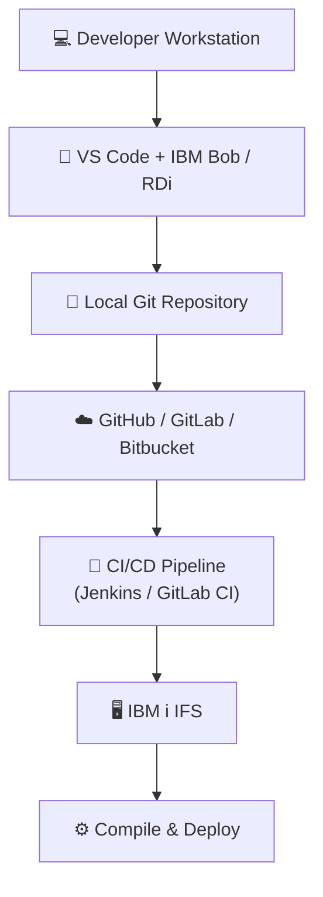
```mermaid
flowchart TD
    A["💻 Developer Workstation"] --> B["🎨 VS Code + IBM Bob / RDi"]
    B --> C["🔀 Local Git Repository"]
    C --> D["☁️ GitHub / GitLab / Bitbucket"]
    D --> E["🔄 CI/CD Pipeline\n(Jenkins / GitLab CI)"]
    E --> F["🖥️ IBM i IFS"]
    F --> G["⚙️ Compile & Deploy"]
```

---

# Part XI — Performance and Security

## 62. Performance: I/O and SQL

**Rule: measure before optimizing.** Never guess.

### Traditional I/O vs SQL — the scaling cliff


The chart above shows a real benchmark. At **10,000 rows**:
- Traditional record-level access (SETLL/READ loop): **~23 seconds**
- SQL set-based access (single SELECT): **~1.5 seconds** — roughly flat

> "Traditional I/O does not scale as volumes increase. SQL set-based access remains flat as growth occurs." This is not just a style preference — it is a performance requirement for high-volume applications.

**When to switch:**

| Volume | Recommendation |
|--------|---------------|
| < 100 rows | Either approach — native is fine |
| 100–1,000 rows | Profile first; SQL often wins |
| > 1,000 rows | SQL set-based strongly preferred for aggregation/joins |
| > 10,000 rows | SQL is not optional for multi-record operations |

### Common performance pitfalls

**N+1 I/O anti-pattern — avoid:**

```rpgle
// Expensive: one CHAIN per order in a large loop
read ORDERREC;
dow not %eof(ORDERPF);
   chain CUSTOMER_ID CUSTREC;   // separate I/O per record
   read ORDERREC;
enddo;
```

**Set-based alternative — prefer when appropriate:**

```rpgle
exec sql
   select o.order_id, o.amount, c.name
     from orders o
     join customer c on c.customer_id = o.customer_id
    where o.status = 'A';
```

### Guidelines

| Situation | Recommendation |
|-----------|---------------|
| Direct key access | Native CHAIN — fast and index-friendly |
| Ordered traversal of a known key range | SETLL + READE |
| Aggregate (SUM, COUNT, AVG) over many rows | SQL — avoid native loop accumulation |
| Set-based UPDATE/DELETE | SQL DML — far fewer I/O operations |
| Join two large files | SQL JOIN with optimizer guidance |
| Subfile data load from indexed file | Native SETLL + READ — low overhead |

### Db2 for i query optimization tools

| Tool | How to use | Best for |
|------|-----------|---------|
| **IBM ACS — Visual Explain** | Run Access Client Solutions → Database → Visual Explain; paste or run any SQL statement | Interactive query tuning — see the optimizer's plan, index usage, estimated cost, without writing CL |
| **IBM ACS — SQL Performance Center** | ACS → Database → SQL Performance Center | Collect and analyse query performance over time; index advice |
| **STRDBMON / ENDDBMON** | CL command — captures all SQL/queries run by a job into an output file | Batch job analysis; capture queries from a running program |

```cl
STRDBMON OUTFILE(QTEMP/DBMON)        -- start database monitor
CALL PGM(MYLIB/MYPGM)
ENDDBMON                              -- stop monitor
-- Analyze QTEMP/DBMON for expensive queries
-- Or open QTEMP/DBMON directly in ACS Run SQL Scripts for easier reading
```

> **Recommended starting point:** Use **IBM ACS Visual Explain** first — it requires no CL setup, works interactively, and shows the optimizer plan graphically. Fall back to `STRDBMON` when you need to capture queries from a running batch program.

> **IBM Bob** can help you work with all these tools — ask Bob to explain a Visual Explain plan, interpret a STRDBMON output file, suggest missing indexes, or rewrite a slow RLA loop as an optimised SQL query.

---

## 63. IBM i Security Model

A technically correct program can be dangerous if it runs with excessive authority. IBM i enforces security at the **object level** — independently of what code does internally.

### Principles

1. **Least privilege** — grant only the authority actually needed
2. **Object authority** — security is enforced at the OS level, not just inside RPG
3. **Adopted authority** — use cautiously; understand what authority the program adopts
4. **Default to `*EXCLUDE`** — create objects with `AUT(*EXCLUDE)` and grant explicitly
5. **Dynamic commands** — never construct a CL command string from user input without validation

### User profiles

Every user on IBM i has a **user profile** (`*USRPRF` object) that contains:

| Attribute | Contents |
|-----------|---------|
| Identity | User ID and password |
| Privilege class | `*USER`, `*SYSOPR`, `*PGMR`, `*SECADM`, `*SECOFR` |
| Special authorities | Additional system-wide powers (see below) |
| Limits & defaults | Initial menu, library, output queue, job description |
| Object ownership | All objects owned by this profile |
| Explicit authorities | Objects the profile is specifically authorised (or barred) to use |

### System privileges (special authorities)

| Special Authority | What it grants |
|-------------------|---------------|
| `*ALLOBJ` | Access to any system resource regardless of private authority |
| `*AUDIT` | Modify system and object auditing values |
| `*JOBCTL` | Change, hold, release, cancel any job on the system |
| `*SAVSYS` | Save and restore objects |
| `*SECADM` | Create and maintain user profiles |
| `*SPLCTL` | Full control of all spool functions |
| `*SYSNFG` | Change system configuration |
| `*SERVICE` | Access service tools |

> Grant `*ALLOBJ` only to security officers. Never to application users.

### Authority levels on objects

| Authority | Code | What you can do |
|-----------|------|----------------|
| All | `*ALL` | Any operation including ownership transfer |
| Change | `*CHANGE` | Read, update, delete records; run programs |
| Use | `*USE` | Read records; run programs; no updates |
| Exclude | `*EXCLUDE` | No access — overrides public authority |
| Add | `*ADD` | Add records or members |
| Read | `*READ` | Read object contents |
| Delete | `*DELETE` | Delete objects or records |
| Execute | `*EXECUTE` | Run programs; search libraries |

### Authorization lists

An **authorization list** (`*AUTL`) lets you manage a set of objects through one central policy — instead of setting authority individually on every object:

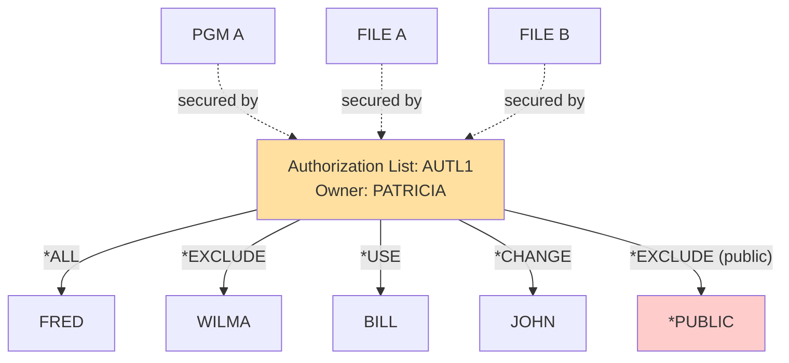
```mermaid
flowchart TD
    AUTL["Authorization List: AUTL1\nOwner: PATRICIA"]
    AUTL -->|"*ALL"| FRED["FRED"]
    AUTL -->|"*EXCLUDE"| WILMA["WILMA"]
    AUTL -->|"*USE"| BILL["BILL"]
    AUTL -->|"*CHANGE"| JOHN["JOHN"]
    AUTL -->|"*EXCLUDE (public)"| PUB["*PUBLIC"]
    OBJ1["PGM A"] -.->|"secured by"| AUTL
    OBJ2["FILE A"] -.->|"secured by"| AUTL
    OBJ3["FILE B"] -.->|"secured by"| AUTL
    style AUTL fill:#ffe0a0
    style PUB fill:#ffcccc
```

```cl
CRTAUTL AUTL(AUTL1) AUT(*EXCLUDE)       -- create the list, default deny
ADDAUTLE AUTL(AUTL1) USER(BILL) AUT(*USE)  -- add BILL with read-only
GRTOBJAUT OBJ(MYLIB/CLIENTPF) OBJTYPE(*FILE) AUTL(AUTL1) -- attach list to object
```

### Public vs private authority

- **Public authority** (`*PUBLIC`) is set at object creation time (e.g. `AUT(*EXCLUDE)`)
- **Private authority** — explicit grants/revokes override public authority for specific users
- Authority resolution order: `*EXCLUDE` private > other private > authorization list > public

### Object authority commands

```cl
-- Create with restricted public access (recommended default)
CRTPF FILE(MYLIB/CLIENTPF) AUT(*EXCLUDE)

-- Grant read-only access
GRTOBJAUT OBJ(MYLIB/CLIENTPF) OBJTYPE(*FILE) USER(APPUSR) AUT(*USE)

-- Revoke change authority
RVKOBJAUT OBJ(MYLIB/CLIENTPF) OBJTYPE(*FILE) USER(APPUSR) AUT(*CHANGE)

-- Display current authority
DSPOBJAUT OBJ(MYLIB/CLIENTPF) OBJTYPE(*FILE)

-- Transfer ownership
CHGOBJOWN OBJ(MYLIB/CLIENTPF) OBJTYPE(*FILE) NEWOWN(APPADM)
```

> Do not rely on tests inside RPG code as the only security layer. IBM i authority is enforced at the OS level regardless of what the program does.

---

# Part XII — Quick References

## 69. Build Commands Reference

| Command | What it creates | When to use |
|---------|----------------|-------------|
| `CRTRPGMOD` | `*MODULE` | ILE RPG source → module for binding |
| `CRTSQLRPGI` | `*MODULE` | SQL RPG source → pre-compile SQL + create module |
| `CRTCBLMOD` | `*MODULE` | ILE COBOL source → module |
| `CRTCLMOD` | `*MODULE` | ILE CL source → module |
| `CRTBNDRPG` | `*PGM` | Single-source RPG → program (compile + bind in one step) |
| `CRTPGM` | `*PGM` | Bind one or more `*MODULE` → executable program |
| `CRTSRVPGM` | `*SRVPGM` | Bind module(s) → service program |
| `CRTBNDCL` | `*PGM` | Single-source CL → program |
| `CRTCLPGM` | `*PGM` | OPM CL → program |
| `CRTRPGPGM` | `*PGM` | OPM RPG → program |
| `RTVBNDSRC` | Binder source member | Extract exports from existing `*SRVPGM` |

**Key compilation parameters:**

| Parameter | Purpose |
|-----------|---------|
| `DBGVIEW(*SOURCE)` | Source-level debug — always use in non-production |
| `ACTGRP(*CALLER)` | Join caller's activation group |
| `ACTGRP('name')` | Named activation group |
| `BNDDIR(lib/bnddir)` | Search this binding directory for service program exports |
| `BNDSRVPGM(lib/srvpgm)` | Directly bind this service program |
| `TGTRLS(*CURRENT)` | Target the current OS release |
| `COMMIT(*CS)` | Cursor stability for SQL pre-compile |

---

## 70. IBM Official References

| Document | URL |
|----------|-----|
| ILE RPG Reference (7.6) | https://www.ibm.com/docs/en/i/7.6.0?topic=rpg-ile-reference |
| Modernizing IBM i (Redbook) | https://www.redbooks.ibm.com/docs/MD260020/MD260020.html |
| IBM i Developer's Guide eBook | https://programmers.io/ibmi-ebook/ |

---

## Comparison Tables

### Tool evolution summary

| Feature | Green Screen | RDi (Eclipse) | VS Code |
|---------|-------------|---------------|---------|
| Editor | SEU | Eclipse-based | Modern |
| Source storage | QSYS Members | QSYS Members | Members / IFS / Local |
| Git support | No | Limited | Full |
| Syntax highlighting | No | Yes | Yes |
| Debugging | STRDBG (text) | Graphical | Graphical |
| Remote work | No | Yes | Yes |
| Extensions | No | Limited | Many |

### SCM comparison

| Feature | Native IBM i | Aldon LMi | ARCAD | Git-Based |
|---------|-------------|-----------|-------|-----------|
| Version history | Manual | Full | Full | Full |
| Branching | No | Limited | Yes | Yes |
| Merging | No | Limited | Yes | Yes |
| CI/CD | No | Partial | Yes | Yes |
| Approval workflows | No | Yes | Yes | Via tooling |
| Impact analysis | No | Yes | Yes | Limited |
| Rollback | Manual | Yes | Yes | Yes |
| Cost | Free | $$$ | $$ | Free/$ |

---

## Part XIII — Resources & Reference Links

---

### 1. MUST — Getting Started

#### Get Your Badge: Getting Started with IBM i Development (DL06005G)

- YourLearning: <https://yourlearning.ibm.com/activity/ITS-DL06005G>
- IBM Training course page: <https://www.ibm.com/training/course/getting-started-with-ibm-i-development-DL06005G>
- IBM Learn: <https://learn.ibm.com/course/view.php?id=18426>

#### How to Use Visual Studio Code on IBM i

- Guide: <https://programmers.io/blog/mastering-visual-studio-code-on-ibmi/>
- **Tutorials — Learn RPG Programming on IBM i (Complete Beginner Series)**
  - Video 4 — Learn RPG on IBM i with VSCode. Our first RPG program.
  - RPG Tutorial: <https://yourlearning.ibm.com/activity/AB-6182FE3C5838>
- **Code for i Docs:** <https://codefori.github.io/docs/>

#### Know More About the IBM i Landscape

- IBM i Marketplace Survey by Fortra: <https://power.fortra.com/resources/guides/ibm-i-marketplace-survey-results>

---

### 2. OPTIONAL — Education

#### IBM Training (GTP-delivered, charged)

- IBM i Developer Learning Path: <https://www.ibm.com/training/learning-path/ibm-i-developer-882>

#### Self-paced Courses

| Topic | Link |
|-------|------|
| Db2 for IBM i — Introduction for Programmers | <https://yourlearning.ibm.com/activity/ALM-COURSE_3954133> |
| ILE Concepts in RPG IBM i | <https://yourlearning.ibm.com/activity/URL-ROHPFI8M08G> |
| 6 RDi Tutorials in 60 Minutes | <https://yourlearning.ibm.com/activity/URL-8OLLLXNGHQA> — [YouTube](https://www.youtube.com/watch?v=8oLlLXnGhQA) |
| Building a REST Service with Integrated Web Services Server for IBM i (3-part) | <https://developer.ibm.com/tutorials/i-rest-web-services-server3/> |
| The Definitive Guide to Prompting for IBM i and RPG Developers | *(link TBD)* |

---

### 3. References

| Resource | Link |
|----------|------|
| Modernizing IBM i Applications (Redbook, July 2026) | [YourLearning](https://yourlearning.ibm.com/activity/REDBOOKS-MD260020) — [Redbooks](https://www.redbooks.ibm.com/docs/MD260020/MD260020.html) |
| RPG Cafe | <https://ibm.biz/rpg_cafe> |
| IBM Bob Premium Package for IBM i | IBM Seismic (internal) |
| Deep Dive: What is IBM i & IBM i Development? (all you want to know about IBM i) | <https://programmers.io/ibmi-ebook/> |

---

### 4. Practical Links

| Resource | Link |
|----------|------|
| Need Bob Enterprise for a PoC? IBM i LPAR on TechZone? (IBM/BP) | <https://ibm.biz/bob-ppi-techzone> |
| IBM i Application Modernization with Bob (GitHub) | <https://github.com/bmarolleau/IBM-i-Application-Modernization-with-Bob> |
| IBM Internal (Bob Marketplace) Repository | IBM internal access required |

---

*End of document.*

---

*IBM i — Complete Developer Guide: From Platform Foundations to Professional RPG*

*Sources:*
- *IBM i Development Guide — platform, tools, compilation, SCM, debugging*
- *RPG on IBM i: From Junior to Senior — Michel Simoneau with ChatGPT, September 2026 (translated from French by IBM Bob)*

*For official IBM documentation, always refer to the IBM i Knowledge Center at ibm.com/docs/en/i*
