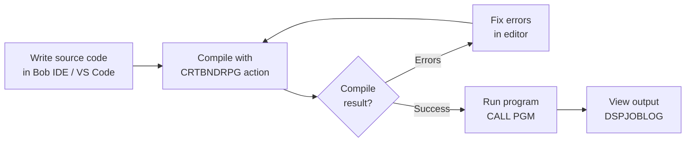

# Episode 1 — Your First RPG Program: Hello World

**Series:** Learn RPG on IBM i with Bob IDE / VS Code
**Video:** [Watch on YouTube](https://www.youtube.com/watch?v=VTqkNDnARGM)

In this tutorial you write your first RPG program using modern tools. You will follow the complete development workflow — from creating a source file to running the compiled program — using **two approaches**: the classic Source Physical File (SPF) and the modern IFS stream file.

---

## Useful Resources

Before (or alongside) this tutorial, take advantage of these free learning resources:

| Resource | Where to find it | What it covers |
|----------|-----------------|---------------|
| **Code for IBM i — Built-in Walkthrough** | VS Code → `Ctrl+Shift+P` → *Welcome: Open Walkthrough* → search **"IBM i"** | Interactive step-by-step tour of connecting, browsing objects, editing members, and running actions — built directly into VS Code |
| **Episode 1 video** | [youtube.com/watch?v=VTqkNDnARGM](https://www.youtube.com/watch?v=VTqkNDnARGM) | Full video walkthrough this written tutorial is based on |
| **Code for IBM i documentation** | [codefori.github.io/docs](https://codefori.github.io/docs/) | Official reference for all extension features |
| **Code for IBM i GitHub** | [github.com/codefori/vscode-ibmi](https://github.com/codefori/vscode-ibmi) | Source, issues, and release notes |

> **Recommended starting point:** If this is your first time using Code for IBM i, open the **built-in walkthrough first** (instructions below). It takes about 10 minutes and covers the connection and UI basics assumed by this tutorial.

### How to open the Code for IBM i Walkthrough

1. In Bob IDE / VS Code, **collapse the IBM BOB panel** on the right side of the screen to reveal the full Welcome view.
2. Press `Ctrl+Shift+P` (or `Cmd+Shift+P` on Mac) to open the Command Palette.
3. Type `Welcome: Open Walkthrough` and press **Enter**.
4. In the walkthrough gallery, search for **IBM i** or scroll to find **"Get started with Code for IBM i"**.
5. Work through the steps: connecting to IBM i, browsing the Object Browser, and opening a source member.

Once you are connected and comfortable navigating the UI, return here and continue with Step 1.

---

## Prerequisites

- Bob IDE / VS Code with the **Code for IBM i** extension installed and connected to an IBM i system
- Access to a 5250 green-screen session (via the IBM i terminal or a separate emulator)

### Create Your Library

First, create the library where your compiled objects will live. In Bob IDE / VS Code, you can do this directly from the **Object Browser**:

1. In the IBM i side panel, open the **Object Browser**.
2. Right-click anywhere in the Object Browser and select **Create library**.
3. Enter `MYLIB` as the library name and confirm.

Or run this in the IBM i terminal (`Ctrl+Shift+P` → *IBM i: Open IBM i terminal*):

```cl
CRTLIB LIB(MYLIB) TEXT('My RPG library')
```

> If `MYLIB` already exists you will get a harmless message — no action needed.

### Set Your Current Library

Before you compile anything, set `MYLIB` as your **current library** in Bob IDE / VS Code. The current library is where compiled objects (`*PGM`, `*MODULE`, `*SRVPGM`) are created.

1. In the IBM i side panel, click the **User Library List** section.
2. Click the **pencil icon** (or right-click) next to **Current library**.
3. Type `MYLIB` and confirm.

Alternatively, run this in the IBM i terminal (`Ctrl+Shift+P` → *IBM i: Open IBM i terminal*):

```cl
CHGCURLIB CURLIB(MYLIB)
```

> **Why does this matter?** The compile actions in Bob IDE / VS Code use the `&CURLIB` variable to determine where to place the compiled object. If your current library is wrong, the program will be created in the wrong library.

---

## Part 1 — Source Physical File (Traditional Approach)

### Step 1 — Create a Source Physical File

A **Source Physical File (SPF)** is a special database file that stores source code as *members*. Each member is one source program.

Open the **IBM i terminal** in Bob IDE / VS Code (`Ctrl+Shift+P` → *IBM i: Open IBM i terminal*) and run:

```cl
CRTSRCPF FILE(MYLIB/QRPGLESRC) RCDLEN(112) TEXT('RPG Source Members')
```

| Parameter | Value | Purpose |
|-----------|-------|---------|
| `FILE` | `MYLIB/QRPGLESRC` | Library and file name |
| `RCDLEN` | `112` | Standard record length for ILE RPG source |
| `TEXT` | `'RPG Source Members'` | Description |

> **Why 112?** ILE RPG source members use a 112-byte record: 6 bytes for sequence number + date, 1 byte for indicator, and 100 bytes for code.

---

### Step 2 — Create a Filter in Bob IDE / VS Code

A **filter** tells the Code for IBM i extension which library/file/member combination to display in the object browser.

1. In Bob IDE / VS Code, open the **IBM i** side panel (the IBM i icon in the Activity Bar).
2. Under **Object Browser**, click **+** to add a new filter.
3. Fill in the fields:

   | Field | Value |
   |-------|-------|
   | Filter name | `My RPG Sources` |
   | Library | `MYLIB` |
   | Object | `QRPGLESRC` |
   | Object type | `*SRCPF` |

4. Click **Save**.

The filter now appears in the Object Browser, and you can expand `QRPGLESRC` to see its members.

---

### Step 3 — Create a New RPG Source Member

1. In the Object Browser, right-click on **QRPGLESRC** under `MYLIB`.
2. Select **Create member**.
3. Enter:

   | Field | Value |
   |-------|-------|
   | Member name | `HELLO` |
   | Source type | `RPGLE` |
   | Description | `Hello World program` |

4. Click **Confirm**. The empty member opens in the editor.

---

### Step 4 — Write the RPG Program

Type (or paste) the following code into the editor:

```rpgle
**free
// Hello World - Episode 1
// First RPG program using free-format syntax

ctl-opt dftactgrp(*no) actgrp(*new);

dsply 'Hello World!';

*inlr = *on;
```

**Code walkthrough:**

| Line | What it does |
|------|-------------|
| `**free` | Tells the compiler all code is fully free-format |
| `ctl-opt dftactgrp(*no) actgrp(*new)` | Runs in the ILE environment (required for modern features) |
| `dsply 'Hello World!';` | Displays the message in the job log |
| `*inlr = *on;` | Sets the Last Record indicator — signals the program to end and release resources |

Save the file with `Ctrl+S`.

---

### Step 5 — Compile the Program from Bob IDE / VS Code

Code for IBM i uses **Actions** to compile source members.

1. With the `HELLO` member open, press `Ctrl+E` (Windows/Linux) or `Cmd+E` (Mac) — or right-click in the editor and select **Run Action**.
2. A list of available actions appears at the top. Select:
   ```
   CRTBNDRPG
   ```
3. Wait for the compile to finish. The **Output** panel at the bottom shows the result.

   - **Green check** = compiled successfully
   - **Red X** = errors found — click the message to jump to the error line

> **Tip:** `CRTBNDRPG` creates a bound program directly from one source member — the simplest compile command for a single-module RPG program.

---

### Step 6 — Run the Program from the Green Screen

Switch to a 5250 terminal session and run:

```cl
CALL PGM(MYLIB/HELLO)
```

The program runs silently. The message is written to the **job log**, not the screen.

---

### Step 7 — View the Output in the Job Log

Still on the green screen, display the job log:

```cl
DSPJOBLOG
```

Scroll to the end of the log. You should see:

```
Hello World!
```

> **What is the job log?** The job log records all messages generated by jobs running on the system. `DSPLY` writes to the external message queue, which appears here.

---

## Part 2 — IFS Stream File (Modern Approach)

The **Integrated File System (IFS)** stores files as stream files in a Unix-like directory structure — no members, no record length constraints. This is the preferred approach for modern RPG development.

### Step 8 — Create an IFS Folder

1. In the Bob IDE / VS Code IBM i side panel, open the **IFS Browser**.
2. Navigate to your home directory (e.g. `/home/YOURUSER`).
3. Right-click and select **Create directory**.
4. Name it `rpg` (or `src`).

The directory `/home/YOURUSER/rpg` is now created.

---

### Step 9 — Create an RPG Stream File

1. Right-click on the new `/home/YOURUSER/rpg` directory.
2. Select **New file**.
3. Name the file `hello.rpgle`.

The `.rpgle` extension tells Code for IBM i (and the compiler) that this is an ILE RPG source file.

The empty file opens in the editor. Enter the same code as before:

```rpgle
**free
// Hello World - Episode 1 (IFS version)

ctl-opt dftactgrp(*no) actgrp(*new);

dsply 'Hello World from IFS!';

*inlr = *on;
```

Save with `Ctrl+S`.

---

### Step 10 — Compile the IFS Source File

1. With `hello.rpgle` open in the editor, press `Ctrl+E` (Windows/Linux) or `Cmd+E` (Mac) to open **Run Action**.
2. Select the **CRTBNDRPG** action.
3. The compile runs. Check the Output panel for success or errors.

By default, Code for IBM i places the compiled program object in the library configured in your connection settings (usually your current library).

> **Tip:** You can configure a custom compile command — or set the target library explicitly — in the Code for IBM i action settings.

---

### Step 11 — Run the IFS-Compiled Program

Back on the green screen:

```cl
CALL PGM(MYLIB/HELLO)
```

Then display the job log again:

```cl
DSPJOBLOG
```

You will see `Hello World from IFS!` at the end of the log.

---

## Summary

You have now completed the full RPG development workflow — twice:



| Step | SPF approach | IFS approach |
|------|-------------|-------------|
| Store source | Member in `QRPGLESRC` | Stream file `.rpgle` |
| Create source | Right-click SPF → Create member | Right-click IFS dir → New file |
| Compile | **Run Action** (`Ctrl+E` / `Cmd+E`) → CRTBNDRPG | **Run Action** (`Ctrl+E` / `Cmd+E`) → CRTBNDRPG |
| Run | `CALL PGM(MYLIB/HELLO)` | `CALL PGM(MYLIB/HELLO)` |
| View output | `DSPJOBLOG` | `DSPJOBLOG` |

Both approaches produce the same program object. The **IFS approach** is recommended for new projects because it integrates naturally with Git and modern tooling.

---

## Key Concepts Recap

| Concept | What it is |
|---------|-----------|
| **Source Physical File** | A database file (`*SRCPF`) that stores source code as members |
| **QRPGLESRC** | Convention name for an RPG source physical file |
| **RPGLE member** | One source program stored inside a source physical file |
| **IFS stream file** | A regular file stored in a Unix-like directory on IBM i |
| **`**free`** | Compiler directive enabling fully free-format RPG syntax |
| **`ctl-opt`** | Control options — program-level settings (replaces the H-spec) |
| **`dsply`** | Displays a message to the job log / external message queue |
| **`*inlr = *on`** | Sets the Last Record indicator to end the program cleanly |
| **CRTBNDRPG** | Compile command that creates a bound RPG program from one source |
| **DSPJOBLOG** | CL command to display the current job's message log |

---

## What's Next

In the next episode we will refactor `HELLO` into a **service program caller**:

1. Write a `NOMAIN` module (`HELLOSRV`) that exports a `GetGreeting` procedure
2. Bind it into a `*SRVPGM`
3. **Replace `HELLO.rpgle` with a new version** that calls the service program instead of using `DSPLY` directly

> **Note:** The `HELLO.rpgle` file in Episode 2 is a **completely different program** from the one you wrote here. It replaces this version — same object name (`HELLO`), different source. The Episode 2 version requires a two-step compile (`CRTRPGMOD` + `CRTPGM`) and cannot be compiled with `CRTBNDRPG` alone.

> **Try it yourself:** Modify the `DSPLY` message to display your name and recompile. Watch how fast the compile-test cycle is with Bob IDE / VS Code and Code for IBM i.
