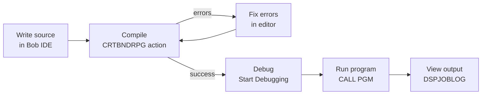

# Episode 1 — Your First RPG Program: Hello World

**Series:** Learn RPG on IBM i with Bob IDE / VS Code
**Video:** [Watch on YouTube](https://www.youtube.com/watch?v=VTqkNDnARGM)

In this tutorial you write your first RPG program using modern tools. You will follow the complete development workflow — from creating a source file to running the compiled program — using **two approaches**: the classic Source Physical File (SPF) and the modern workspace stream file.

---

## Useful Resources

Before (or alongside) this tutorial, take advantage of these free learning resources:

| Resource | Where to find it | What it covers |
|----------|-----------------|---------------|
| **Code for IBM i — Built-in Walkthrough** | VS Code → `Ctrl+Shift+P` → *Welcome: Open Walkthrough* → search **"IBM i"** | Interactive step-by-step tour of connecting, browsing objects, editing members, and running actions — built directly into VS Code |
| **Episode 1 video** | [youtube.com/watch?v=VTqkNDnARGM](https://www.youtube.com/watch?v=VTqkNDnARGM) | Full video walkthrough this written tutorial is based on |
| **Code for IBM i documentation** | [codefori.github.io/docs](https://codefori.github.io/docs/) | Official reference for all extension features |
| **Code for IBM i GitHub** | [github.com/codefori/vscode-ibmi](https://github.com/codefori/vscode-ibmi) | Source, issues, and release notes |

> **Recommended starting point:** If this is your first time using Code for IBM i, open the **built-in walkthrough first** (instructions below). It takes about 10 minutes and covers the connection and UI basics assumed by this tutorial.

### How to open the Code for IBM i Walkthrough

1. In Bob IDE / VS Code, **collapse the IBM BOB panel** on the right side of the screen to reveal the full Welcome view.
2. Press `Ctrl+Shift+P` (or `Cmd+Shift+P` on Mac) to open the Command Palette.
3. Type `Welcome: Open Walkthrough` and press **Enter**.
4. In the walkthrough gallery, search for **IBM i** or scroll to find **"Get started with Code for IBM i"**.
5. Work through the steps: connecting to IBM i, browsing the Object Browser, and opening a source member.

Once you are connected and comfortable navigating the UI, return here and continue with Step 1.

---

## Prerequisites

- Bob IDE / VS Code with the **Code for IBM i** extension installed and connected to an IBM i system

> **How to open a terminal.**
> Two types of terminal are used in this lab:
>
> - **IBM i shell terminal** (bash/QShell) — press `Ctrl+Shift+P` (or `Cmd+Shift+P` on Mac), type **IBM i: Launch Terminal Picker**, and select the shell option. Use this to run CL commands and `DSPJOBLOG`.
> - **5250 terminal** — press `Ctrl+Shift+P`, type **IBM i: Launch Terminal Picker**, and select **5250**. Alternatively use IBM ACS, tn5250, or any 5250 emulator connected to your system.
>
> Wherever this lab says *"open an IBM i terminal"* or *"open a 5250 terminal"*, use the method above.

> **How source files work with Code for i.**
> This tutorial covers two approaches. In the **SPF approach** (Part 1), source members live directly on the IBM i inside a source physical file — you open and edit them from the Object Browser and there is no local copy on your PC. In the **workspace stream file approach** (Part 2), you create and edit files **locally in your workspace** (on your PC) like any other file in VS Code. When you run an Action (`Ctrl+E`), Code for i automatically deploys the file to the IBM i IFS (this is what `"deployFirst": true` does) and then runs the compile command. The IFS deploy path for this project is `~/builds/IBMi-101`. You never need to create or edit files directly in the IFS Browser.

### Create Your Library

First, create the library where your compiled objects will live. In Bob IDE / VS Code, you can do this directly from the **Object Browser**:

1. In the IBM i side panel, open the **Object Browser**.
2. Right-click anywhere in the Object Browser and select **Create library**.
3. Enter `MYLIB` as the library name and confirm.

*(Terminal alternative: `CRTLIB LIB(MYLIB) TEXT('My RPG library')`)*

> If `MYLIB` already exists you will get a harmless message — no action needed.

### Set Your Current Library

Before you compile anything, set `MYLIB` as your **current library** in Bob IDE / VS Code. The current library is where compiled objects (`*PGM`, `*MODULE`, `*SRVPGM`) are created.

1. In the IBM i side panel, click the **User Library List** section.
2. Click the **pencil icon** (or right-click) next to **Current library**.
3. Type `MYLIB` and confirm.

*(Terminal alternative: `CHGCURLIB CURLIB(MYLIB)`)*

> **Why does this matter?** The compile actions in Bob IDE / VS Code use the `&CURLIB` variable to determine where to place the compiled object. If your current library is wrong, the program will be created in the wrong library.

---

## Part 1 — Source Physical File (Traditional / Legacy Approach)

A **Source Physical File (SPF)** is a special database file on the IBM i that stores source code as *members*. Each member is one source program. This is the traditional approach — source lives entirely on the IBM i, and you open and edit members directly from the Object Browser in Code for i.

> **No local deploy needed for SPF.** When you open a source member from the Object Browser, Code for i streams it directly from the IBM i into the editor. Saving with `Ctrl+S` writes it back to the member immediately. There is no local file on your PC and no deploy step.

### Step 1 — Create a Source Physical File

In the **Object Browser**, right-click `MYLIB` and select **New Source file**, then name it `QRPGLESRC`.

*(Terminal alternative: `CRTSRCPF FILE(MYLIB/QRPGLESRC) RCDLEN(112) TEXT('RPG Source Members')`)*

| Parameter | Value | Purpose |
|-----------|-------|---------|
| `FILE` | `MYLIB/QRPGLESRC` | Library and file name — `QRPGLESRC` is the conventional name for an RPG source physical file |
| `RCDLEN` | `112` | Standard record length for ILE RPG source |

> **Why 112?** ILE RPG source members use a 112-byte record: 6 bytes for sequence number + date, 1 byte for indicator, and 100 bytes for code.

---

### Step 2 — Create a Filter in Bob IDE / VS Code

A **filter** tells the Code for IBM i extension which library/file/member combination to display in the Object Browser.

1. In Bob IDE / VS Code, open the **IBM i** side panel (the IBM i icon in the Activity Bar).
2. Under **Object Browser**, click **+** to add a new filter.
3. Fill in the fields:

   | Field | Value |
   |-------|-------|
   | Filter name | `My RPG Sources` |
   | Library | `MYLIB` |
   | Object | `QRPGLESRC` |
   | Object type | `*SRCPF` |

4. Click **Save**.

The filter now appears in the Object Browser, and you can expand `QRPGLESRC` to see its members.

---

### Step 3 — Create a New RPG Source Member

1. In the Object Browser, right-click on **QRPGLESRC** under `MYLIB`.
2. Select **New Member**.
3. Enter the name `HELLO.RPGLE` — the extension sets the source type automatically.
4. Press **Enter**. The empty member opens in the editor.

> **Adding a description later:** Right-click the member in the Object Browser and select **Change description** to add or update the text description.

---

### Step 4 — Write the RPG Program

Type (or paste) the following code into the editor:

```rpgle
**free
// Hello World - Episode 1
// First RPG program using free-format syntax

ctl-opt dftactgrp(*no) actgrp(*new);

dsply 'Hello World!';

*inlr = *on;
```

**Code walkthrough:**

| Line | What it does |
|------|-------------|
| `**free` | Tells the compiler all code is fully free-format |
| `ctl-opt dftactgrp(*no) actgrp(*new)` | Runs in the ILE environment (required for modern features) |
| `dsply 'Hello World!';` | Displays the message in the job log |
| `*inlr = *on;` | Sets the Last Record indicator — signals the program to end and release resources |

Save the file with `Ctrl+S`.

---

### Step 5 — Compile the Program from Bob IDE / VS Code

Code for IBM i uses **Actions** to compile source members.

1. With the `HELLO` member open, press `Ctrl+E` (Windows/Linux) or `Cmd+E` (Mac) — or right-click in the editor and select **Run Action**.
2. A list of available actions appears at the top. Select **Create RPGLE Program (CRTBNDRPG)**.
3. Wait for the compile to finish. The **Output** panel at the bottom shows the result.

   - **Green check** = compiled successfully
   - **Red X** = errors found — click the message to jump to the error line

> **Tip:** `CRTBNDRPG` creates a bound program directly from one source member — the simplest compile command for a single-module RPG program.

---

### Step 6 — Debug the Program

Code for i has a built-in source-level debugger that lets you step through your RPG code line by line, inspect variables, and set breakpoints — all inside VS Code, without a green screen.

> **Prerequisite:** The program must have been compiled with `DBGVIEW(*SOURCE)`, which the **CRTBNDRPG** action already includes.

1. In the **Object Browser**, expand `MYLIB` and locate the `HELLO *PGM` object.
2. Right-click it and select **Start Debugging**.
3. Code for i opens the source member in a read-only debug view and the debugger connects to the IBM i.
4. The program pauses at the first executable statement. You will see a **yellow arrow** in the gutter indicating the current line.

**Useful debugger controls:**

| Action | Keyboard | What it does |
|---|---|---|
| Step Over | `F10` | Execute current line, move to next |
| Step Into | `F11` | Step into a called procedure |
| Continue | `F5` | Run until next breakpoint or end |
| Add breakpoint | Click gutter | Pause execution at that line |
| Inspect variable | Hover over name | Shows current value in a tooltip |

5. Hover over `'Hello World!'` on the `dsply` line — the debugger shows the literal value.
6. Press `F5` to continue. The program runs to completion.

> **Why `DBGVIEW(*SOURCE)`?** This parameter tells the compiler to store the source mapping in the object. Without it the debugger shows only machine-level statements, not your RPG source lines.

---

### Step 7 — Run the Program

Open an IBM i terminal and run:

```cl
CALL PGM(MYLIB/HELLO)
```

The program runs silently. The message is written to the **job log**, not the screen.

> **5250 alternative:** Open a 5250 terminal and run the same command.

---

### Step 8 — View the Output in the Job Log

Still in the IBM i terminal, display the job log:


```cl
DSPJOBLOG
```

Scroll to the end of the log. You should see:

```
Hello World!
```

> **What is the job log?** The job log records all messages generated by jobs running on the system. `DSPLY` writes to the external message queue, which appears here.

> **5250 alternative:** Open a 5250 terminal and run `DSPJOBLOG` there — the output is the same.

---

## Part 2 — Workspace Stream File (Modern Approach)

In this approach your source file lives **locally in your workspace** (on your PC). Code for i deploys it to the IBM i IFS automatically when you run an Action, then compiles it from there. The IFS is just a staging area — your workspace is the source of truth, and you can put it under Git version control.

> **IFS deploy path for this project:** `~/builds/IBMi-101`
> Code for i copies your workspace files to this path on the IBM i before each compile. The path is configured in your Code for i connection settings under **Deploy directory**.

### Step 8 — Create a Local Source File

In the VS Code Explorer panel, open the `tutorials/src/` folder. The file `hello.rpgle` may already exist there. If not, right-click the `tutorials/src` folder and select **New File**, name it `hello.rpgle`.

The `.rpgle` extension tells Code for IBM i (and the compiler) that this is an ILE RPG source file.

The empty file opens in the editor. Enter the same code as before:

```rpgle
**free
// Hello World - Episode 1 (stream file version)

ctl-opt dftactgrp(*no) actgrp(*new);

dsply 'Hello World from IFS!';

*inlr = *on;
```

Save with `Ctrl+S`.

---

### Step 9 — Compile the Stream File Source

1. With `hello.rpgle` open in the editor, press `Ctrl+E` (Windows/Linux) or `Cmd+E` (Mac) to open **Run Action**.
2. Select the **Create RPGLE Program (CRTBNDRPG)** action.
3. Code for i deploys the file to `~/builds/IBMi-101/tutorials/src/hello.rpgle` on the IBM i, then runs:

```cl
CRTBNDRPG PGM(MYLIB/HELLO)
          SRCSTMF('/home/YOURUSER/builds/IBMi-101/tutorials/src/hello.rpgle')
          DBGVIEW(*SOURCE) TGTCCSID(*JOB)
```

Check the Output panel for a green check.

---

### Step 10 — Debug the Stream File Program

Debugging a workspace stream file program works the same way as for a member:

1. In the **Object Browser**, expand `MYLIB` and locate the `HELLO *PGM` object.
2. Right-click it and select **Start Debugging**.
3. Code for i connects the debugger and pauses at the first executable line.
4. Step through the code with `F10`, hover over variables to inspect them, and press `F5` to run to completion.

> **Tip:** The debugger always connects to the compiled object on the IBM i — it doesn't matter whether the source came from a member or a workspace stream file. As long as the object was compiled with `DBGVIEW(*SOURCE)`, debugging works identically.

---

### Step 11 — Run the Stream-File-Compiled Program

In the **Object Browser**, expand `MYLIB`, right-click the `HELLO *PGM` object and select **Run Action**, then choose **Call Program**.

Code for i runs the equivalent of:

```cl
CALL PGM(MYLIB/HELLO)
```

The program runs and the result appears in the Output panel. To view the job log output, open an IBM i terminal and run:

```cl
DSPJOBLOG
```

You will see `Hello World from IFS!` at the end of the log.

> **5250 alternative:** Open a 5250 terminal and run `CALL PGM(MYLIB/HELLO)` then `DSPJOBLOG`.

---

## Summary

You have now completed the full RPG development workflow using both approaches:



| Step | SPF approach | Workspace stream file approach |
|------|-------------|-------------------------------|
| Source lives on | IBM i, in `MYLIB/QRPGLESRC` member | Your PC workspace, deployed to `~/builds/IBMi-101` |
| Create source | Object Browser → right-click `MYLIB` → **New Source file**, then right-click `QRPGLESRC` → **New Member** | VS Code Explorer → right-click folder → **New File** |
| Edit source | Open member from Object Browser — edits saved directly to IBM i | Edit locally in VS Code — deployed automatically on Action run |
| Compile | `Ctrl+E` → **Create RPGLE Program (CRTBNDRPG)** | `Ctrl+E` → **Create RPGLE Program (CRTBNDRPG)** |
| Run | `CALL PGM(MYLIB/HELLO)` | `CALL PGM(MYLIB/HELLO)` |
| View output | `DSPJOBLOG` | `DSPJOBLOG` |

Both approaches produce the same program object. Choose based on your project conventions: **SPF** for legacy or team environments already on QSYS, **workspace stream files** for new projects with Git and modern tooling.

---

## Key Concepts Recap

| Concept | What it is |
|---------|-----------|
| **Source Physical File** | A database file (`*SRCPF`) that stores source code as members — the traditional IBM i approach |
| **QRPGLESRC** | Conventional name for an RPG source physical file |
| **RPGLE member** | One source program stored inside a source physical file |
| **Workspace stream file** | A source file edited locally on your PC and deployed to the IBM i IFS by Code for i when you run an Action |
| **IFS** | Integrated File System — the Unix-like file system on IBM i where Code for i stages your deployed stream files |
| **Deploy directory** | The IFS path Code for i copies your workspace files to before compiling — `~/builds/IBMi-101` for this project |
| **`**free`** | Compiler directive enabling fully free-format RPG syntax |
| **`ctl-opt`** | Control options — program-level settings (replaces the H-spec) |
| **`dsply`** | Displays a message to the job log / external message queue |
| **`*inlr = *on`** | Sets the Last Record indicator to end the program cleanly |
| **CRTBNDRPG** | Compile command that creates a bound RPG program from one source |
| **DSPJOBLOG** | CL command to display the current job's message log |

---

## What's Next

In the next episode you will work with **two source files**:

| File | Purpose |
|------|---------|
| `HELLOSRV.rpgle` | New `NOMAIN` module — exports the `GetGreeting` procedure, compiled into a `*SRVPGM` |
| `HELLO.rpgle` | Rewritten caller — binds to `HELLOSRV` and calls `GetGreeting` instead of using `DSPLY` directly |

> **Note:** The `HELLO.rpgle` you wrote in this episode is **replaced** in Episode 2 by a different version — same object name (`MYLIB/HELLO *PGM`), completely different source. The Episode 2 version requires a two-step compile (`CRTRPGMOD` + `CRTPGM`) because it must be bound to `HELLOSRV` at link time; `CRTBNDRPG` alone is not sufficient.

> **Try it yourself:** Modify the `DSPLY` message to display your name and recompile. Watch how fast the compile-test cycle is with Bob IDE / VS Code and Code for IBM i.
