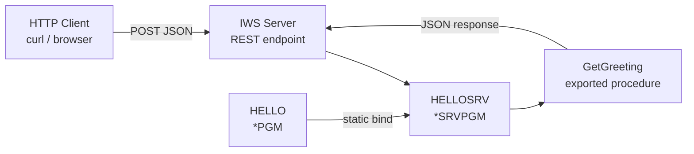
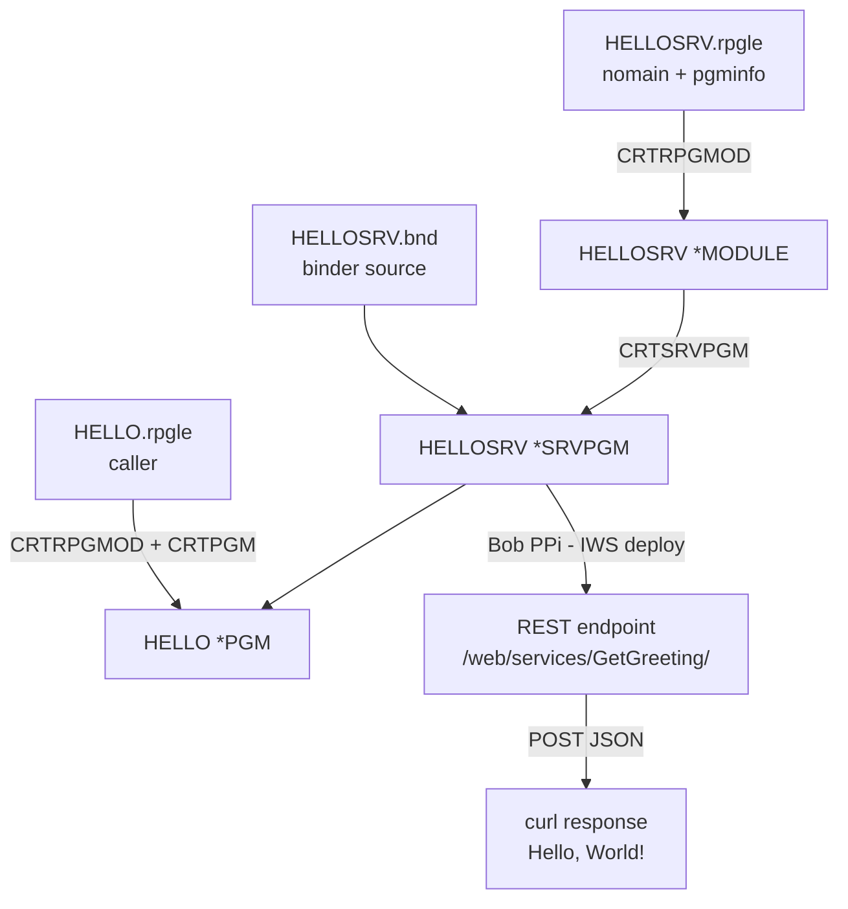

# Episode 2 — Service Programs and REST APIs with IWS

**Series:** Learn RPG on IBM i with Bob IDE / VS Code
**Prerequisite:** [Episode 1 — Your First RPG Program: Hello World](episode-01-hello-world.md)

In this episode you refactor the `HELLO` program from Episode 1 into a **service program**, then expose it as a **REST API** using IBM i Integrated Web Services (IWS) — with the help of **Bob Premium Package for i (PPi)**.

---

## What You Will Build



| Object | Type | Purpose |
|---|---|---|
| `HELLOSRV` | `*SRVPGM` | Reusable library — exports `GetGreeting` |
| `HELLO` | `*PGM` | Standalone caller — binds to `HELLOSRV` |
| IWS service | REST endpoint | Exposes `GetGreeting` over HTTP |

---

## Key Concepts

**What is a service program?**
A `*SRVPGM` is a reusable library of procedures on IBM i — like a shared DLL. It is **not callable directly** (`CALL` won't work on it). Other programs bind to it at compile time and call its exported procedures as if they were local — this is called **static binding** and has zero runtime call overhead.

**Why not just use a `*PGM`?**
If 10 programs all need the same greeting logic, you'd have 10 copies of the code. With a service program you have one copy, and you only recompile the service program when the logic changes — callers don't need to be recompiled as long as the exported interface is compatible.

| Concept | What it means |
|---|---|
| **`NOMAIN`** | Module with no entry point — procedures only, not directly runnable |
| **`export`** | Makes a procedure visible and callable from other modules |
| **`dcl-pr`** | Prototype in the caller — declares how to call the remote procedure |
| **Binder source (`.bnd`)** | Lists which procedures are exported and sets a version signature |
| **Static binding** | Link resolved at compile time — faster than a dynamic `CALL` |
| **`ACTGRP(*CALLER)`** | Service program shares the caller's activation group and resources |
| **PCML** | XML metadata the compiler embeds in the object — IWS reads it to understand the procedure's parameters |

---

## Source Files

| File | Description |
|---|---|
| [`tutorials/src/HELLOSRV.rpgle`](src/HELLOSRV.rpgle) | NOMAIN module — exports `GetGreeting` |
| [`tutorials/src/HELLOSRV.bnd`](src/HELLOSRV.bnd) | Binder source — controls exports and signature |
| [`tutorials/src/HELLO.rpgle`](src/HELLO.rpgle) | Caller program — calls `GetGreeting` |

---

## Part 1 — Create the Service Program

### Step 1 — Open the Module Source

In Bob IDE / VS Code, open [`tutorials/src/HELLOSRV.rpgle`](src/HELLOSRV.rpgle):

```rpgle
**free
ctl-opt nomain
        pgminfo(*pcml:*module:*dclcase);

dcl-proc GetGreeting export;
  dcl-pi *n;
    name   char(50) const;
    result char(100);
  end-pi;

  result = 'Hello, ' + %trim(name) + '!';

end-proc;
```

| Line | What it does |
|---|---|
| `ctl-opt nomain` | No entry point — this is a module of procedures, not a runnable program |
| `pgminfo(*pcml:*module:*dclcase)` | Embeds PCML metadata in the object — **required** for IWS deployment |
| `dcl-proc GetGreeting export` | Exported procedure — callable from any program that binds to this service program |
| `dcl-pi *n` | No return value — result is passed back via output parameter |
| `name char(50) const` | Input — the name to greet (read-only) |
| `result char(100)` | Output — the greeting string written back to the caller |

> **Why `char` instead of `varchar`?** PCML restricts **return values** to 4-byte integers only — no `varchar` returns are allowed at any PCML version. Using an output parameter (`char(100)`) works around this cleanly.

### Step 2 — Compile the Module

With [`HELLOSRV.rpgle`](src/HELLOSRV.rpgle) open in the editor, press `Ctrl+E` (Windows/Linux) or `Cmd+E` (Mac) to open **Run Action**, then select **Create RPGLE Module**:

```cl
CRTRPGMOD MODULE(MYLIB/HELLOSRV)
          SRCSTMF('/home/YOURUSER/rpg/HELLOSRV.rpgle')
          DBGVIEW(*SOURCE) TGTCCSID(*JOB)
```

This creates a `*MODULE` object — compiled but **not yet runnable**.

### Step 3 — Review the Binder Source

Open [`tutorials/src/HELLOSRV.bnd`](src/HELLOSRV.bnd):

```
STRPGMEXP PGMLVL(*CURRENT) SIGNATURE('HELLOSRV V1')
  EXPORT SYMBOL('GETGREETING')
ENDPGMEXP
```

The binder source is a short text file that:
- Lists every procedure name that is **visible to callers** (symbol names are always uppercase on IBM i)
- Sets a **signature** string — if you later add new procedures, add them at the end to stay backward compatible

### Step 4 — Create the Service Program

In the IBM i terminal (`Ctrl+Shift+P` → *IBM i: Open IBM i terminal*):

```cl
CRTSRVPGM SRVPGM(MYLIB/HELLOSRV)
          MODULE(MYLIB/HELLOSRV)
          EXPORT(*SRCFILE)
          SRCSTMF('/home/YOURUSER/rpg/HELLOSRV.bnd')
          ACTGRP(*CALLER)
          TEXT('Hello World service program')
```

Verify it was created:

```cl
DSPOBJD OBJ(MYLIB/HELLOSRV) OBJTYPE(*SRVPGM)
```

---

## Part 2 — Compile the Caller Program

> **This `HELLO.rpgle` replaces the Episode 1 version.**
> The Episode 1 `HELLO` was a simple standalone program compiled with `CRTBNDRPG`.
> This version calls `GetGreeting` from `HELLOSRV` — it **cannot** be compiled with `CRTBNDRPG` because the binder needs to know about `HELLOSRV`. Use the **"Create RPGLE Program (CRTRPGMOD + CRTPGM bound to HELLOSRV)"** action, or run the two commands in Step 6 manually. The compiled `MYLIB/HELLO *PGM` object is overwritten in place — no other cleanup needed.

### Step 5 — Open the Caller Source

Open [`tutorials/src/HELLO.rpgle`](src/HELLO.rpgle):

```rpgle
**free

ctl-opt dftactgrp(*no) actgrp(*new);

// Prototype — tells the compiler how to call GetGreeting
dcl-pr GetGreeting extproc('GETGREETING');
  name   char(50) const;
  result char(100);
end-pr;

dcl-s greeting  char(100);
dcl-s display52 char(52);

GetGreeting('World' : greeting);
display52 = %subst(greeting : 1 : 52);
dsply display52;

*inlr = *on;
```

The `dcl-pr` (prototype) must match the service program's `dcl-pi` exactly — same types, same order. The `extproc('GETGREETING')` name is the **uppercase symbol** as stored in the object.

> **Note on `DSPLY`:** The `DSPLY` operation is limited to 52 bytes. The greeting is copied into `display52` (`char(52)`) before display.

### Step 6 — Compile the Caller Module then Bind

```cl
CRTRPGMOD MODULE(MYLIB/HELLO)
          SRCSTMF('/home/YOURUSER/rpg/HELLO.rpgle')
          DBGVIEW(*SOURCE) TGTCCSID(*JOB)

CRTPGM PGM(MYLIB/HELLO)
       MODULE(MYLIB/HELLO)
       BNDSRVPGM(MYLIB/HELLOSRV)
       ACTGRP(*NEW)
```

`BNDSRVPGM` is where the static binding happens — the binder resolves `GETGREETING` from `HELLOSRV` and hard-wires the link into `HELLO`.

### Step 7 — Test the Caller

From the IBM i terminal:

```cl
CALL PGM(MYLIB/HELLO)
DSPJOBLOG
```

You should see `Hello, World!` in the job log.

---

## Part 3 — Expose as a REST API with IWS

Now that `HELLOSRV *SRVPGM` exists, you have two ways to create a web service from it:

| Option | How | Best for |
|---|---|---|
| **IWS Web Admin wizard** | Browser at `http://<ibmi-host>:2001/HTTPAdmin` | Interactive, point-and-click — great for first-time setup or when you want to see all options |
| **Bob PPi** | Ask Bob in the chat | Automated, repeatable — Bob runs the IWS commands for you |

### Option A — IWS Web Admin Wizard

1. Open a browser and go to `http://<ibmi-host>:2001/HTTPAdmin`
2. Sign in with your IBM i credentials.
3. In the left panel, click **Integrated Web Services Server**.
4. Select an existing server (or create one with **New**).
5. Click **Deploy New Service** and follow the wizard:
   - **Program object**: browse to `MYLIB/HELLOSRV.SRVPGM`
   - **Service type**: choose `REST` or `SOAP`
   - **Procedure**: select `GETGREETING`
   - **Parameter usage**: mark `name` as input, `result` as output
6. Click **Finish** — the wizard deploys and starts the service.

> The wizard generates the same PCML and WAR that the command-line approach produces. For the GET service with a path parameter, you will still need to provide the external [`GetGreetingGET.pcml`](src/GetGreetingGET.pcml) file when prompted for a markup language file.

### Option B — Ask Bob to Create Both REST Services

Now ask **Bob** to do this part for you.

> **What is Bob PPi?**
> Bob Premium Package for i (PPi) is an IBM AI assistant with IBM i skills, including IWS administration. When you ask Bob to deploy an IWS web service, Bob connects directly to your IBM i and runs the deployment commands on your behalf — you don't need to type them manually.

You will deploy the **same service program twice** — once as a **POST** service (name in the JSON body) and once as a **GET** service (name in the URL path). Both call the identical `GETGREETING` procedure.

| Service name | HTTP method | How to pass `name` | URL pattern |
|---|---|---|---|
| `GetGreetingPOST` | POST | JSON request body | `/web/services/GetGreetingPOST/` |
| `GetGreetingGET` | GET | URL path segment | `/web/services/GetGreetingGET/{name}` |

### Step 8 — Ask Bob to Create Both REST Services

In the Bob IDE chat, type:

> *"Using your IWS skills, create two REST services from the `GETGREETING` procedure in `HELLOSRV` in library `MYLIB` — one as POST with JSON body and one as GET with the name in the URL path. Create an IWS server if none exists."*

Bob PPi will connect to your IBM i and perform the following steps automatically:

**1. Check for an existing IWS server:**
```sh
listWebServicesServers.sh
```
If no server exists, Bob creates one:
```sh
createWebServicesServer.sh -server MYAPISVR -startingPort 10010
startWebServicesServer.sh  -server MYAPISVR
```

**2. Deploy the POST service** (name sent in the JSON body):

No external PCML file is needed — IWS reads the PCML embedded in the `*SRVPGM` at deployment time.

```sh
installWebService.sh \
  -server MYAPISVR \
  -programObject '/QSYS.LIB/MYLIB.LIB/HELLOSRV.SRVPGM' \
  -service GetGreetingPOST \
  -serviceType '*REST' \
  -parameterUsage GETGREETING:i,o \
  -libraryList MYLIB
```

**3. Deploy the GET service** (name in the URL path):

The GET service requires an external PCML file — not because the compiler didn't embed PCML, but because `restInPathParam` is a **REST deployment attribute** that must be set at install time and cannot be expressed in the RPG source. Save this as [`tutorials/src/GetGreetingGET.pcml`](src/GetGreetingGET.pcml):

```xml
<pcml restUriPathTemplate="/{name}" version="7.0">
    <program entrypoint="GETGREETING" name="GetGreeting"
        parseorder="result"
        path="/QSYS.LIB/MYLIB.LIB/HELLOSRV.SRVPGM"
        restConsumes="*/*"
        restHttpRequestMethod="GET"
        restProduces="application/json"
        threadsafe="false" wrapInputParams="false" wrapOutputParam="true">
        <data length="50" name="name" type="char" restInPathParam="name" usage="input"/>
        <data length="100" name="result" type="char" usage="output"/>
    </program>
</pcml>
```

> **`restInPathParam="name"`** binds the `{name}` URL segment to the procedure parameter. IWS uses this to generate the correct `@PathParam` annotation. Without it the path value is never passed to the program.

```sh
installWebService.sh \
  -server MYAPISVR \
  -programObject '/QSYS.LIB/MYLIB.LIB/HELLOSRV.SRVPGM' \
  -service GetGreetingGET \
  -markupLanguage '/home/YOURUSER/rpg/GetGreetingGET.pcml' \
  -serviceType '*REST' \
  -libraryList MYLIB
```

**4. Start both services:**
```sh
startWebService.sh -server MYAPISVR -service GetGreetingPOST
startWebService.sh -server MYAPISVR -service GetGreetingGET
```

---

## Part 4 — Test Both REST Services

> **Which port?**
> IWS runs two ports per server:
> - The **application server port** (e.g. `10000`) — Liberty JVM, always reachable from the IBM i itself via `localhost`.
> - The **HTTP proxy port** (e.g. `10010`) — Apache frontend; reachability from outside depends on your network and firewall.
>
> Bob will confirm the correct port for your system. Replace `<ibmi-host>:<port>` below accordingly.

### Step 9 — Test the POST Service

**From a bash terminal on the IBM i:**
```sh
curl -X POST "http://localhost:<port>/web/services/GetGreetingPOST/" \
  -H "Content-Type: application/json" \
  -H "Accept: application/json" \
  -d '{"name": "World"}'
```

**From a remote machine:**
```sh
curl -X POST "http://<ibmi-host>:<port>/web/services/GetGreetingPOST/" \
  -H "Content-Type: application/json" \
  -H "Accept: application/json" \
  -d '{"name": "World"}'
```

**Expected response:**
```json
{"result":"Hello, World!"}
```

### Step 10 — Test the GET Service

**From a bash terminal on the IBM i:**
```sh
curl "http://localhost:<port>/web/services/GetGreetingGET/World"
```

**From a remote machine:**
```sh
curl "http://<ibmi-host>:<port>/web/services/GetGreetingGET/World"
```

**Expected response:**
```json
{"result":"Hello, World!"}
```

---

## Summary



| Step | What happens |
|---|---|
| `CRTRPGMOD` | Source → compiled module (`*MODULE`) |
| `CRTSRVPGM` | Module + binder source → service program (`*SRVPGM`) |
| `CRTPGM` | Caller module + service program → executable program (`*PGM`) |
| Bob PPi IWS | Service program → REST API — Bob handles all the IWS commands |

---

## Key Concepts Recap

| Term | What it is |
|---|---|
| `*MODULE` | Compiled but non-runnable — must be bound into a `*PGM` or `*SRVPGM` |
| `*SRVPGM` | Shared library of exported procedures — statically bound into callers |
| `*PGM` | Runnable program — one or more modules + optional service programs |
| `NOMAIN` | No program entry point — the module contains only subprocedures |
| `export` | Makes a procedure callable from outside its module |
| `dcl-pr` | Prototype in the caller — must match the procedure's `dcl-pi` exactly |
| Binder source | Lists exported symbols (uppercase) and sets the version signature |
| PCML | Parameter metadata embedded in the object — IWS reads it to build the REST interface |
| Bob PPi | IBM i AI assistant — connects to your system and runs IWS admin commands for you |

---

## What's Next

In the next episode we will:

1. Create a **database table** on IBM i
2. Read names from the table inside the service program using embedded SQL
3. Return a personalised greeting from live database data

> **Try it yourself:** Ask Bob: *"Change the greeting to say 'Greetings' instead of 'Hello' and redeploy."* Bob will update the source, recompile, and restart the service for you.
