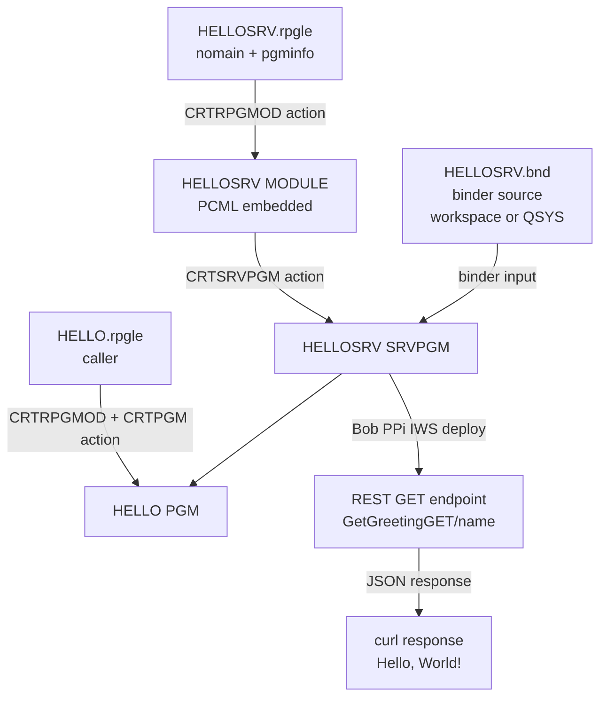

# Episode 2 — Service Programs and REST APIs with IWS

**Series:** Learn RPG on IBM i with Bob IDE / VS Code
**Prerequisite:** [Episode 1 — Your First RPG Program: Hello World](episode-01-hello-world.md)

In this episode you refactor the `HELLO` program from Episode 1 into a **service program**, then expose it as a **REST GET API** using IBM i Integrated Web Services (IWS) — with the help of **Bob Premium Package for i (PPi)**.

---

## What You Will Build


| Object | Type | Purpose |
|---|---|---|
| `HELLOSRV` | `*SRVPGM` | Reusable library — exports `GetGreeting` |
| `HELLO` | `*PGM` | Standalone caller — binds to `HELLOSRV` |
| IWS service | REST GET endpoint | Exposes `GetGreeting` over HTTP with JSON response |

---

## Key Concepts

**What is a service program?**
A `*SRVPGM` is a reusable library of procedures on IBM i — like a shared DLL. It is **not callable directly** (`CALL` won't work on it). Other programs bind to it at compile time and call its exported procedures as if they were local — this is called **static binding** and has zero runtime call overhead.

**Why not just use a `*PGM`?**
If 10 programs all need the same greeting logic, you'd have 10 copies of the code. With a service program you have one copy, and you only recompile the service program when the logic changes — callers don't need to be recompiled as long as the exported interface is compatible.

| Concept | What it means |
|---|---|
| **`NOMAIN`** | Module with no entry point — procedures only, not directly runnable |
| **`export`** | Makes a procedure visible and callable from other modules |
| **`dcl-pr`** | Prototype in the caller — declares how to call the remote procedure |
| **Binder source (`.bnd`)** | Lists which procedures are exported and sets a version signature |
| **Static binding** | Link resolved at compile time — faster than a dynamic `CALL` |
| **`ACTGRP(*CALLER)`** | Service program shares the caller's activation group and resources |
| **PCML** | XML descriptor that describes a program's parameters so IWS (and other Java tooling) can call it — it can be **supplied externally** as a hand-written `.pcml` file, or **generated automatically** by the compiler via `pgminfo(*pcml:...)` and embedded inside the object; we use the compiler-generated approach here |

---

## Source Files

| File | Description |
|---|---|
| [`tutorials/src/HELLOSRV.rpgle`](src/HELLOSRV.rpgle) | NOMAIN module — exports `GetGreeting` |
| [`tutorials/src/HELLOSRV.bnd`](src/HELLOSRV.bnd) | Binder source — controls exports and signature |
| [`tutorials/src/HELLO.rpgle`](src/HELLO.rpgle) | Caller program — calls `GetGreeting` |

> **How Code for i handles your source files.**
> You edit all source files **locally in your workspace** (on your PC), just like any other file in VS Code. When you run an Action (`Ctrl+E`), Code for i automatically deploys the file to the IBM i IFS (this is what `"deployFirst": true` does) and then runs the compile command pointing at that deployed path. The IFS deploy path for this project is `~/builds/IBMi-101`. You never need to create or edit files directly in the IFS Browser — your workspace is the single source of truth.

---

## Part 1 — Create the Service Program

### Step 1 — Open the Module Source

In Bob IDE / VS Code, open [`tutorials/src/HELLOSRV.rpgle`](src/HELLOSRV.rpgle):

```rpgle
**free
ctl-opt nomain
        pgminfo(*pcml:*module:*dclcase);

dcl-proc GetGreeting export;
  dcl-pi *n;
    name   char(50) const;
    result char(100);
  end-pi;

  result = 'Hello, ' + %trim(name) + '!';

end-proc;
```

| Line | What it does |
|---|---|
| `ctl-opt nomain` | No entry point — this is a module of procedures, not a runnable program |
| `pgminfo(*pcml:*module:*dclcase)` | Embeds PCML metadata in the compiled object — **required** for IWS deployment |
| `dcl-proc GetGreeting export` | Exported procedure — callable from any program that binds to this service program |
| `dcl-pi *n` | No return value — result is passed back via output parameter |
| `name char(50) const` | Input — the name to greet (read-only) |
| `result char(100)` | Output — the greeting string written back to the caller |

> **Why `char` instead of `varchar`?** PCML restricts **return values** to 4-byte integers only — no `varchar` returns are allowed at any PCML version. Using an output parameter (`char(100)`) works around this cleanly.

> **PCML — embedded vs external.** PCML is an XML descriptor that tells IWS (and Java tooling) the name, type, and direction of every procedure parameter. It can be **written by hand** and supplied as an external `.pcml` file at deploy time, or **generated automatically** by the RPG compiler. The `pgminfo(*pcml:*module:*dclcase)` keyword chooses the latter: the compiler writes the PCML directly into the `*MODULE` and it is carried forward into the `*SRVPGM`. IWS reads it from the object at deployment time — no external file is needed.

### Step 2 — Compile the Module with Code for i

With [`HELLOSRV.rpgle`](src/HELLOSRV.rpgle) open in the editor, press `Ctrl+E` (Windows/Linux) or `Cmd+E` (Mac) to open **Run Action**, then select **Create RPGLE Module (CRTRPGMOD)**:

Code for i deploys the file to `~/builds/IBMi-101/tutorials/src/HELLOSRV.rpgle` on the IBM i, then runs:

```cl
CRTRPGMOD MODULE(MYLIB/HELLOSRV)
          SRCSTMF('/home/YOURUSER/builds/IBMi-101/tutorials/src/HELLOSRV.rpgle')
          DBGVIEW(*SOURCE) TGTCCSID(*JOB)
```

This creates a `*MODULE` object — compiled but **not yet runnable**.

---

### Step 3 — The Binder Source

The **binder source** is a short text file that controls which procedures are visible to callers and sets a version signature. Open [`tutorials/src/HELLOSRV.bnd`](src/HELLOSRV.bnd):

```
STRPGMEXP PGMLVL(*CURRENT) SIGNATURE('HELLOSRV V1')
  EXPORT SYMBOL('GETGREETING')
ENDPGMEXP
```

- **`EXPORT SYMBOL`** — lists every procedure name visible to callers (symbol names are always uppercase on IBM i)
- **`SIGNATURE`** — version string; add new procedures at the end to stay backward compatible with existing callers

#### Where to store the binder source — workspace stream file or QSYS member

The right choice depends on how the rest of your project source is managed:

- **Workspace stream file** — if your RPG source files live in the workspace (stream files compiled via Code for i actions), keep the binder source there too. Code for i deploys it to the IFS before compiling.
- **QSYS source member** — if your project works entirely in source physical files on the IBM i, store the binder source as a member in `QSRVSRC`.

---

**Workspace stream file approach**

The `HELLOSRV.bnd` file already exists in your workspace at [`tutorials/src/HELLOSRV.bnd`](src/HELLOSRV.bnd). You edit it locally like any other file — you never touch the IFS directly.

When you run the **Create Service Program** action on it, Code for i automatically deploys it to the IFS deploy directory for this project (`~/builds/IBMi-101/tutorials/src/HELLOSRV.bnd`) before running `CRTSRVPGM`, which references it with `SRCSTMF`:

```cl
CRTSRVPGM SRVPGM(MYLIB/HELLOSRV) ... SRCSTMF('/home/YOURUSER/builds/IBMi-101/tutorials/src/HELLOSRV.bnd')
```

---

**QSYS source member approach**

Create a `QSRVSRC` source physical file and store the binder source as a member:

1. In the **Object Browser**, right-click `MYLIB` and select **New Source file**, name it `QSRVSRC`.
   *(Terminal alternative: `CRTSRCPF FILE(MYLIB/QSRVSRC) RCDLEN(112) TEXT('Binder Source')`)*
2. Right-click `QSRVSRC` → **New Member**, enter the name `HELLOSRV.BND` — the extension sets the source type automatically.
3. Paste the binder source content and save with `Ctrl+S`.

The `CRTSRVPGM` command then references it with `SRCFILE`/`SRCMBR`:

```cl
CRTSRVPGM SRVPGM(MYLIB/HELLOSRV) ... EXPORT(*SRCFILE) SRCFILE(MYLIB/QSRVSRC) SRCMBR(HELLOSRV)
```

---

### Step 4 — Create the Service Program with Code for i

With [`HELLOSRV.bnd`](src/HELLOSRV.bnd) open in the editor (or the `HELLOSRV` member if you used the QSYS approach), press `Ctrl+E` / `Cmd+E` and select **Create Service Program (CRTSRVPGM)**.

Code for i deploys the binder source and runs (workspace approach shown — adjust to `SRCFILE`/`SRCMBR` if you used QSYS members):

```cl
CRTSRVPGM SRVPGM(MYLIB/HELLOSRV)
          MODULE(MYLIB/HELLOSRV)
          EXPORT(*SRCFILE)
          SRCSTMF('/home/YOURUSER/builds/IBMi-101/tutorials/src/HELLOSRV.bnd')
          ACTGRP(*CALLER)
          TEXT('Hello World service program')
```

> **Terminal alternative:** If you prefer, open the IBM i terminal (`Ctrl+Shift+P` → *IBM i: Open IBM i terminal*) and paste the command above. You can also verify the object was created with `DSPOBJD OBJ(MYLIB/HELLOSRV) OBJTYPE(*SRVPGM)`.

Check the Output panel for a green check — the `HELLOSRV *SRVPGM` object is now in `MYLIB`.

---

## Part 2 — Compile the Caller Program

> **Two source files, one replaced object.**
> Episode 2 uses **two separate source files**: `HELLOSRV.rpgle` (the service module you just compiled) and `HELLO.rpgle` (the caller below).
> The `HELLO.rpgle` here **replaces** the Episode 1 standalone version — same object name (`MYLIB/HELLO *PGM`), completely different source.
> This caller version **cannot** be compiled with `CRTBNDRPG` because the binder must know about `HELLOSRV`. Use the **Create RPGLE Program (CRTRPGMOD + CRTPGM)** action and the `BNDSRVPGM` parameter. The compiled `MYLIB/HELLO *PGM` object is overwritten in place — no other cleanup needed.

### Step 5 — Open the Caller Source

Open [`tutorials/src/HELLO.rpgle`](src/HELLO.rpgle):

```rpgle
**free

ctl-opt dftactgrp(*no) actgrp(*new);

// Prototype — tells the compiler how to call GetGreeting
dcl-pr GetGreeting extproc('GETGREETING');
  name   char(50) const;
  result char(100);
end-pr;

dcl-s greeting  char(100);
dcl-s display52 char(52);

GetGreeting('World' : greeting);
display52 = %subst(greeting : 1 : 52);
dsply display52;

*inlr = *on;
```

The `dcl-pr` (prototype) must match the service program's `dcl-pi` exactly — same types, same order. The `extproc('GETGREETING')` name is the **uppercase symbol** as stored in the object.

> **Note on `DSPLY`:** The `DSPLY` operation is limited to 52 bytes. The greeting is copied into `display52` (`char(52)`) before display.

### Step 6 — Compile the Caller with Code for i

With [`HELLO.rpgle`](src/HELLO.rpgle) open in the editor, press `Ctrl+E` / `Cmd+E` and select **Create RPGLE Program (CRTRPGMOD + CRTPGM bound to service program)**.

Code for i deploys the file to `~/builds/IBMi-101/tutorials/src/HELLO.rpgle` on the IBM i, then runs:

```cl
CRTRPGMOD MODULE(MYLIB/HELLO)
          SRCSTMF('/home/YOURUSER/builds/IBMi-101/tutorials/src/HELLO.rpgle')
          DBGVIEW(*SOURCE) TGTCCSID(*JOB)

CRTPGM PGM(MYLIB/HELLO)
       MODULE(MYLIB/HELLO)
       BNDSRVPGM(MYLIB/HELLOSRV)
       ACTGRP(*NEW)
```

`BNDSRVPGM` is where static binding happens — the binder resolves `GETGREETING` from `HELLOSRV` and hard-wires the link into `HELLO`.

---

### Step 7 — Test the Caller

#### With Code for i (IBM i terminal in Bob IDE)

Open the IBM i terminal in Bob IDE / VS Code (`Ctrl+Shift+P` → *IBM i: Open IBM i terminal*) and run:

```cl
CALL PGM(MYLIB/HELLO)
```

The program runs silently — the message goes to the job log, not the screen. To view it, still in the terminal:

```cl
DSPJOBLOG
```

Scroll to the end. You should see `Hello, World!`.

> **Green screen alternative:** Switch to a 5250 session and run the same two commands — `CALL PGM(MYLIB/HELLO)` then `DSPJOBLOG`. The result is identical.

---

## Part 3 — Expose as a REST GET API with IWS

The PCML metadata is already embedded in `HELLOSRV *SRVPGM` thanks to the `pgminfo(*pcml:*module:*dclcase)` keyword. IWS reads it directly from the object at deployment time — **no external PCML file is needed**.

You will deploy a single **GET** service: the caller passes `name` as a URL path segment and receives a JSON response.

| Service name | HTTP method | How to pass `name` | URL pattern |
|---|---|---|---|
| `GetGreetingGET` | GET | URL path segment `/{name}` | `/web/services/GetGreetingGET/{name}` |

### Step 8 — Ask Bob to Deploy the REST GET Service

In the Bob IDE chat, type:

> *"Using your IWS skills, create a REST GET service from the `GETGREETING` procedure in `HELLOSRV` in library `MYLIB`, with the name passed as a URL path parameter and a JSON response. Create an IWS server if none exists."*

Bob PPi will connect to your IBM i and perform the following steps automatically:

**1. Check for an existing IWS server:**
```sh
listWebServicesServers.sh
```
If no server exists, Bob creates one:
```sh
createWebServicesServer.sh -server MYAPISVR -startingPort 10010
startWebServicesServer.sh  -server MYAPISVR
```

**2. Deploy the GET service:**

Because the PCML is embedded in the `*SRVPGM`, Bob reads it directly from the object. The `restInPathParam` REST deployment attribute maps the `{name}` URL segment to the procedure parameter — this is the only thing that cannot be expressed in the RPG source itself, so Bob supplies it as an override at install time:

```sh
installWebService.sh \
  -server MYAPISVR \
  -programObject '/QSYS.LIB/MYLIB.LIB/HELLOSRV.SRVPGM' \
  -service GetGreetingGET \
  -serviceType '*REST' \
  -restUriPathTemplate '/{name}' \
  -restHttpRequestMethod GET \
  -restProduces 'application/json' \
  -parameterUsage GETGREETING:i,o \
  -restInPathParam 'name:name' \
  -libraryList MYLIB
```

**3. Start the service:**
```sh
startWebService.sh -server MYAPISVR -service GetGreetingGET
```

---

## Part 4 — Test the REST GET Service

> **Which port?**
> IWS runs two ports per server:
> - The **application server port** (e.g. `10000`) — Liberty JVM, always reachable from the IBM i itself via `localhost`.
> - The **HTTP proxy port** (e.g. `10010`) — Apache frontend; reachability from outside depends on your network and firewall.
>
> Bob will confirm the correct port for your system. Replace `<ibmi-host>:<port>` below accordingly.

### Step 9 — Test the GET Service

**From the IBM i terminal in Bob IDE** (`Ctrl+Shift+P` → *IBM i: Open IBM i terminal*):

```sh
curl "http://localhost:<port>/web/services/GetGreetingGET/World"
```

**From a remote machine or browser:**
```sh
curl "http://<ibmi-host>:<port>/web/services/GetGreetingGET/World"
```

**Expected JSON response:**
```json
{"result":"Hello, World!"}
```

Try different names in the URL path — `/Alice`, `/IBM`, `/Bob` — and observe the response change.

---

## Summary



| Step | What happens | How |
|---|---|---|
| `CRTRPGMOD` | Source → compiled module (`*MODULE`) with embedded PCML | Code for i Action (`Ctrl+E`) |
| `CRTSRVPGM` | Module + binder source → service program (`*SRVPGM`) | Code for i Action (`Ctrl+E`) |
| `CRTPGM` | Caller module + service program → executable program (`*PGM`) | Code for i Action (`Ctrl+E`) |
| Bob PPi IWS | Service program → REST GET API — Bob handles all the IWS commands | Ask Bob in chat |

---

## What's Next

In the next episode we will:

1. Create a **database table** on IBM i
2. Read names from the table inside the service program using embedded SQL
3. Return a personalised greeting from live database data

> **Try it yourself:** Ask Bob: *"Change the greeting to say 'Greetings' instead of 'Hello' and redeploy."* Bob will update the source, recompile, and restart the service for you.
